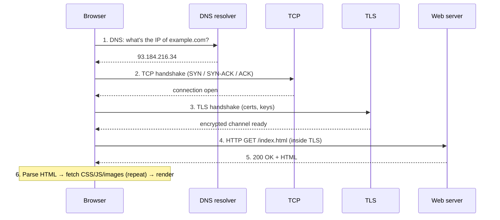

# What happens when you load a web page (end-to-end)

> The single most useful walkthrough in networking: type a URL, press Enter, and follow
> the bytes through **every layer and protocol** until the page renders. This is the map;
> every other doc is a zoom-in on one stop along the way.

## Top-down: where you already meet this
You do this hundreds of times a day. The whole point of the top-down approach is that
this familiar action secretly invokes *the entire stack* — DNS, TCP, TLS, HTTP, IP
routing, ARP, Ethernet. Read this doc first for the **shape** of the journey, then dive
into any layer that interests you and come back. It's the classic interview question
("what happens when you type google.com and hit Enter?") for a reason: answering it well
means you understand networking.

## Problem
A URL like `https://example.com/index.html` is just text. Turning it into pixels requires
finding the server, building a reliable encrypted connection to it, asking for the file in
a language it understands, and getting the answer back — coordinating four or five
protocols across machines you don't control. This doc shows how they hand off to each other.

## Core concepts — the journey, step by step



**Step 0 — Is it even a URL?** The browser first checks: is `example.com` something it
already knows (HSTS list, cache)? Does the typed text look like a search? Assume it's a
real URL: `https://example.com/index.html`. Scheme `https` → port **443**, encrypted.

**Step 1 — DNS: name → address.** The network routes by [IP address](../network-layer/ip-addressing.md),
not names. So the browser asks a **DNS resolver** to translate `example.com` →
`93.184.216.34`. The answer is often cached (browser, OS, resolver) and comes back in
milliseconds; a cold lookup walks the [DNS hierarchy](../application-layer/dns.md)
(root → `.com` → example.com's nameserver). DNS itself usually rides on
[UDP](../transport-layer/ports-and-udp.md) — fast, no connection.

**Step 2 — TCP: build a reliable pipe.** Now the browser opens a
[TCP](../transport-layer/tcp.md) connection to `93.184.216.34:443`. This is the **3-way
handshake** — `SYN → SYN-ACK → ACK` — three packets that agree on sequence numbers so
both sides can detect loss and reorder. After it, the browser has a reliable, ordered
**byte stream** to the server. (One round-trip of latency spent.)

**Step 3 — TLS: make it private.** Because it's `https`, the browser and server run a
[TLS handshake](../security/tls-https.md) over that TCP connection: the server presents a
**certificate** proving it's really `example.com` (signed by a CA the browser trusts),
they agree on keys, and from here everything is encrypted. (Another 1 round-trip in TLS
1.3.)

**Step 4 — HTTP: ask for the page.** *Now*, inside the encrypted TCP stream, the browser
sends the actual request — plain [HTTP](../application-layer/http.md):
```
GET /index.html HTTP/1.1
Host: example.com
```
**Step 5 — Response.** The server replies `200 OK` plus the HTML body. Same connection.

**Step 6 — Render & repeat.** The browser parses the HTML, discovers it needs `style.css`,
`app.js`, and three images — and fires **more HTTP requests** (often reusing the same
connection, or opening parallel ones / using HTTP/2 multiplexing). As each resource
arrives, the page paints. Done.

**And underneath every arrow above** — each of those messages was
[encapsulated](./protocol-layers.md) into IP packets, each packet was forwarded
[hop-by-hop by routers](../network-layer/routing-and-forwarding.md), and on each hop it
was wrapped in a [link-layer frame](../link-layer/ethernet-and-arp.md) addressed to the
*next* device's MAC (found via **ARP**). The very first hop left your laptop through your
home router doing [NAT](../network-layer/nat-and-dhcp.md). All of that happened for *every
single packet*, invisibly, in milliseconds.

## Essential terminology

| Term | Meaning |
| --- | --- |
| **URL** | Uniform Resource Locator: `scheme://host[:port]/path` — names *what* you want and *where*. |
| **Resolver** | The DNS client/server that turns a hostname into an IP for you. |
| **Round-trip time (RTT)** | Time for a packet to go to the server and back — the unit of "how many trips did this cost." |
| **Handshake** | An opening exchange of packets that sets up state before real data (TCP, TLS). |
| **Certificate** | A signed document proving a server owns a domain — the basis of HTTPS trust. |
| **Render** | The browser turning HTML/CSS into the visual page. |
| **Connection reuse** | Sending many HTTP requests over one already-open TCP/TLS connection to skip handshakes. |

## Example
Counting the round-trips for a *cold* visit to `https://example.com` (nothing cached),
which is why first loads feel slow:

| Step | Round-trips (RTT) | Notes |
| --- | --- | --- |
| DNS lookup | ~1 | often cached → 0 |
| TCP handshake | 1 | SYN / SYN-ACK / ACK |
| TLS 1.3 handshake | 1 | (TLS 1.2 was 2) |
| HTTP request + response | 1 | the actual page |
| **Total before first byte of HTML** | **~3–4 RTT** | at 50 ms RTT ≈ 150–200 ms before *anything* |

This table is *why* the industry obsesses over latency tricks: caching DNS, **TLS session
resumption** (0-RTT), **HTTP/3** folding TCP+TLS into one handshake, and
[CDNs](../../2-case-studies/cdn.md) that shrink the RTT itself by sitting closer to you.
You can watch the real thing with `curl -v https://example.com` (see
[the curl lab](../../3-practice/lab-curl-https.md)).

## Common tools
| Tool | What it is | Use it for |
| --- | --- | --- |
| `curl -v` | Verbose HTTP client | watching DNS→TCP→TLS→HTTP for one URL |
| Browser DevTools → Network | Per-request waterfall | seeing DNS/connect/TLS/TTFB timings per resource |
| `dig` | DNS lookup tool | doing step 1 by hand |
| Wireshark | Packet capture | seeing the SYN, TLS, and HTTP packets in order |

## Trade-offs
- ✅ The layered hand-off means each step is independently optimizable (cache DNS, resume
  TLS, reuse connections).
- ⚠️ Each handshake is a serialized round-trip — latency, not bandwidth, dominates first
  loads. A faster pipe doesn't help if you're spending 4 RTTs setting up.
- ⚠️ So much caching (DNS, connection, HTTP) means "why is it stale/wrong?" is a common,
  layered debugging problem.

## Real-world examples
- **HTTP/3 + QUIC** merges the TCP and TLS handshakes into a single round-trip (and 0-RTT
  on repeat visits) — directly attacking the table above.
- **CDNs** (Cloudflare, Akamai, Netflix Open Connect) terminate your TCP/TLS a few
  milliseconds away instead of across an ocean.
- **DevTools "waterfall"** is literally this doc, visualized per-resource — every senior
  engineer reads it to find the slow step.

## References
- Kurose & Ross, *Top-Down Approach* — Ch. 1 (the wrap-up "a day in the life of a request")
- [High Performance Browser Networking (Ilya Grigorik)](https://hpbn.co/) — free, the canonical deep dive
- [What happens when… (famous interview question writeup)](https://github.com/alex/what-happens-when)
