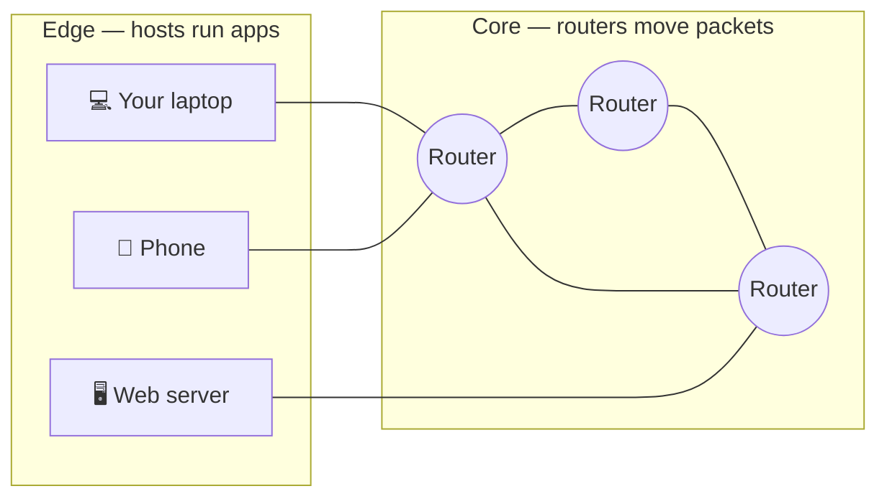
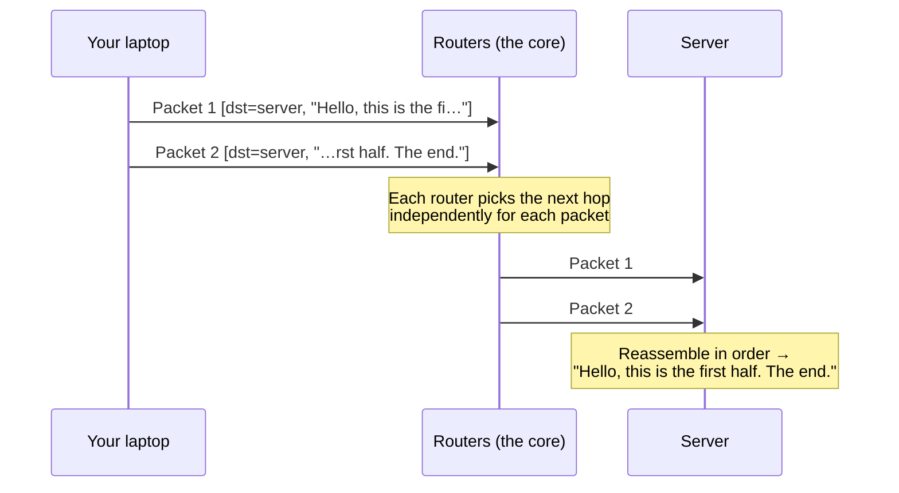

# What is a network? The Internet, top-down

> A computer network is a set of devices that exchange messages over shared links by
> agreeing on **protocols**. The Internet is the biggest one: a "network of networks"
> that lets any two of billions of devices address and reach each other.

## Top-down: where you already meet this
You just opened this page. Your laptop sent a request to a server that might be 8,000
km away, it came back in under a second, and the text rendered — across Wi-Fi, your
ISP, a dozen routers you'll never see, and a data center. Nobody coordinated that trip
in advance. **How is that even possible?** That question *is* computer networking, and
everything in this area is an answer to one piece of it. We start here with the map of
the whole territory, then spend the rest of the area zooming into each part.

## Problem
Two programs on different machines need to exchange data, but between them sits a mess
of different hardware (fibre, copper, radio), owned by different companies, in different
countries, with no central boss. The network's job is to hide all of that and give
programs a simple illusion: *"hand me a chunk of data and the address of who should get
it, and I'll deliver it."* Making that illusion real, fast, and reliable is the whole
game.

## Core concepts

**The edge vs. the core.** The Internet has two parts:
- **The edge** — the *end systems* (also called **hosts**): your phone, laptops,
  servers, smart TVs, IoT sensors. This is where applications run.
- **The core** — the mesh of **routers** and links that shuttle data between hosts. The
  core doesn't run your app; it just moves packets.

**Packet switching.** Your data isn't sent as one long stream. It's chopped into
**packets** — small, independently-addressed chunks (typically up to ~1,500 bytes each).
Each packet carries a destination address and is forwarded hop-by-hop by routers, each
choosing the next hop. Packets from millions of conversations share the same links,
interleaved. This is the opposite of the old telephone network's **circuit switching**,
which reserved a dedicated path for your whole call.

| | Circuit switching (old phone network) | Packet switching (the Internet) |
| --- | --- | --- |
| Path | Reserved end-to-end for the session | None reserved; packets routed independently |
| Idle time | Wastes the reserved capacity | Link is free for others |
| Guarantees | Constant rate, no congestion | Best-effort; can drop/delay under load |
| Good for | Constant-rate voice | Bursty data (the web, everything) |

Packet switching wins for data because traffic is **bursty** — you load a page, then
read for 30 seconds doing nothing. Reserving a circuit for that would waste the link.

**A network of networks.** There is no single "Internet" cable. There are ~70,000
independently-run networks (called **Autonomous Systems** — a university, an ISP,
Google) that agree to interconnect. Your packet to a server hops *across* several of
these networks. They connect at **IXPs** (Internet Exchange Points) and through
business relationships (your ISP pays a bigger ISP for *transit*; big networks *peer*
for free). The magic is that they all speak the same addressing and routing language
([IP](../network-layer/ip-addressing.md) and [BGP](../network-layer/routing-and-forwarding.md)),
so the whole thing behaves like one network.

**Protocols.** A **protocol** is an agreed-upon format and order of messages — like the
etiquette of a conversation. "When you connect, I say SYN, you say SYN-ACK, I say ACK,
*then* we talk." Without a shared protocol, two machines exchanging bytes is just noise.
Every layer of the network is defined by its protocols, which is why the whole area is
really a tour of protocols.

**Clients and servers.** Most apps follow the **client-server** model: a **server** waits
at a known address for requests; **clients** (your browser) initiate them. Some apps are
**peer-to-peer** (BitTorrent, parts of video calls) where hosts talk directly. Either way
the network underneath is the same.

## Essential terminology

| Term | Meaning |
| --- | --- |
| **Host / end system** | A device at the edge that runs applications (laptop, server, phone). |
| **Router** | A device in the core that forwards packets toward their destination. |
| **Link** | One physical connection between two devices (a fibre, a Wi-Fi hop). |
| **Packet** | A small, independently-addressed chunk of data — the unit the network moves. |
| **Protocol** | An agreed format + order of messages two parties use to communicate. |
| **Bandwidth** | The *rate* a link can carry data, in bits/second (e.g. 100 Mbps). |
| **Latency** | The *delay* for one bit to travel end-to-end (e.g. 20 ms). See [latency vs bandwidth](./latency-bandwidth-throughput.md). |
| **ISP** | Internet Service Provider — the network that connects you to the rest. |
| **Bit vs byte** | A bit is a 0/1; a byte is 8 bits. Link speeds are in **bits**/s, file sizes in **bytes**. |

## Example
Picture sending a 3 KB message. At ~1,500 bytes per packet, it becomes **2 packets**.
Each gets a header stamped with the destination [IP address](../network-layer/ip-addressing.md),
and they travel independently:

The two packets might even take *different paths* and arrive out of order — it's the
[transport layer's](../transport-layer/tcp.md) job to put them back in order. The core
itself makes no promises: it's **best-effort** delivery.

## Common tools
| Tool | What it is | Use it for |
| --- | --- | --- |
| `ping` | Sends tiny probe packets | measuring round-trip latency & reachability |
| `traceroute` / `tracert` | Maps the hops to a host | seeing the routers between you and a server |
| `ip addr` / `ifconfig` | Shows your host's addresses | finding your own IP & interfaces |
| `curl` | Makes app-layer requests | fetching a URL and seeing the response |
| Wireshark | Packet capture & decode | watching real packets layer by layer |

## Trade-offs
- ✅ Packet switching is efficient and resilient: links are shared, and if a router dies,
  packets route around it.
- ⚠️ Best-effort means **no built-in guarantees** — packets can be dropped, delayed, or
  reordered. Reliability is added *on top* by [TCP](../transport-layer/tcp.md), not by the core.
- ⚠️ No central authority means cooperation is by agreement (protocols + business deals),
  which makes the Internet robust but also messy (routing leaks, BGP hijacks).

## Real-world examples
- **Your home setup:** laptop → Wi-Fi → home router → ISP → the wider Internet. The home
  router does [NAT](../network-layer/nat-and-dhcp.md) so all your devices share one public address.
- **A CDN like Cloudflare or Netflix's Open Connect** pushes servers *close to the edge*
  (inside ISPs) so packets travel fewer hops — latency engineering in action.
- **Submarine cables** carry ~99% of intercontinental traffic; "the cloud" is, physically,
  fibre on the ocean floor.

## References
- Kurose & Ross, *Computer Networking: A Top-Down Approach* — Ch. 1
- [How the Internet works (Cloudflare Learning)](https://www.cloudflare.com/learning/network-layer/how-does-the-internet-work/)
- [Submarine Cable Map](https://www.submarinecablemap.com/)
