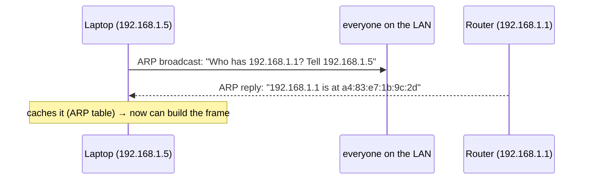

# Ethernet, MAC addresses, switches & ARP

> The bottom of the journey: actually moving a packet across **one physical hop** — your
> laptop to the router, the router to the next router. This is the **link layer**, where
> data travels in **frames** addressed by **MAC addresses**, **switches** move frames
> within a LAN, and **ARP** bridges the gap between IP addresses and MAC addresses.

## Top-down: where you already meet this
Your packet has an [IP destination](../network-layer/ip-addressing.md) thousands of km
away — but IP delivery is built out of many small hops, and *each hop* is a single link:
Wi-Fi to your router, a fibre to the ISP, and so on. The link layer is what gets a packet
across *one* of those hops. It's the next-to-last layer in our top-down descent — below it is
just the [physical layer](../physical-layer/signals-and-media.md) (voltages, light, radio).
Everything above has been riding inside these frames the whole time without knowing it.

## Problem
[IP routing](../network-layer/routing-and-forwarding.md) decides the *next hop* — "send this
to the router at `192.168.1.1`." But the actual wire/Wi-Fi doesn't understand IP addresses;
it needs a way to (a) wrap the packet for *this specific link's* technology, (b) address the
*physically attached* device that is the next hop, and (c) detect if the bits got corrupted
in transit. That's the link layer's job, repeated fresh at every hop.

## Core concepts

**Frames — the link layer's unit.** Each hop wraps the IP [packet](../fundamentals/protocol-layers.md)
in a **frame**: a link-layer header (source + destination **MAC**), the packet as payload,
and a trailer with a **CRC checksum** to catch corruption. Crucially, the frame is
**rebuilt at every hop** — the IP addresses inside stay the same end-to-end, but the MAC
addresses are *replaced* each hop to name the next physical device.

```
[ Dest MAC | Src MAC | Type | … IP packet (unchanged end-to-end) … | CRC ]
   ▲ next-hop device   ▲ this device          ▲ payload         ▲ error check
```

**MAC addresses — physical, local names.** A **MAC address** (e.g. `a4:83:e7:1b:9c:2d`) is a
48-bit ID burned into each network interface at the factory. Contrast with IP:

| | **MAC address** | **IP address** |
| --- | --- | --- |
| Scope | One link / LAN (local) | The whole Internet (global) |
| Assigned by | Hardware maker (mostly fixed) | Network / DHCP (changes by location) |
| Used for | Delivery across *one* hop | Routing across *many* hops |
| Analogy | Your name | Your mailing address |

You keep your MAC wherever you go; your IP changes with the network you join. The link layer
uses MAC; the network layer uses IP — and **ARP** connects the two.

**ARP — "who has this IP? tell me your MAC."** To build a frame for the next hop, a device
knows the next hop's *IP* (from the routing table) but needs its *MAC*. **ARP** (Address
Resolution Protocol) finds it by broadcasting to the whole LAN:


The result is cached in an **ARP table** so it's not re-asked every packet. ARP is the
glue between IP (layer 3) and MAC (layer 2).

**Switches — moving frames within a LAN.** A **switch** connects many devices into one LAN.
Unlike a dumb hub (which copies every frame to every port), a switch **learns** which MAC is
on which port (by watching source addresses) and forwards each frame only out the right
port. It builds a **MAC address table** automatically. A switch is a **layer-2** device — it
reads MACs, never opens the IP header.

**Switch vs router — the key distinction:**

| | **Switch (layer 2)** | **Router (layer 3)** |
| --- | --- | --- |
| Addresses | MAC | IP |
| Scope | Within one LAN/subnet | Between networks |
| Forwards by | MAC table (learned) | Routing table (longest-prefix) |
| Changes the frame? | Forwards as-is | **Re-frames** for the next hop |
| Broadcast domain | One (floods unknowns) | Separates them |

So a frame's life: the switch shuttles it between devices *on your subnet*; the moment it
must leave the subnet, the **router** strips the frame, looks at the IP, and builds a *new*
frame for the next hop. That re-framing at each router is why MAC is "local" and IP is
"global."

**Ethernet & Wi-Fi.** **Ethernet** (802.3) is the wired link standard; **Wi-Fi** (802.11) is
the wireless one. Both use MAC addressing and framing — Wi-Fi adds handling for a *shared,
collision-prone* medium (you can't listen while transmitting on radio, so it uses
**CSMA/CA** — sense the channel, avoid collisions — plus link-level ACKs).

## Essential terminology

| Term | Meaning |
| --- | --- |
| **Link layer** | Layer 2 — moves frames across one physical hop. |
| **Frame** | The link layer's data unit: MAC header + packet + CRC trailer. |
| **MAC address** | 48-bit hardware address identifying an interface on a link. |
| **CRC / FCS** | Checksum in the frame trailer to detect corrupted bits. |
| **ARP** | Protocol mapping a next-hop IP → its MAC, via LAN broadcast. |
| **ARP table** | Cached IP→MAC mappings on a host. |
| **Switch** | Layer-2 device forwarding frames by MAC within a LAN. |
| **Hub** | Dumb predecessor to a switch; floods every frame to every port. |
| **LAN** | Local Area Network — devices on one link/subnet. |
| **Broadcast domain** | The set of devices a broadcast frame reaches (one switch network). |
| **Ethernet / Wi-Fi** | Wired (802.3) / wireless (802.11) link technologies. |
| **MTU** | Max frame payload size (Ethernet ≈ 1500 bytes) — sets the [packet size](../fundamentals/latency-bandwidth-throughput.md). |

## Example
Inspect the layer-2 machinery on your own machine:
```console
$ ip link                       # your interface's MAC address
2: wlan0  link/ether a4:83:e7:1b:9c:2d   ← burned-in 48-bit MAC

$ ip neigh                      # the ARP table: IP → MAC it has learned
192.168.1.1   dev wlan0  lladdr 3c:37:86:00:11:22  REACHABLE   ← the router's MAC
192.168.1.6   dev wlan0  lladdr a8:5e:45:aa:bb:cc  STALE

$ ping 192.168.1.1              # first ping triggers an ARP if not cached
```
That router entry is the answer to an ARP broadcast: your laptop asked "who has
`192.168.1.1`?" and built every outbound frame's destination from the reply. Everything you
send to the Internet leaves in a frame addressed to *that* MAC — the router — which then
re-frames it onward.

## Common tools
| Tool | What it is | Use it for |
| --- | --- | --- |
| `ip link` / `ifconfig` | Interface info | your MAC address, MTU, link state |
| `ip neigh` / `arp -a` | ARP table | learned IP→MAC mappings |
| `arping` | ARP prober | testing layer-2 reachability directly |
| Wireshark | Packet capture | seeing raw Ethernet frames, ARP requests/replies |
| `ethtool` | NIC settings | link speed, duplex, driver details |

## Trade-offs
- ✅ **Separation of concerns:** MAC handles *one hop*, IP handles *the journey* — re-framing
  per hop lets totally different link techs (fibre, Wi-Fi, 5G) interoperate under one IP layer.
- ✅ **Switches are plug-and-play:** they learn the topology automatically.
- ⚠️ **ARP is unauthenticated** → **ARP spoofing**: an attacker on your LAN can claim to be the
  router and intercept traffic (a classic man-in-the-middle, which is partly why
  [TLS](../security/tls-https.md) matters).
- ⚠️ **Broadcasts don't scale:** ARP and unknown frames flood the whole LAN, so big flat
  networks are split with **VLANs** and routers.
- ⚠️ **MTU mismatches** cause fragmentation or dropped packets — a subtle, common source of
  "works for small requests, hangs on big ones" bugs.

## Real-world examples
- **Every Wi-Fi/Ethernet connection** you make does ARP + framing constantly — invisibly.
- **Public Wi-Fi attacks** often use ARP spoofing to MITM users — defended against by HTTPS.
- **VLANs** segment one physical switch into many logical LANs (per-department isolation).
- **"MAC address filtering"** on routers and **MAC randomization** on phones (privacy, so you
  aren't tracked across Wi-Fi networks) are everyday uses of MAC addressing.

## References
- Kurose & Ross, *Top-Down Approach* — Ch. 6 (link layer, Ethernet, switches, ARP)
- [Cloudflare — What is a MAC address?](https://www.cloudflare.com/learning/network-layer/what-is-a-mac-address/)
- [Practical Networking — Ethernet & ARP](https://www.practicalnetworking.net/series/packet-traveling/host-to-host/)
- IEEE 802.3 (Ethernet), 802.11 (Wi-Fi), RFC 826 (ARP)
