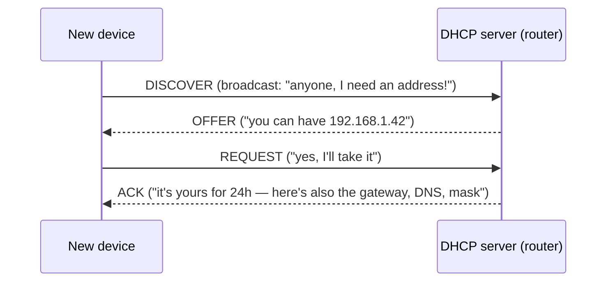
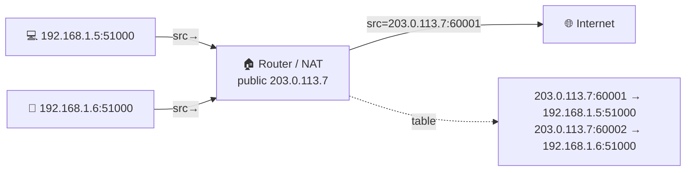

# NAT, private addresses & DHCP

> Two pieces of plumbing make your home and office networks actually work. **DHCP** hands
> each device an [IP address](./ip-addressing.md) automatically when it joins. **NAT** lets
> a whole household of devices share a *single* public address — the hack that let the
> Internet keep growing after IPv4 ran out.

## Top-down: where you already meet this
You connect a new phone to Wi-Fi and it "just works" — it got an address, found the router,
reached the Internet, with zero configuration. And somehow your laptop, phone, TV, and
console all reach the Internet at once even though your ISP gave you **one** public IP. Two
unglamorous protocols make that seamless experience happen: DHCP (automatic addressing) and
NAT (address sharing). They're where the clean theory of IP addressing meets the messy
reality of a world with too few addresses.

## Problem
Two practical problems:
1. **Addresses don't assign themselves.** Every device needs an IP, the router's address, a
   DNS server, and a subnet mask — typing those into every phone and laptop by hand is
   absurd. → **DHCP** automates it.
2. **There aren't enough public IPv4 addresses** for every device on Earth (only ~4.3
   billion, [long exhausted](./ip-addressing.md)). Yet a home has a dozen devices and the ISP
   gives it one address. → **NAT** lets them share it.

## Core concepts

**Private addresses — reusable inside, invisible outside.** Three ranges
(`10.0.0.0/8`, `172.16.0.0/12`, `192.168.0.0/16`) are reserved for **private** use. Every
home network reuses them (yours and your neighbor's both use `192.168.1.x`), and that's
fine because they're **not routable on the public Internet** — they only have meaning inside
your LAN. To reach the outside, they must be translated. That translation is NAT.

**DHCP — automatic addressing.** When a device joins, it shouts for configuration and the
DHCP server (usually your router) leases it everything it needs. The handshake is **DORA**:


The address is a **lease** (time-limited, e.g. 24 h) so addresses recycle as devices come and
go. One exchange and the device is fully configured: IP, subnet mask, **default gateway**
(the router), and [DNS](../application-layer/dns.md) servers.

**NAT — sharing one public IP.** Your router sits on the boundary with a private side
(`192.168.1.x`) and one public IP from the ISP. When an inside device sends a packet out,
the router **rewrites the source** from the private IP+port to *its own* public IP + a new
port, and remembers the mapping in a **translation table**. Replies come back to the public
IP+port; the router looks up the table and rewrites the destination back to the original
inside device. Because it tracks **ports**, one public IP can multiplex thousands of inside
connections — this is **PAT** (Port Address Translation), the common form of NAT.



**Why NAT changes the Internet's shape.** Inside devices can *initiate* outbound connections
fine, but they have **no public address**, so the outside can't initiate a connection *to*
them — there's no table entry yet. This is great for security-by-default (your laptop isn't
directly reachable) but breaks peer-to-peer apps (games, VoIP, video calls), which need
**NAT traversal** tricks (**STUN/TURN**, **hole punching**) to connect two devices both
behind NATs.

## Essential terminology

| Term | Meaning |
| --- | --- |
| **Private address** | `10./172.16./192.168.` ranges — reusable, not Internet-routable. |
| **Public address** | A globally unique, Internet-routable IP (your ISP gives you one). |
| **NAT** | Network Address Translation — rewriting addresses at the LAN boundary. |
| **PAT** | Port Address Translation — NAT that also rewrites ports so many hosts share one IP. |
| **Translation table** | The router's record mapping inside (IP:port) ↔ outside (IP:port). |
| **DHCP** | Dynamic Host Configuration Protocol — auto-assigns IP + config. |
| **Lease** | A time-limited DHCP address assignment. |
| **Default gateway** | The router a host sends packets to for anything off its subnet. |
| **Port forwarding** | A manual NAT rule letting outside traffic reach a specific inside host. |
| **NAT traversal** | STUN/TURN/hole-punching to connect peers behind NATs. |

## Example
What one outbound web request looks like as NAT rewrites it:
```
Inside the LAN:   src 192.168.1.5:51000  → dst 93.184.216.34:443
                          │ router rewrites the source ▼
On the Internet:  src 203.0.113.7:60001  → dst 93.184.216.34:443
                          ▲ reply comes back to 203.0.113.7:60001
Router looks up table → rewrites dst back to 192.168.1.5:51000 → delivers to your laptop
```
The remote server only ever sees `203.0.113.7` — it has **no idea** there are a dozen
devices behind it. Check your own two views: `ip addr` shows your private `192.168.x` address;
visiting `whatismyip.com` (or `curl ifconfig.me`) shows the single public one NAT presents.

## Common tools
| Tool | What it is | Use it for |
| --- | --- | --- |
| `ip addr` / `ipconfig` | Interface info | your private address & DHCP-assigned config |
| `curl ifconfig.me` | Echo service | seeing the public IP NAT presents |
| Router admin page | DHCP/NAT config | viewing leases & adding port-forward rules |
| `iptables -t nat -L` | Linux NAT table | inspecting NAT rules on a Linux gateway |
| `dhclient -v` | DHCP client | watching the DORA exchange live |

## Trade-offs
- ✅ **DHCP:** zero-config networking — devices join and work instantly; addresses recycle.
- ✅ **NAT:** stretched IPv4 for decades and gives a free "default-deny" firewall (outside can't
  reach inside unprompted).
- ⚠️ **NAT breaks end-to-end connectivity:** peer-to-peer, gaming, and VoIP need traversal
  hacks; some protocols don't survive it.
- ⚠️ **NAT is stateful:** the router must hold a table; **CGNAT** (carriers NAT-ing many
  customers together) compounds the pain and complicates abuse tracking.
- ⚠️ **IPv6 makes NAT largely unnecessary** — every device gets a real public address — but
  many keep a firewall for the security NAT incidentally provided.

## Real-world examples
- **Every home router** does DHCP + NAT — it's why your network "just works."
- **CGNAT (Carrier-Grade NAT)** is how mobile carriers and many ISPs share scarce IPv4 among
  thousands of customers.
- **Port forwarding** is what you set up to host a game server or reach a home device from
  outside.
- **WebRTC video calls** use **STUN/TURN** servers to punch through both peers' NATs — the
  reason a "TURN relay" appears in video-call architectures.

## References
- Kurose & Ross, *Top-Down Approach* — Ch. 4.3 (NAT), DHCP discussion
- [Cloudflare — What is NAT?](https://www.cloudflare.com/learning/network-layer/what-is-nat/)
- RFC 2131 (DHCP), RFC 3022 (NAT), RFC 1918 (private addresses)
- [How NAT traversal works (Tailscale blog)](https://tailscale.com/blog/how-nat-traversal-works/)
