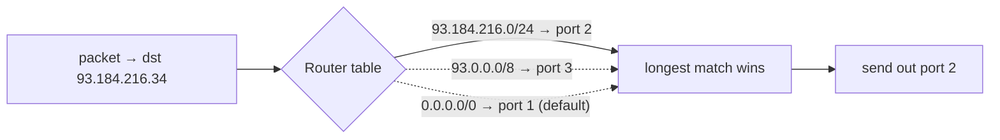
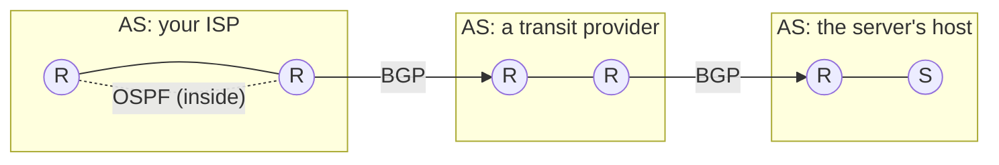

# Routing & forwarding

> How does a packet stamped with an [IP address](./ip-addressing.md) actually *find its way*
> across the planet through routers that have never heard of your destination? Two jobs:
> **forwarding** (a router's fast, local "which port does this packet go out?") and
> **routing** (the slower, network-wide process of *building* the maps that answer it).

## Top-down: where you already meet this
Your packet leaves your laptop and, ~80 ms later, arrives at a server an ocean away, having
been handled by a dozen routers owned by different companies — none of which were told in
advance about your connection. Each just looked at the destination IP and made one decision:
"next hop = that way." Multiply that by every router on the path and the packet
*walks itself* to the destination. This is the core-of-the-network magic the whole top-down
tour has been building toward. Run `traceroute` and you literally see every router that
touched your packet.

## Problem
There's no master map and no central controller. Each router knows only its direct
neighbors, yet collectively they must deliver packets to any of millions of networks, adapt
within seconds when a link fails, and do it across ~70,000 independently-run networks that
don't trust each other. Solving "find a good path with only local knowledge, at global
scale" is what routing protocols do.

## Core concepts

**Forwarding vs routing — don't confuse them:**

| | **Forwarding** | **Routing** |
| --- | --- | --- |
| When | Per packet, billions/sec | Background, continuous |
| Scope | Local: one router, one decision | Global: routers exchange info |
| Question | "Which output port for *this* packet?" | "What's the best path to each network?" |
| Speed | Nanoseconds (often in hardware) | Seconds (algorithms, updates) |
| Produces | a lookup in the table | *builds* the forwarding table |

Routing is *making the map*; forwarding is *reading the map*.

**The forwarding table & longest-prefix match.** Each router holds a table of
`prefix → next hop`. For each packet it finds the **most specific** matching
[prefix](./ip-addressing.md) — **longest-prefix match** — and sends the packet to that next
hop. A **default route** (`0.0.0.0/0`) catches everything else ("if you don't know, send it
upstream").



**Hop by hop.** No router knows the whole path — each only knows the *next* hop. The packet
is forwarded router→router, each independently consulting its table, until it reaches the
destination's network. The path *emerges* from many local decisions.

**Two scales of routing.** The Internet is split so routing stays manageable:

- **Inside one network (an Autonomous System)** — *intra-domain* / **IGP**. The operator
  controls everything and optimizes for the *shortest/fastest* path. Protocols:
  - **OSPF** — *link-state*: every router learns the full map of the AS and runs
    Dijkstra's shortest-path. (Also **IS-IS**.)
  - **RIP** — *distance-vector*: routers tell neighbors "I can reach X in N hops"
    (older, simple).
- **Between networks** — *inter-domain* / **BGP**. This is the protocol that *stitches the
  Internet together*. ASes advertise "I can reach these prefixes" to their neighbors. BGP
  picks paths based on **business policy** (who pays whom), not just shortest distance — a
  packet may take a longer route because of money, not geography.



**Link-state vs distance-vector** — the two classic ways to learn routes:

| | Link-state (OSPF) | Distance-vector (RIP) |
| --- | --- | --- |
| What's shared | The full topology, flooded to all | Only "my distances," to neighbors |
| Each router computes | Whole map → Dijkstra | Best next hop from neighbor reports |
| Converges | Fast, predictable | Slower; can loop ("count to infinity") |
| Scale | Large networks | Small networks |

## Essential terminology

| Term | Meaning |
| --- | --- |
| **Forwarding** | A router's per-packet "which output port?" lookup. |
| **Routing** | The network-wide process of building the forwarding tables. |
| **Forwarding/routing table** | `prefix → next hop` entries a router consults. |
| **Next hop** | The neighboring router to send a packet to next. |
| **Longest-prefix match** | Choosing the most specific matching route. |
| **Default route** | `0.0.0.0/0` — where to send anything not otherwise matched. |
| **Autonomous System (AS)** | One independently-administered network (ISP, Google, a university). |
| **IGP** | Interior Gateway Protocol — routing *within* an AS (OSPF, IS-IS, RIP). |
| **BGP** | Border Gateway Protocol — routing *between* ASes; runs the Internet. |
| **Link-state / distance-vector** | The two families of route-learning algorithms. |
| **Convergence** | All routers reaching a consistent view after a change. |
| **TTL / hop limit** | A counter decremented each hop; hits 0 → packet dropped (kills loops). |

## Example
`traceroute` reveals the hop-by-hop path — each line is one router (it works by sending
packets with increasing **TTL** so each successive router replies):
```console
$ traceroute example.com
 1  192.168.1.1       1 ms     ← your home router (default gateway)
 2  10.20.0.1        9 ms     ← ISP edge
 3  72.14.215.85    12 ms     ← ISP core
 4  108.170.245.1   18 ms     ← peering into another AS (BGP boundary)
 5  142.250.x.x     22 ms
 6  93.184.216.34   24 ms     ← arrived
```
Each hop made *one* local forwarding decision; together they delivered the packet. The
jump in latency between hops 3→4 is often where your packet crossed from one AS into
another. Try it yourself in the [traceroute lab](../../3-practice/lab-traceroute.md).

## Common tools
| Tool | What it is | Use it for |
| --- | --- | --- |
| `traceroute` / `mtr` | Path tracer | seeing every router & per-hop latency |
| `ip route` | Local routing table | your host's own forwarding decisions |
| `bgp.tools` / looking glasses | BGP viewers | seeing real Internet AS paths to a prefix |
| `vtysh` (FRR/Quagga) | Router CLI | configuring OSPF/BGP on software routers |
| `ping -t`/`-m` | TTL control | observing the hop-limit mechanism |

## Trade-offs
- ✅ **Decentralized & resilient:** local decisions + no master controller → reroutes around
  failures automatically.
- ✅ **Scales** via the IGP/BGP split and prefix aggregation.
- ⚠️ **BGP trusts announcements:** a network can (accidentally or maliciously) announce
  prefixes it doesn't own → **route hijacks** and **leaks** (e.g. the 2008 Pakistan/YouTube
  incident, the 2021 Facebook outage).
- ⚠️ **Convergence isn't instant:** during a failure, packets can loop or drop until routers
  agree (TTL keeps loops from lasting forever).
- ⚠️ **Policy ≠ optimal:** BGP picks paths by business relationship, so packets sometimes take
  geographically silly routes.

## Real-world examples
- **`traceroute`** is the everyday window into real forwarding paths.
- **BGP runs the Internet** — and BGP misconfigurations cause the biggest outages: Facebook
  withdrew its own routes in 2021 and vanished from the Internet for hours.
- **RPKI / BGP route signing** is the ongoing effort to make route announcements verifiable.
- **SDN** (software-defined networking) centralizes routing *within* big data centers — Google's
  B4 WAN computes paths centrally for efficiency the distributed model can't match.

## References
- Kurose & Ross, *Top-Down Approach* — Ch. 5 (routing algorithms, OSPF, BGP)
- [Cloudflare — What is BGP?](https://www.cloudflare.com/learning/security/glossary/what-is-bgp/)
- [Understanding traceroute](https://www.cloudflare.com/learning/network-layer/what-is-traceroute/)
- RFC 4271 (BGP-4), RFC 2328 (OSPF)
