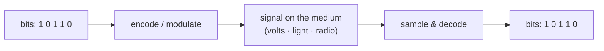

# The physical layer — bits as signals on a medium

> At the very bottom, every [frame](../link-layer/ethernet-and-arp.md) becomes a physical
> **signal** — voltage on copper, light in fibre, or radio waves in the air. The physical
> layer's one job: reliably turn 1s and 0s into something that travels across a medium, and
> back. This is where networking meets physics, and where the hard limits on
> [bandwidth](../fundamentals/latency-bandwidth-throughput.md) come from.

## Top-down: where you already meet this
You've followed a request all the way down — DNS, TCP, IP, Ethernet framing. The frame's bits
now have to *physically leave the machine*. Whether that's a pulse of light down a fibre under
the ocean or a 5 GHz radio wobble to your access point, **something physical carries the bit**.
This is the floor of the stack: below it is only physics. It's deliberately the last and
lightest stop in a top-down tour — but knowing it explains *why* links have the speeds and
quirks they do.

## Problem
A bit is an abstraction; a wire only knows voltage, a fibre only knows light, the air only
knows electromagnetic waves. We need to (a) **encode** 1s and 0s into a physical signal, (b)
push that signal across an imperfect medium that attenuates and distorts it, and (c) let the
receiver **recover** the original bits despite noise — all as fast as physics allows.

## Core concepts

**Bits → signals (encoding & modulation).** The sender represents bits as changes in a
physical quantity. On copper that might be voltage levels/transitions; on fibre, light on/off;
on radio, changes in a carrier wave's amplitude, frequency, or phase (**modulation**). Clever
schemes pack **multiple bits per symbol** (e.g. QAM in Wi-Fi/cable) to push more data through
the same channel.



**The three media — and their trade-offs:**

| Medium | Carries bits as | Strengths | Weaknesses |
| --- | --- | --- | --- |
| **Copper** (twisted pair, coax) | electrical voltage | cheap, easy, powers devices | attenuates fast, picks up noise, limited range/speed |
| **Fibre optic** | pulses of light | huge bandwidth, very low loss, immune to EM noise, long range | fragile, costlier, needs precise connectors |
| **Wireless** (radio) | electromagnetic waves | no cables, mobility | shared/contended, interference, range & obstacles, security |

This is why the Internet's **backbone and submarine cables are fibre** (bandwidth + distance),
the **last hop to your devices is often wireless** (convenience), and **copper** lingers for
short, cheap runs.

**Why links have a speed limit.** A channel can only carry so much. The **Nyquist** and
**Shannon** limits say capacity grows with the channel's **bandwidth** (range of frequencies)
and its **signal-to-noise ratio** — more noise means fewer distinguishable signal levels, so
fewer bits/second. This is the physics under the
[bandwidth number](../fundamentals/latency-bandwidth-throughput.md) your ISP sells: you can't
exceed what the medium + noise permit, which is why your Wi-Fi slows at the edge of range (more
noise, lower SNR) and why fibre crushes copper (light has enormous usable bandwidth and little
noise).

**Propagation speed sets latency's floor.** Signals travel near light speed — but only ~⅔ of it
in copper/fibre (~200,000 km/s). That finite speed is the irreducible **propagation delay**
behind [latency](../fundamentals/latency-bandwidth-throughput.md): distance ÷ speed. No
encoding trick beats it; only **shorter distance** does (the whole reason for CDNs and edge).

**Bandwidth vs throughput, physically.** The physical layer gives a *raw* bit rate (the
"line rate"). Real data is less: framing overhead, encoding overhead, error correction, and —
on shared media like Wi-Fi — time lost to **contention and collisions**
([CSMA/CA](../link-layer/ethernet-and-arp.md)). The link layer rides directly on top, turning
this raw, error-prone bit pipe into addressed, checksummed frames.

## Essential terminology

| Term | Meaning |
| --- | --- |
| **Physical layer** | Layer 1 — turning bits into signals on a medium and back. |
| **Medium** | The physical carrier: copper, fibre, or air (radio). |
| **Encoding** | Mapping bits to signal patterns (line codes). |
| **Modulation** | Varying a carrier wave (amplitude/frequency/phase) to carry bits — radio, cable. |
| **Symbol** | One transmitted signal unit; may encode several bits. |
| **Bandwidth (Hz)** | The frequency range a channel offers — physically distinct from data-rate "bandwidth" (bps), but related via Shannon. |
| **SNR** | Signal-to-noise ratio — higher = more bits/second possible. |
| **Shannon / Nyquist limit** | The theoretical max data rate of a channel given its bandwidth & noise. |
| **Attenuation** | Signal weakening over distance. |
| **Propagation speed** | How fast the signal travels (~⅔ c in cable) — sets the latency floor. |
| **Line rate** | The raw physical bit rate before overhead. |

## Example
Why your Wi-Fi is fastest next to the router and crawls across the house — pure physical-layer
physics:
```
Close to AP:  strong signal, high SNR  → router uses dense modulation (e.g. 256-QAM,
                                          ~8 bits/symbol) → high data rate
Far / walls:  weak signal, low SNR     → router falls back to robust modulation (e.g. QPSK,
                                          2 bits/symbol) → much lower data rate
```
The hardware **adapts the modulation to the measured SNR** (rate adaptation). Same Wi-Fi
"bandwidth," very different throughput — Shannon's limit, live in your living room. Check it
with your OS Wi-Fi status: the "link rate / TX rate" drops as you walk away.

## Common tools
| Tool | What it is | Use it for |
| --- | --- | --- |
| `ethtool eth0` | NIC link info | line rate, duplex, whether the cable negotiated 1G vs 100M |
| `iw dev wlan0 link` (Linux) | Wi-Fi link stats | signal strength (dBm), current TX rate, modulation |
| OS Wi-Fi status | Signal/rate readout | watching rate drop with distance |
| OTDR / cable testers | Hardware tools | locating breaks/attenuation in real cable (field work) |
| `mtr` / `ping` | Latency probes | observing the propagation-delay floor over distance |

## Trade-offs
- ✅ **Abstraction for everyone above:** the link layer (and all layers up) get a simple "bit
  pipe," free to ignore volts and photons.
- ✅ **Medium choice fits the job:** fibre for backbone bandwidth/distance, radio for mobility,
  copper for cheap short runs.
- ⚠️ **Hard physical limits:** Shannon caps data rate; light-speed caps latency. You engineer
  *around* these (shorter distance, better SNR, more spectrum), never past them.
- ⚠️ **Wireless is shared and noisy:** contention, interference, and security (anyone can
  receive radio) make it less predictable than a dedicated fibre.

## Real-world examples
- **Submarine fibre cables** carry ~99% of intercontinental traffic — chosen for bandwidth and
  low loss over thousands of km.
- **Fibre-to-the-home (FTTH)** vs old **DSL/coax** is a physical-layer upgrade: replacing
  noise-prone copper with light multiplies achievable speed.
- **Wi-Fi 6/7 and 5G** win largely by using **more spectrum** and **denser modulation** —
  attacking Shannon's two terms directly.
- **Starlink** cut satellite latency not with better encoding but by flying satellites *lower*
  (shorter distance → less propagation delay) — physics, not protocol.

## References
- Kurose & Ross, *Top-Down Approach* — Ch. 1.2 & Ch. 6 (physical media)
- Tanenbaum, *Computer Networks* — Ch. 2 (the physical layer, Nyquist/Shannon)
- [How fiber-optic internet works (Cloudflare)](https://www.cloudflare.com/learning/network-layer/what-is-a-fiber-optic-cable/)
