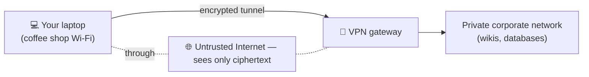

# Network attacks & defenses — firewalls, VPNs & common threats

> [TLS](./tls-https.md) protects one connection's contents, but a network has a wider attack
> surface: who can *reach* what, who can *impersonate* whom, and who can *overwhelm* a service.
> This doc covers the everyday defensive toolkit — **firewalls** and **VPNs** — and the
> classic attacks they (and TLS) defend against: **spoofing**, **MITM**, **DDoS**, and more.

## Top-down: where you already meet this
Your laptop runs dozens of services, yet random strangers on the Internet can't poke them.
Your company's internal wiki is reachable from your work VPN but nowhere else. A big site
shrugs off an attack that floods it with millions of bogus requests. None of that is
accidental — it's firewalls deciding *what traffic is allowed*, VPNs deciding *who's on the
trusted network*, and anti-DDoS deciding *what's real*. Security is the cross-cutting concern
that touches every layer you've learned, so it gets its own doc.

## Problem
The Internet is [open and trusting by default](./tls-https.md): packets carry whatever source
address the sender writes, any host can try to connect to any other, and a service will answer
anyone who asks. That openness enables three broad threats:
1. **Unauthorized access** — reaching services that should be private.
2. **Impersonation & interception** — pretending to be someone, or sitting in the middle.
3. **Denial of service** — overwhelming a target so legitimate users can't get through.

We need controls at the network boundary and on the wire to manage each.

## Core concepts

**Firewalls — control who can reach what.** A **firewall** filters traffic against a ruleset,
allowing or dropping packets/connections. The safe default is **default-deny**: block
everything, then permit only what's needed.

| Firewall type | Decides based on | Example |
| --- | --- | --- |
| **Packet filter (stateless)** | per-packet: IP, [port](../transport-layer/ports-and-udp.md), protocol | "allow TCP→443, drop the rest" |
| **Stateful** | tracks connection state | "allow replies to connections *we* started" |
| **Application / L7 (WAF)** | inspects [HTTP](../application-layer/http.md) content | "block SQL-injection-looking requests" |

A firewall is essentially a routing checkpoint applying policy. [NAT](../network-layer/nat-and-dhcp.md)
gives a *similar* default-deny side effect (the outside can't initiate inbound connections),
which is why home networks are incidentally somewhat protected.

**VPNs — extend a trusted network over an untrusted one.** A **VPN** (Virtual Private Network)
builds an **encrypted tunnel** across the public Internet, so two endpoints behave as if on the
same private LAN. It works by **tunneling**: wrapping (encapsulating) each private
[IP packet](../network-layer/ip-addressing.md) inside an encrypted packet to the VPN gateway —
[layering](../fundamentals/protocol-layers.md) applied recursively.


Uses: reach a private corporate network remotely, encrypt traffic on hostile Wi-Fi, or appear
to be in another location. Common implementations: **WireGuard** (modern, fast), **IPsec**,
**OpenVPN**.

**Common attacks — and what stops them:**

| Attack | What it does | Primary defense |
| --- | --- | --- |
| **IP/ARP spoofing** | Forge a source address or [MAC](../link-layer/ethernet-and-arp.md) to impersonate | ingress filtering; authentication ([TLS](./tls-https.md)); switch security |
| **Man-in-the-middle (MITM)** | Sit between two parties, read/alter traffic | **TLS** (authenticated encryption) — the big one |
| **DNS spoofing / cache poisoning** | Feed a fake [DNS](../application-layer/dns.md) answer to misdirect you | DNSSEC, DoH/DoT |
| **(D)DoS** | Flood a target with traffic so it can't serve real users | rate limiting, scrubbing, CDNs, anycast |
| **Port scanning** | Probe which services are open (recon) | firewall default-deny, minimal exposure |
| **SYN flood** | Half-open many [TCP](../transport-layer/tcp.md) handshakes to exhaust server state | SYN cookies |

**DDoS in particular — overwhelming, not breaking in.** A **Distributed** Denial of Service
uses thousands of machines (a **botnet**) to flood a target. Defenses don't "block the attack"
so much as **absorb and filter** it: spread capacity across a global
[anycast](../../2-case-studies/cdn.md) network, scrub obviously-bogus traffic at the edge, and
rate-limit. This is a major reason services sit behind a CDN/edge provider — the distributed
edge soaks up floods the origin never could.

**Defense in depth.** No single control is enough; you layer them — firewall at the boundary,
TLS on the wire, authentication at the app, segmentation inside (**VLANs**, **zero-trust**:
"never trust the network alone; verify every request"). The modern stance assumes the network
is *already* hostile and authenticates everything regardless of where it comes from.

## Essential terminology

| Term | Meaning |
| --- | --- |
| **Firewall** | A filter that allows/drops traffic per a ruleset. |
| **Default-deny** | Block all, then explicitly allow what's needed (the safe posture). |
| **Stateful firewall** | One that tracks connections (allows replies to traffic you initiated). |
| **WAF** | Web Application Firewall — inspects HTTP for app-layer attacks. |
| **VPN** | Encrypted tunnel making remote endpoints act like one private network. |
| **Tunneling** | Encapsulating one (encrypted) packet inside another. |
| **Spoofing** | Forging a source identity (IP, MAC, DNS, email). |
| **MITM** | An attacker intercepting/altering traffic between two parties. |
| **DDoS** | Distributed flood from many machines to deny service. |
| **Botnet** | A network of compromised machines used to attack. |
| **Ingress/egress filtering** | Dropping packets with impossible/forged source addresses. |
| **Zero-trust** | Authenticate every request; never trust based on network location alone. |

## Example
Inspect and shape what can reach your own machine. Linux firewalls express *exactly* the
default-deny + allowlist idea:
```console
# See current rules (nftables or iptables):
$ sudo nft list ruleset           # or: sudo iptables -L -n

# A minimal default-deny policy, allowing only SSH + HTTPS in (conceptual):
   policy drop                     ← default: deny everything inbound
   tcp dport 22  accept            ← allow SSH
   tcp dport 443 accept            ← allow HTTPS
   ct state established accept     ← allow replies to connections we started (stateful)
```
That last line is the **stateful** trick: you don't open ports for *replies*, you allow traffic
belonging to connections your host already initiated. Probe an exposed host's open ports with
`nmap <host>` (only on systems you're authorized to test) to see a firewall's effect from the
outside.

## Common tools
| Tool | What it is | Use it for |
| --- | --- | --- |
| `nft` / `iptables` / `ufw` | Linux firewalls | writing allow/deny rules |
| `nmap` | Port/host scanner | seeing which services are reachable (authorized testing only) |
| `wireguard` / `openvpn` | VPN software | building encrypted tunnels |
| Cloudflare / fail2ban | Edge protection / IP banning | absorbing DDoS, blocking abusive IPs |
| `ssh -L` / `ssh -D` | SSH tunneling | a quick ad-hoc encrypted tunnel/proxy |

## Trade-offs
- ✅ **Firewalls** give cheap, coarse "who can reach what" control — the first and broadest line.
- ✅ **VPNs** safely extend private networks and protect traffic on hostile links.
- ✅ **Edge/anycast** absorbs volumetric attacks no single server could survive.
- ⚠️ **Perimeter security is brittle:** once inside the firewall, a flat network is wide open —
  hence segmentation and **zero-trust**.
- ⚠️ **VPNs become a single point of failure/target** and a performance chokepoint; a
  compromised VPN credential = inside access.
- ⚠️ **Security vs convenience:** strict default-deny and inspection add friction, latency, and
  operational overhead; teams constantly balance the two.
- ⚠️ **Encryption hides attacks too:** TLS everywhere means firewalls/WAFs see ciphertext, so
  inspection moves to the endpoints (or controversial TLS-interception proxies).

## Real-world examples
- **Cloudflare/AWS Shield** absorb record-breaking DDoS attacks (tens of millions of
  requests/sec) by filtering at a global anycast edge.
- **Corporate "zero-trust" rollouts** (Google's BeyondCorp) dropped the classic VPN-perimeter
  model in favor of authenticating every request — assuming the network is hostile.
- **WireGuard** is now in the Linux kernel and powers many consumer VPNs for its speed/simplicity.
- **Cloud Security Groups** (AWS/GCP) are stateful firewalls you configure per instance — the
  default-deny allowlist model, as a checkbox.

## References
- Kurose & Ross, *Top-Down Approach* — Ch. 8 (network security)
- [Cloudflare — What is a DDoS attack?](https://www.cloudflare.com/learning/ddos/what-is-a-ddos-attack/) ·
  [What is a firewall?](https://www.cloudflare.com/learning/security/what-is-a-firewall/)
- [WireGuard whitepaper](https://www.wireguard.com/papers/wireguard.pdf)
- [NIST Zero Trust Architecture (SP 800-207)](https://csrc.nist.gov/pubs/sp/800/207/final)
