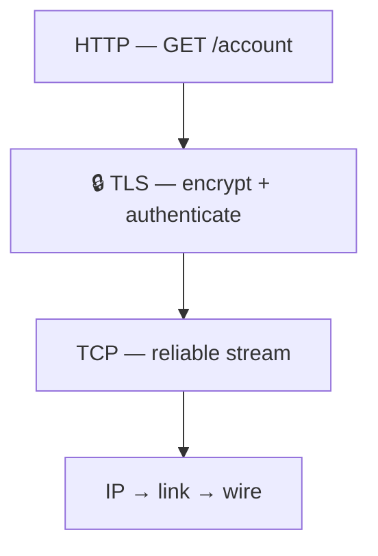
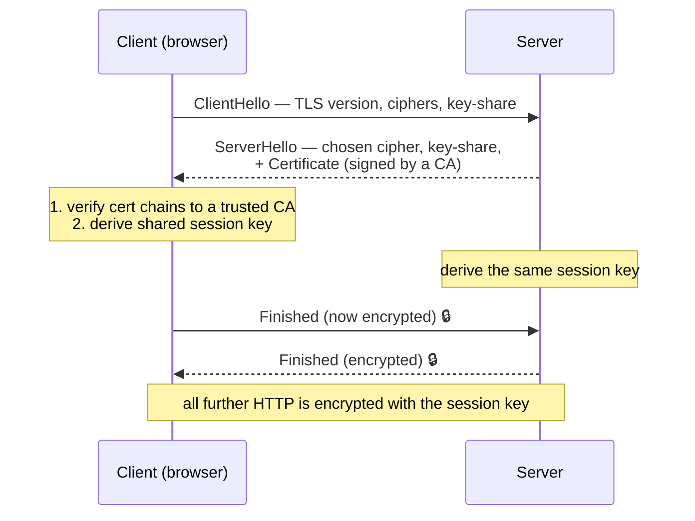

# TLS & HTTPS — how the web gets encrypted

> The `s` in `https` is **TLS**: a layer that slips between [TCP](../transport-layer/tcp.md)
> and [HTTP](../application-layer/http.md) and turns the open, eavesdroppable Internet into
> a private, tamper-proof, authenticated channel. It answers three questions at once: *is
> this really the right server, is anyone reading our traffic, and has it been altered?*

## Top-down: where you already meet this
The padlock in your browser's address bar. You log into your bank over the same shared
routers and Wi-Fi as everyone else — yet your password isn't readable by the coffee-shop
network, your ISP, or any of the dozen routers in between. TLS is why. Everything in this
area so far has been about *delivery*; this doc is about making that delivery **safe**, which
is non-negotiable on today's web (browsers now mark plain `http://` as "Not Secure").

## Problem
The Internet is **open by default**. A packet crosses many networks you don't control, and
anyone on the path — a malicious Wi-Fi hotspot, your ISP, a compromised router, an
[ARP spoofer](../link-layer/ethernet-and-arp.md) — can **read** it (eavesdrop), **change** it
(tamper), or **impersonate** the server you meant to reach (man-in-the-middle). We need three
guarantees layered on top of TCP, without changing the apps above:
1. **Confidentiality** — only the two endpoints can read the data.
2. **Integrity** — tampering is detected.
3. **Authentication** — you're really talking to `yourbank.com`, not an impostor.

## Core concepts

**Where TLS sits.** It's a thin layer between transport and application — TCP carries it,
HTTP rides inside it. The app (HTTP) is unchanged; it just hands bytes to TLS instead of TCP.
This is [layering](../fundamentals/protocol-layers.md) paying off: SMTP, IMAP, and many other
protocols get encryption the same way (`smtps`, `imaps`).



**Two kinds of crypto, used together.** This is the key insight:
- **Asymmetric (public-key)** crypto: a keypair where the **public key** encrypts and only
  the matching **private key** decrypts. Great for *authentication* and *agreeing on a
  secret over an open channel* — but slow.
- **Symmetric** crypto: one shared **session key** both sides use to encrypt/decrypt. Fast —
  good for bulk data.

TLS uses the slow asymmetric step **once**, at the start, to safely agree on a fast symmetric
**session key**, then encrypts all the actual traffic with that. Best of both.

**The TLS handshake (TLS 1.3, simplified).** Over an already-open TCP connection:


TLS 1.3 does this in **1 round-trip** (1.2 took 2); session resumption can make repeat
visits **0-RTT**. This is one of the [round-trips you pay on a cold web request](../fundamentals/web-request-end-to-end.md).

**Certificates & the chain of trust — how you know it's really your bank.** Encryption is
useless if you encrypted it *to an impostor*. So the server presents a **certificate**: a
document binding its domain (`yourbank.com`) to its public key, **digitally signed by a
Certificate Authority (CA)**. Your browser/OS ships with a list of trusted CAs (the **trust
store**). It verifies the signature chains up to one of those CAs and that the domain
matches. No valid chain → the big red warning.

```
Root CA  ──signs──▶  Intermediate CA  ──signs──▶  yourbank.com's cert
(in your OS trust store)                          (presented in the handshake)
```

**Forward secrecy.** Modern TLS derives a *fresh, ephemeral* session key per connection (via
ephemeral Diffie-Hellman), so even if the server's private key leaks *later*, past recorded
traffic can't be decrypted. Each session's secret dies with the session.

**HTTPS = HTTP over TLS.** That's literally all "HTTPS" means: ordinary HTTP, carried inside a
TLS channel, on port **443**. The HTTP itself is identical.

## Essential terminology

| Term | Meaning |
| --- | --- |
| **TLS** | Transport Layer Security — the encryption/authentication layer (successor to SSL). |
| **HTTPS** | HTTP carried inside TLS (port 443). |
| **Confidentiality / integrity / authentication** | The three guarantees: unreadable, untampered, genuine. |
| **Symmetric key** | One shared key for fast bulk encryption (the session key). |
| **Asymmetric / public-key** | Public-encrypts / private-decrypts keypair; used to bootstrap the session key & authenticate. |
| **Session key** | The symmetric key agreed in the handshake, used for the actual data. |
| **Handshake** | The opening exchange that authenticates and agrees on keys. |
| **Certificate** | Signed proof binding a domain to its public key. |
| **Certificate Authority (CA)** | A trusted issuer that signs certificates (Let's Encrypt, DigiCert…). |
| **Chain of trust / trust store** | Cert → intermediate → root, verified against the OS/browser's trusted roots. |
| **Forward secrecy** | Past traffic stays safe even if the long-term key later leaks. |
| **MITM** | Man-in-the-middle — an attacker impersonating the server; what auth defeats. |

## Example
Peek at a real handshake and certificate with `openssl`:
```console
$ openssl s_client -connect example.com:443 -servername example.com </dev/null
…
SSL-Session:
  Protocol  : TLSv1.3
  Cipher    : TLS_AES_256_GCM_SHA384          ← agreed symmetric cipher
Server certificate
  subject=CN = example.com                     ← who the cert is *for*
  issuer =CN = DigiCert Global G2 TLS RSA…     ← which CA signed it
  Verify return code: 0 (ok)                   ← chain validated → trusted ✅
```
A `Verify return code: 0 (ok)` is your browser's padlock, in CLI form. A mismatch
(self-signed, expired, wrong domain) is the "Your connection is not private" page. Watch the
whole DNS→TCP→TLS→HTTP sequence in the [curl-https lab](../../3-practice/lab-curl-https.md).

## Common tools
| Tool | What it is | Use it for |
| --- | --- | --- |
| `openssl s_client` | TLS debug client | inspecting handshakes, certs, ciphers |
| `curl -v https://…` | HTTP+TLS client | seeing the TLS handshake before HTTP |
| Browser → padlock → cert | Cert viewer | who issued it, validity dates, the chain |
| [SSL Labs](https://www.ssllabs.com/ssltest/) | Online TLS scanner | grading a server's TLS config |
| Let's Encrypt / `certbot` | Free CA + automation | issuing/renewing real certs |

## Trade-offs
- ✅ **Privacy, integrity, and authenticity** over a fundamentally untrusted network — the
  foundation of e-commerce, logins, everything sensitive.
- ✅ **Cheap and default now:** Let's Encrypt made certs free and automatic; HTTPS is the norm.
- ⚠️ **Handshake latency:** an extra round-trip on connect (1.3 and resumption minimize it).
- ⚠️ **Trust is only as strong as the CA system:** a compromised or coerced CA can issue rogue
  certs (mitigated by **Certificate Transparency** logs, which publicly record every issued cert).
- ⚠️ **Encrypts content, not metadata:** observers still see *which IP/domain* (via the TLS SNI
  field and DNS) you contact, just not the contents — an active privacy frontier (Encrypted
  ClientHello).
- ⚠️ **Endpoint-only:** TLS protects data *in transit*; a compromised server or client still
  sees the plaintext.

## Real-world examples
- **Let's Encrypt** issues hundreds of millions of free certs — it's why ~all sites are HTTPS now.
- **Browsers mark `http://` "Not Secure"** and auto-upgrade via **HSTS**, pushing the web to
  encrypt by default.
- **Corporate/parental "TLS inspection"** works by installing a custom root CA on devices so a
  proxy can MITM TLS legitimately — a direct demonstration of how the trust store underpins everything.
- **TLS 1.3** (2018) removed old insecure options and cut the handshake to 1-RTT; **QUIC/HTTP3**
  bakes TLS 1.3 directly into the transport.

## References
- Kurose & Ross, *Top-Down Approach* — Ch. 8 (network security, TLS)
- [Cloudflare — How TLS works / What is HTTPS](https://www.cloudflare.com/learning/ssl/what-is-https/)
- [The Illustrated TLS 1.3 Connection](https://tls13.xargs.org/) — byte-by-byte, brilliant
- RFC 8446 — TLS 1.3
