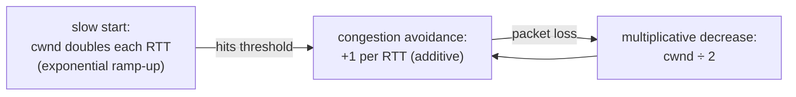

# Congestion control

> If every sender blasts data as fast as it can, the shared links in the middle overflow,
> routers drop packets, everyone retransmits, and the network collapses. **Congestion
> control** is how TCP senders *voluntarily* slow down to match what the network can
> actually carry — keeping the Internet from melting down under its own traffic.

## Top-down: where you already meet this
You're streaming a video and someone else on your Wi-Fi starts a huge download — and
*both* keep working, sharing the link roughly fairly, without any central traffic cop.
Nobody assigned you a speed. Each TCP connection *figured out on its own* how fast to go by
watching for signs of congestion. That self-restraint, multiplied across billions of flows,
is what lets a network with no central controller stay stable. It's the deepest idea in
[TCP](./tcp.md), so it gets its own doc.

## Problem
The network's capacity is **shared and unknown**. No sender is told "you may use 8 Mbps."
If senders are too cautious, links sit idle (wasted capacity). If they're too aggressive,
router queues fill, packets drop, retransmissions pile on *more* traffic, and you get
**congestion collapse** — the 1986 Internet event where throughput fell ~1000× as everyone
retransmitted into an already-jammed network. We need every sender to independently find the
*right* rate and share fairly, using only local signals.

## Core concepts

**The key signal: loss means congestion.** On a wired network, packets are rarely lost to
corruption — they're lost because a **router's queue overflowed**. So TCP treats **packet
loss (a missing ACK) as the network saying "slow down."** Newer algorithms also watch
**rising delay** (queues filling) as an earlier warning.

**The congestion window (cwnd).** Alongside the receiver's flow-control window, the sender
keeps its *own* limit — `cwnd` — its estimate of how much data the *network* can hold in
flight. The actual amount it may send is `min(cwnd, receive window)`. Congestion control is
the set of rules for growing and shrinking `cwnd`.

**AIMD — the core algorithm.** *Additive Increase, Multiplicative Decrease*:
- **No loss?** Grow `cwnd` slowly — **+1** segment per round-trip. (Probe for more bandwidth.)
- **Loss?** Cut `cwnd` **in half**. (Back off hard and fast.)

This "gently up, sharply down" rule is what makes TCP both *efficient* (creeps up to use
spare capacity) and *fair* (competing flows converge toward an equal share). Plotted over
time it makes the famous **sawtooth**:

**The phases of a TCP flow:**

| Phase | What `cwnd` does | Why |
| --- | --- | --- |
| **Slow start** | *Doubles* every RTT (exponential) | quickly find the rough ballpark from a cold start |
| **Congestion avoidance** | +1 per RTT (linear) | gently probe near the limit without overshooting |
| **Loss (timeout)** | reset to 1, slow-start again | severe signal — start over cautiously |
| **Loss (3 dup-ACKs)** | halve `cwnd`, continue (fast recovery) | mild signal — one packet lost, network mostly fine |

("Slow start" is a misnomer — it ramps up *fast*; it just *starts* small.)

**Fairness.** Because every flow runs AIMD, if two share a bottleneck, the one using more
gets cut by a bigger absolute amount on loss, so they converge toward equal shares. This
emergent fairness — no coordination needed — is why the shared Internet works at all.

**Modern algorithms** tune this trade-off:

| Algorithm | Signal it uses | Note |
| --- | --- | --- |
| **Reno / NewReno** | loss | the classic AIMD sawtooth |
| **CUBIC** | loss (cubic growth curve) | Linux default; better on high-speed long links |
| **BBR** (Google) | *bandwidth + RTT*, not loss | models the pipe directly; great on lossy/wireless links, used on YouTube |

## Essential terminology

| Term | Meaning |
| --- | --- |
| **Congestion** | More traffic offered to a link than it can carry → router queues fill & drop. |
| **Congestion collapse** | Throughput crashing as retransmissions flood an already-jammed network. |
| **cwnd** | Congestion window — the sender's estimate of safe in-flight data. |
| **AIMD** | Additive-increase / multiplicative-decrease — grow slowly, cut hard. |
| **Slow start** | Initial exponential ramp-up of `cwnd` from a small value. |
| **Congestion avoidance** | Linear (+1/RTT) growth once near the estimated limit. |
| **Sawtooth** | The up-ramp / halving pattern of `cwnd` over time. |
| **Bottleneck** | The slowest link on the path; where the queue forms. |
| **Bufferbloat** | Over-large router buffers that hide loss but add huge latency. |
| **Fairness** | Competing flows converging on roughly equal shares of a bottleneck. |

## Example
Why a single TCP flow can't instantly use a fast link — the slow-start ramp. Starting at
`cwnd = 10` segments (~14 KB) on a 50 ms RTT path, doubling each round-trip:

| RTT (≈50 ms each) | cwnd (segments) | ~data in flight |
| --- | --- | --- |
| 0 | 10 | 14 KB |
| 1 | 20 | 29 KB |
| 2 | 40 | 58 KB |
| 3 | 80 | 116 KB |
| 4 | 160 | 232 KB |

It takes several round-trips (~250 ms here) just to *ramp up* to full speed — which is why,
combined with the handshake RTTs, **short connections never reach their link's full
bandwidth**, and why connection reuse and CDNs matter so much. Watch `cwnd` evolve live with
`ss -ti` during a download.

## Common tools
| Tool | What it is | Use it for |
| --- | --- | --- |
| `ss -ti` | Per-socket TCP info | watching `cwnd`, RTT, retransmits in real time |
| `iperf3` | Throughput tester | comparing CUBIC vs BBR throughput |
| `sysctl net.ipv4.tcp_congestion_control` | Kernel setting | seeing/changing the algorithm (e.g. to `bbr`) |
| `tc` (traffic control) | Link emulator | injecting loss/delay to *watch* congestion control react |
| Wireshark I/O graphs | Visualization | plotting the throughput sawtooth |

## Trade-offs
- ✅ Keeps a decentralized, shared network **stable and roughly fair** with no central control.
- ✅ Adapts automatically to whatever capacity is available.
- ⚠️ **Loss-based control misreads wireless:** on Wi-Fi/cellular, loss often means
  *interference*, not congestion — so TCP needlessly slows down (BBR was built to fix this).
- ⚠️ **Latency vs throughput tension:** filling buffers maximizes throughput but adds delay
  (bufferbloat); algorithms must balance both.
- ⚠️ **Slow ramp-up** penalizes short flows — they finish before reaching full speed.
- ⚠️ Fairness assumes everyone plays by the rules; a non-congestion-controlled UDP flood can
  crowd out well-behaved TCP.

## Real-world examples
- **CUBIC** is the default on Linux/Android — the reason your downloads ramp and share fairly.
- **BBR** powers **YouTube and Google.com**, delivering more throughput on lossy mobile links
  by modeling the pipe instead of reacting to loss.
- **Bufferbloat** is why a big upload can make your *ping* spike and video calls stutter —
  the fix (`fq_codel`, smarter queue management) ships in modern routers.
- **QUIC** implements congestion control in user space, so services can deploy improvements
  without waiting for OS kernels to update.

## References
- Kurose & Ross, *Top-Down Approach* — Ch. 3.6–3.7 (congestion control, TCP CC)
- Van Jacobson, *Congestion Avoidance and Control* (1988) — the founding paper
- [BBR: Congestion-Based Congestion Control (Google, ACM Queue)](https://queue.acm.org/detail.cfm?id=3022184)
- [Bufferbloat.net](https://www.bufferbloat.net/)
