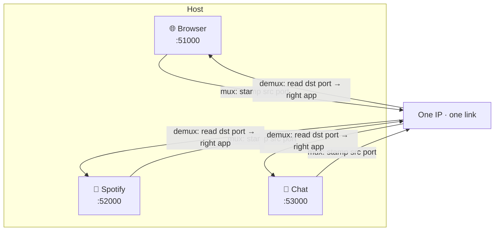

# Ports, sockets & multiplexing (and UDP)

> The network layer gets a packet to the right *machine*; the transport layer gets it to
> the right *program* on that machine — using **port numbers**. This doc covers that
> "last mile" of delivery (multiplexing), the **socket** abstraction programs use, and
> **UDP**, the bare-minimum transport.

## Top-down: where you already meet this
Your laptop runs a browser, Spotify, a chat app, and 40 background services — all sharing
*one* [IP address](../network-layer/ip-addressing.md) and one Wi-Fi link. When a packet
arrives, how does the OS know it's the reply for *Spotify* and not the browser? That's the
transport layer's job, and the answer is **ports**. We've descended one layer: the
application above hands down a message; transport must label it so the matching program on
the far end receives it.

## Problem
[IP](../network-layer/ip-addressing.md) delivers packets to a *host*, but a host runs many
programs at once. We need a way to (a) **demultiplex** incoming packets to the correct
program, and (b) give applications a simple handle to send/receive without thinking about
packets. And sometimes apps want *nothing extra* (no reliability, no setup) — just "send
this datagram, now." That minimal service is **UDP**.

## Core concepts

**Ports identify the program.** A **port** is a 16-bit number (0–65535) that labels one end
of a conversation within a host. Combined with the IP, it pinpoints a specific program:
- **Server side:** programs *listen* on well-known ports — web = **80**/**443**, DNS = 53,
  SSH = 22, Postgres = 5432.
- **Client side:** the OS assigns a random high **ephemeral port** (e.g. 51000) per
  connection.

**Multiplexing & demultiplexing.** *Mux* (sending side): the transport layer gathers data
from many programs and stamps each with its source port. *Demux* (receiving side): it reads
the destination port and hands the payload to the matching program.



**The 4-tuple identifies a connection.** A TCP connection is uniquely named by
`(source IP, source port, dest IP, dest port)`. That's why your browser can hold *several*
connections to the same server (port 443) at once — each has a different source port, so
the tuples differ.

**Sockets — the programmer's handle.** A **socket** is the API the OS gives an application
to use the network: create one, `bind` it to a port, then `send`/`recv`. It's the same idea
as a file descriptor — you read and write it. This single abstraction hides everything
below; see the [TCP sockets lab](../../3-practice/lab-tcp-sockets.md).

**Two transports to choose from:** TCP and UDP sit at the same layer but offer opposite
deals.

| | **UDP** | **TCP** |
| --- | --- | --- |
| Connection? | No — just fire datagrams | Yes — handshake first |
| Reliable? | ❌ may drop/dup/reorder | ✅ retransmits, in-order |
| Ordered? | ❌ | ✅ |
| Speed/overhead | Minimal (8-byte header) | More (handshake, ACKs, 20-byte header) |
| Flow/congestion control | ❌ | ✅ |
| Good for | DNS, video/voice, games, QUIC | web, email, files, APIs |

**UDP — the minimalist.** UDP adds almost nothing to IP: just source/dest ports and a
checksum. No handshake, no retransmission, no ordering. Why would you want *less*? Because
for some apps, **late data is worse than lost data**: in a voice call, a packet that's 2
seconds late is useless — better to skip it and keep talking. UDP gives apps the raw
ability to build *exactly* the reliability they want (and nothing they don't). It's also
why [DNS](../application-layer/dns.md) uses UDP — one tiny request, one tiny reply, no need
to set up a connection.

**The UDP header is famously tiny — 8 bytes:**
```
+------------+------------+----------+----------+
| Src Port   | Dst Port   | Length   | Checksum |
|  (2 bytes) |  (2 bytes) | (2 bytes)| (2 bytes)|
+------------+------------+----------+----------+
| ... payload (your data) ...                   |
```

## Essential terminology

| Term | Meaning |
| --- | --- |
| **Port** | 16-bit number identifying a program's endpoint on a host. |
| **Well-known port** | Standard port for a service (80 http, 443 https, 53 DNS, 22 SSH). |
| **Ephemeral port** | Temporary high port the OS picks for a client connection. |
| **Socket** | The OS handle an app uses to send/receive on the network. |
| **Multiplexing / demultiplexing** | Combining many apps' data onto the wire / splitting it back by port. |
| **Datagram** | A single, self-contained UDP message (no connection, no ordering). |
| **4-tuple** | `(srcIP, srcPort, dstIP, dstPort)` — uniquely names one connection. |
| **Checksum** | A small value letting the receiver detect corrupted bits. |

## Example
See what's listening and connected on your own machine:
```console
$ ss -tulnp        # t=tcp u=udp l=listening n=numeric p=process
Netid State   Local Address:Port   Process
tcp   LISTEN  0.0.0.0:443          nginx        ← web server waiting on 443
tcp   LISTEN  127.0.0.1:5432       postgres     ← DB, localhost only
udp   UNCONN  0.0.0.0:53           dnsmasq      ← DNS on UDP 53
tcp   ESTAB   192.168.1.5:51000  →  93.184.216.34:443   ← your active browser tab
```
That last line *is* a 4-tuple: your ephemeral port 51000 ↔ the server's 443. Open a second
tab to the same site and you'll see a second line with a *different* source port.

## Common tools
| Tool | What it is | Use it for |
| --- | --- | --- |
| `ss` / `netstat` | Socket listers | seeing listening ports & live connections |
| `nc` (netcat) | Raw TCP/UDP swiss-army knife | manually sending/receiving on any port |
| `lsof -i` | Open network files | which process owns which port |
| `dig` | DNS tool | a real-world UDP-based request to watch |
| Python `socket` | Sockets API | writing your own client/server (the lab) |

## Trade-offs
- ✅ Ports let one host run unlimited services and connections simultaneously — simple and
  scalable demux.
- ✅ **UDP**: lowest latency, no setup cost, full app control — ideal for real-time & tiny
  request/reply.
- ⚠️ **UDP**: *you* must handle loss, ordering, and congestion if you need them — and a
  naive UDP app can flood the network (no congestion control).
- ⚠️ Ports are a finite 16-bit space; a busy server/NAT can run low on ephemeral ports.

## Real-world examples
- **DNS, DHCP, VoIP, online games, and video streaming** lean on UDP for speed.
- **QUIC / HTTP/3** is built on UDP, then re-adds reliability + encryption in user space —
  precisely to get UDP's freedom without TCP's constraints. See [TCP](./tcp.md).
- **`:443` vs `:80`** in a URL is you choosing a port; load balancers route by port (L4).
- **NAT** (your home router) rewrites *ports* to let many devices share one public IP — see
  [NAT](../network-layer/nat-and-dhcp.md).

## References
- Kurose & Ross, *Top-Down Approach* — Ch. 3.1–3.3 (mux/demux, UDP)
- [MDN — TCP vs UDP overview](https://developer.mozilla.org/en-US/docs/Glossary/TCP)
- RFC 768 — UDP (one of the shortest RFCs ever, ~3 pages)
- [Beej's Guide to Network Programming](https://beej.us/guide/bgnet/) — the friendly sockets bible
