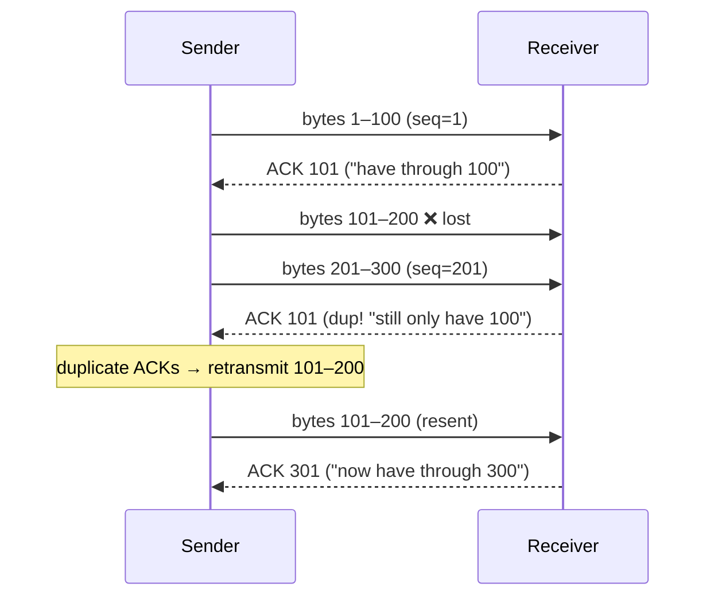

# TCP — reliable, ordered byte streams

> TCP takes the network's unreliable, best-effort packet delivery and builds on top of it
> the illusion every app loves: a **reliable, in-order stream of bytes** between two
> programs, as if they were connected by a private wire. It does this with a handshake,
> sequence numbers, acknowledgements, retransmission, and flow control.

## Top-down: where you already meet this
[HTTP](../application-layer/http.md) just writes `GET /index.html` and trusts that the
exact bytes arrive, in order, with nothing missing — even though the
[network layer](../network-layer/ip-addressing.md) underneath openly drops, duplicates, and
reorders packets. That trust is TCP. It's the workhorse beneath the web, email, SSH, and
most APIs. We've descended another layer: UDP gave us "deliver to the right program";
TCP adds "and make it actually reliable."

## Problem
IP gives **best-effort** delivery: packets can be lost (a router's buffer was full),
duplicated, corrupted, or arrive out of order. But applications want to send a megabyte and
have *exactly that megabyte* come out the other end, in order. Bridging that gap — turning
a lossy packet network into a reliable byte stream — without overwhelming the receiver or
the network, is TCP's entire job.

## Core concepts

**1 · The connection & the 3-way handshake.** Unlike UDP, TCP is **connection-oriented**:
both sides set up shared state (sequence numbers, buffers) before any data flows. It takes
three packets:

```mermaid
sequenceDiagram
    participant C as Client
    participant S as Server
    C->>S: SYN (seq=x)            — "let's talk; my numbering starts at x"
    S-->>C: SYN-ACK (seq=y, ack=x+1) — "ok; mine starts at y; got your x"
    C->>S: ACK (ack=y+1)          — "got your y; we're connected"
    Note over C,S: connection ESTABLISHED — data can flow
```
This costs **1 RTT** before the first byte of data — one of the round-trips you pay on
[every cold web request](../fundamentals/web-request-end-to-end.md). Closing is a similar
4-way `FIN`/`ACK` exchange.

**2 · Sequence numbers & ACKs = reliability + ordering.** TCP numbers every **byte** it
sends. The receiver returns **ACKs** ("I've now got everything up through byte N"). This one
mechanism delivers both guarantees:
- **Ordering:** the receiver buffers out-of-order bytes and only hands the app a contiguous
  stream, in order.
- **Reliability:** if the sender doesn't get an ACK before a **timeout** (or sees 3
  duplicate ACKs — a sign a packet was skipped), it **retransmits** the missing data.



**3 · A byte stream, not messages.** TCP gives you a *stream* — there are no message
boundaries. If you `send("hello")` then `send("world")`, the receiver might `recv("hellow")`
then `recv("orld")`. The app must frame its own messages (HTTP uses `Content-Length`,
newlines, etc.). This trips up beginners constantly: **TCP delivers bytes, not packets or
messages.**

**4 · Flow control — don't drown the receiver.** Every ACK also advertises a **receive
window**: "I have room for N more bytes right now." The sender never sends more unACKed data
than that window, so a fast sender can't overflow a slow receiver's buffer. This is
*receiver* protection.

**5 · Congestion control — don't drown the network.** Separately, TCP probes how much the
*network* can take and backs off when it sees loss. That's a big topic on its own — see
[congestion control](./congestion-control.md). Flow control protects the *peer*; congestion
control protects the *network* between you.

**Head-of-line (HOL) blocking — TCP's Achilles heel.** Because TCP guarantees in-order
delivery of *one* stream, a single lost packet stalls **everything** behind it until it's
retransmitted — even data that already arrived. When HTTP/2 multiplexes many requests over
one TCP connection, one lost packet freezes *all* of them. This is exactly why **HTTP/3 /
QUIC** abandoned TCP for [UDP](./ports-and-udp.md) and rebuilt reliability per-stream.

## Essential terminology

| Term | Meaning |
| --- | --- |
| **Connection-oriented** | State is set up (handshake) before data; torn down after. |
| **3-way handshake** | SYN → SYN-ACK → ACK; opens a connection in 1 RTT. |
| **Sequence number** | Per-byte counter that lets the receiver order & detect gaps. |
| **ACK** | "I've received everything up to byte N." |
| **Retransmission** | Re-sending data that wasn't ACKed (timeout or 3 dup-ACKs). |
| **Byte stream** | TCP delivers an ordered stream of bytes, *not* discrete messages. |
| **Flow control** | Receiver-advertised window stopping the sender from overrunning it. |
| **Receive window (rwnd)** | How much buffer space the receiver currently has free. |
| **Head-of-line blocking** | One lost packet stalls all later in-order data behind it. |
| **RTT** | Round-trip time; TCP estimates it to set retransmission timeouts. |

## Example
Watch the handshake yourself — `curl` to any site while capturing
(see the [handshake lab](../../3-practice/lab-tcp-handshake.md)):
```console
$ sudo tcpdump -n 'tcp and host example.com'
… > 93.184.216.34.443: Flags [S],  seq 1001              ← SYN     (client → server)
… > 192.168.1.5.51000:  Flags [S.], seq 5001, ack 1002   ← SYN-ACK (server → client)
… > 93.184.216.34.443: Flags [.],  ack 5002              ← ACK     (client → server)
… > 93.184.216.34.443: Flags [P.], seq 1002, …           ← first data (the TLS/HTTP)
```
Three control packets, *then* data — the 1-RTT setup tax, made visible. The `[S]` is SYN,
`[.]` is a bare ACK, `[P.]` is data being pushed.

## Common tools
| Tool | What it is | Use it for |
| --- | --- | --- |
| `tcpdump` / Wireshark | Packet capture | seeing SYN/ACK/retransmits, window sizes |
| `ss -ti` | Socket stats | live RTT, window, retransmit counts per connection |
| `curl -v` | HTTP client | observing connection setup timing |
| `iperf3` | Throughput tester | measuring TCP throughput & tuning windows |
| `tcp_info` (Linux) | Kernel TCP metrics | per-socket congestion window, RTT, losses |

## Trade-offs
- ✅ **Rock-solid abstraction:** apps get a reliable, ordered stream and ignore the messy
  network — enormous simplification.
- ✅ **Self-tuning:** flow + congestion control adapt to receiver and network conditions.
- ⚠️ **Setup latency:** the handshake costs a round-trip before any data (HTTP/3 fixes this).
- ⚠️ **Head-of-line blocking:** one loss stalls the whole stream — bad for multiplexed or
  real-time traffic.
- ⚠️ **Not for real-time:** the retransmit-and-wait model means late data, which voice/video
  don't want — they use [UDP](./ports-and-udp.md) instead.
- ⚠️ **State & memory:** every connection holds buffers; servers with millions of connections
  feel it.

## Real-world examples
- **HTTP(S), SSH, SMTP, database protocols** — nearly everything that must not lose data
  runs on TCP.
- **`curl`'s "connecting…" pause** on a slow site is the handshake RTT you're watching.
- **HTTP/3 / QUIC** (Google, Cloudflare, Meta) replaced TCP precisely to kill its handshake
  latency and head-of-line blocking on mobile networks.
- **SYN floods** — a classic DoS attack — abuse the handshake by sending SYNs and never
  finishing, exhausting server state (mitigated by SYN cookies).

## References
- Kurose & Ross, *Top-Down Approach* — Ch. 3.4–3.5 (reliable transfer, TCP)
- [The TCP/IP Guide — TCP](http://www.tcpipguide.com/free/t_TCPIPTransmissionControlProtocolTCP.htm)
- RFC 9293 — TCP (the consolidated spec)
- [High Performance Browser Networking — Building Blocks of TCP](https://hpbn.co/building-blocks-of-tcp/)
