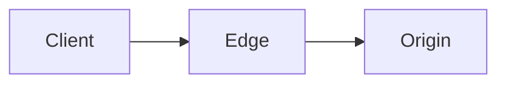

# <System / Scenario Title>

> One-sentence description of the real system or scenario and what it teaches.

## The scenario
What real-world situation are we tracing end-to-end? Why is it interesting?

## Requirements
What must this system achieve (latency, scale, reliability)?

## How it works — end to end
The path a request/packet takes, layer by layer, with a diagram.

## Deep dives
The two or three mechanisms that make it work, each in detail. Link back to the
relevant [knowledge docs](../1-knowledge/).

## Trade-offs & failure modes
- ✅ What this design buys.
- ⚠️ Where it breaks, and how that's mitigated.

## References
- [Link](https://example.com)
