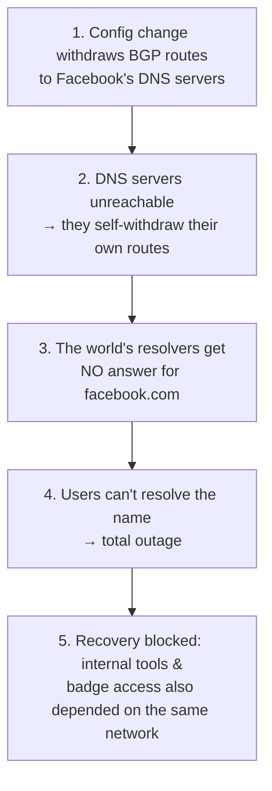

# Anatomy of a real outage (BGP & DNS)

> The most memorable way to understand [routing](../1-knowledge/network-layer/routing-and-forwarding.md)
> and [DNS](../1-knowledge/application-layer/dns.md) is to watch them *fail*. This case study
> dissects the kind of cascading outage that has repeatedly taken large parts of the Internet
> offline — and shows why the culprits are almost always the two protocols that quietly hold
> everything together: **BGP** and **DNS**.

## The scenario
On October 4, 2021, Facebook, Instagram, and WhatsApp vanished from the Internet for ~6 hours —
not because their servers crashed, but because of a routing mistake. We trace the chain of
events as a worked example of how a single change at the **network layer** can erase a company
from the Internet, and why recovery was so hard. (The specifics are drawn from the public
post-mortem; the mechanics generalize to many outages.)

## Requirements (what *should* have happened)
For users to reach `facebook.com`, two things must work continuously:
1. **DNS** must resolve the name → an IP ([DNS doc](../1-knowledge/application-layer/dns.md)).
2. **BGP** must advertise routes so packets can *reach* those IPs
   ([routing doc](../1-knowledge/network-layer/routing-and-forwarding.md)).

Break either and the service is unreachable even if every server is healthy.

## How it failed — end to end

### Step 1 — A BGP withdrawal
A routine maintenance command unintentionally caused Facebook's routers to **withdraw the
[BGP](../1-knowledge/network-layer/routing-and-forwarding.md) announcements** for the prefixes
that included its authoritative **DNS** servers. BGP is how an
[Autonomous System](../1-knowledge/network-layer/routing-and-forwarding.md) tells the rest of
the Internet "you can reach these IP blocks through me." Withdraw the announcement and, as far
as every other network is concerned, **those addresses no longer exist on the Internet.**

### Step 2 — The DNS servers disappeared
Facebook's DNS servers had a safety mechanism: if they lost their own connectivity to the
backbone, they'd *stop advertising their routes* (assuming they were unhealthy). The BGP
withdrawal triggered exactly this — so the DNS servers, which were *fine*, took themselves
further off the map. Now nothing could even reach them to ask a question.

### Step 3–4 — Resolution fails everywhere
Every [recursive resolver](../1-knowledge/application-layer/dns.md) on Earth that tried to look
up `facebook.com` got **no response** — there was no reachable authoritative server. Cached
answers expired after their [TTL](../1-knowledge/application-layer/dns.md), and after that, the
name simply didn't resolve. To users, Facebook was *gone*: not "slow," not "error 500" — the
name didn't turn into an address at all. (A side effect: the world's resolvers **retried
relentlessly**, hammering DNS infrastructure globally and degrading *other* sites.)

### Step 5 — Recovery was the hard part
The fix — re-advertise the routes — was simple in theory. But Facebook's *internal* tools,
remote access, and even physical **badge systems** ran on the same network that was now
unreachable. Engineers couldn't log in remotely to fix it and had to physically reach hardened
data-center hardware. **The blast radius included the tools needed to recover** — the classic
deepest failure mode.

## Deep dives

**Why BGP is this powerful (and dangerous).** BGP is built on **trust** and
[announcements](../1-knowledge/network-layer/routing-and-forwarding.md): a network's routes
exist because it *says* they do. Withdraw the statement and reachability evaporates globally in
seconds. The same trust enables **route hijacks** (announcing prefixes you don't own) and
**route leaks** — e.g. the 2008 incident where Pakistan accidentally blackholed YouTube
worldwide by announcing a more specific prefix. Defenses (RPKI route signing) are still rolling
out.

**Why DNS is a single point of failure.** Everything starts with a name lookup, so DNS sits on
the critical path of *every* request. When it fails, healthy servers are invisible. The 2016
**Dyn** DDoS (which knocked out Twitter, Spotify, Reddit by attacking a DNS provider) is the
same lesson from the attacker's side. [TTLs and caching](../1-knowledge/application-layer/dns.md)
both help (cached names survive briefly) and hurt (stale/negative answers linger).

**The cascade pattern.** Note the shape: a [network-layer](../1-knowledge/fundamentals/protocol-layers.md)
change broke the [application-layer](../1-knowledge/application-layer/dns.md) service, which
broke *user* reachability, which broke *recovery*. Outages are rarely one failure — they're a
dependency chain crossing layers, which is exactly why
[layered debugging](../1-knowledge/fundamentals/protocol-layers.md) ("which layer is actually
broken?") is a core skill.

## Trade-offs & failure modes — the lessons
- ⚠️ **Don't co-locate your DNS and your reachability:** if the path to your nameservers can be
  withdrawn by the same change that breaks everything else, you lose your safety net. Spread
  authoritative DNS across independent networks/providers.
- ⚠️ **Beware self-protective automation:** the DNS servers' "withdraw routes if unhealthy" rule
  *amplified* the failure. Safety mechanisms need blast-radius limits.
- ⚠️ **Keep an out-of-band recovery path:** recovery tooling must not depend on the system it
  recovers. Plan for "the network is down and so are the tools."
- ⚠️ **TTLs are a tuning knob for blast radius:** short TTLs speed recovery but increase load;
  long TTLs cushion outages but slow propagation.
- ✅ **The flip side:** these same mechanisms (BGP's flexibility, DNS's indirection) are exactly
  what make the Internet adaptable and [CDNs](./cdn.md)/failover possible. The power and the
  danger are the same property.

## See it yourself
- `dig facebook.com` and watch the TTL — imagine it expiring with no server to refresh it.
- Explore live BGP at [bgp.tools](https://bgp.tools) or a route "looking glass": see which AS
  announces a prefix, and what a withdrawal would mean.
- Re-read [routing & forwarding](../1-knowledge/network-layer/routing-and-forwarding.md) and
  [DNS](../1-knowledge/application-layer/dns.md) — this outage is those two docs, failing together.

## References
- [Cloudflare's analysis of the Oct 2021 Facebook outage](https://blog.cloudflare.com/october-2021-facebook-outage/)
- [Facebook's own post-mortem](https://engineering.fb.com/2021/10/05/networking-traffic/outage-details/)
- [The 2016 Dyn DNS DDoS](https://www.cloudflare.com/learning/ddos/famous-ddos-attacks/)
- [Routing & forwarding](../1-knowledge/network-layer/routing-and-forwarding.md) ·
  [DNS](../1-knowledge/application-layer/dns.md)
