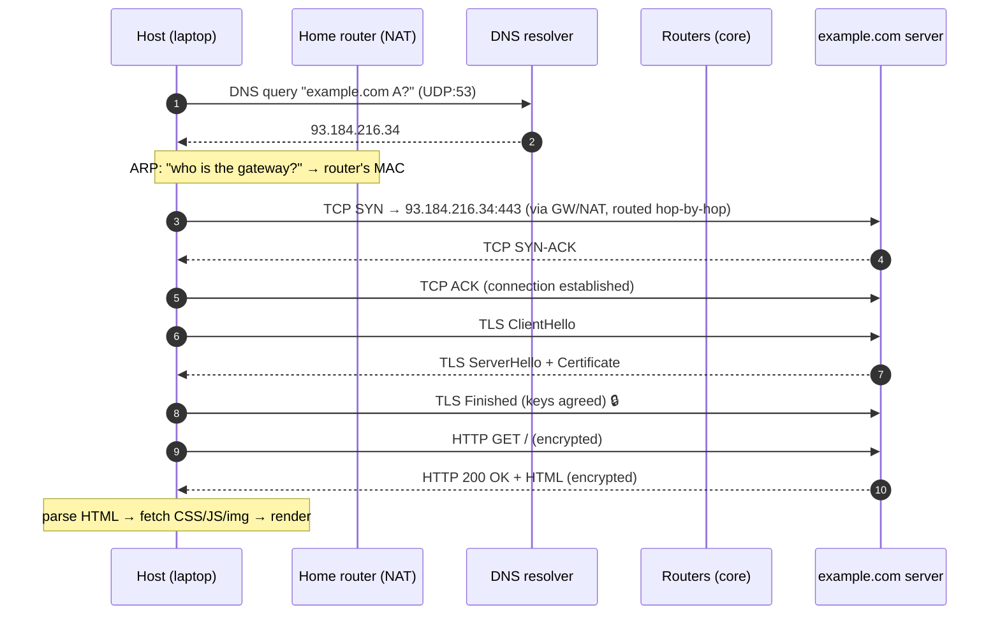

# Loading `https://example.com` — every layer, every packet

> The [end-to-end knowledge doc](../1-knowledge/fundamentals/web-request-end-to-end.md) gave
> the *shape* of a web request. This case study walks the **same journey at packet depth** —
> the actual bytes, ports, and headers, with every [layer](../1-knowledge/fundamentals/protocol-layers.md)
> made explicit — and counts exactly where the milliseconds go. It's the capstone that turns
> all 17 knowledge docs into one continuous story.

## The scenario
You're on a laptop, on home Wi-Fi, nothing cached. You type `https://example.com` and press
Enter. We follow every packet from your network card to the server and back, naming the
protocol at each step. By the end you'll be able to answer the famous interview question —
"what happens when you load a web page?" — at any depth the interviewer pushes to.

## Requirements
Deliver a remote HTML file to the browser **correctly** (no corruption, in order),
**securely** (encrypted, authenticated), and **fast** (minimize round-trips). Across networks
you don't control, with no pre-arrangement.

## How it works — end to end

### Step 1 — Find the address ([DNS](../1-knowledge/application-layer/dns.md), ~0–20 ms)
The browser needs an IP. The OS sends a **DNS query** for `example.com` to its configured
resolver — a tiny [UDP](../1-knowledge/transport-layer/ports-and-udp.md) packet to port **53**.
If cached anywhere (browser → OS → resolver), the answer `93.184.216.34` returns in
microseconds; if cold, the resolver walks root → `.com` → authoritative. **One small UDP
round-trip (or zero).**

### Step 2 — Leave the house ([ARP](../1-knowledge/link-layer/ethernet-and-arp.md) + [NAT](../1-knowledge/network-layer/nat-and-dhcp.md))
`93.184.216.34` isn't on your [subnet](../1-knowledge/network-layer/ip-addressing.md), so the OS
decides: *send it to the default gateway*. But it needs the gateway's **MAC** — so it
**ARP**-broadcasts "who has `192.168.1.1`?" and caches the reply. Now it can build the
[Ethernet frame](../1-knowledge/link-layer/ethernet-and-arp.md). As the packet leaves the home
router, **NAT** rewrites the source from your private `192.168.1.5:51000` to the router's public
IP + a port, and records the mapping.

### Step 3 — Build the reliable pipe ([TCP](../1-knowledge/transport-layer/tcp.md), 1 RTT)
The browser opens TCP to `93.184.216.34:443`: **SYN → SYN-ACK → ACK**. Each packet is
[encapsulated](../1-knowledge/fundamentals/protocol-layers.md) — `[Eth | IP | TCP]` — and
[routed hop-by-hop](../1-knowledge/network-layer/routing-and-forwarding.md) across a dozen
routers, each doing a longest-prefix lookup and **re-framing** for the next hop (the IP
addresses stay fixed; the MACs change every hop). One round-trip and the pipe is up.

### Step 4 — Make it private ([TLS](../1-knowledge/security/tls-https.md), 1 RTT)
Because it's `https`, a **TLS 1.3 handshake** runs over the TCP stream: ClientHello →
ServerHello + **Certificate** → Finished. The browser verifies the cert chains to a trusted CA
and that it's for `example.com`, then both derive a session key. ~1 round-trip; everything after
is encrypted.

### Step 5 — Ask for the page ([HTTP](../1-knowledge/application-layer/http.md), 1 RTT)
*Now*, inside the encrypted stream, the real request: `GET / HTTP/2`, `Host: example.com`. The
server replies `200 OK` + the HTML body.

### Step 6 — Render & repeat
The browser parses the HTML, finds `style.css`, `app.js`, images — and issues **more HTTP
requests**, reusing the same TCP/TLS connection (HTTP/2 multiplexes them). As bytes arrive the
page paints.

## Deep dive — where did the time go?

For a **cold** load at 50 ms RTT, the round-trips serialize:

| Phase | RTTs | ~Time | Knowledge doc |
| --- | --- | --- | --- |
| DNS | ~1 (often 0) | 0–50 ms | [DNS](../1-knowledge/application-layer/dns.md) |
| TCP handshake | 1 | 50 ms | [TCP](../1-knowledge/transport-layer/tcp.md) |
| TLS handshake | 1 | 50 ms | [TLS](../1-knowledge/security/tls-https.md) |
| HTTP request/response | 1 | 50 ms | [HTTP](../1-knowledge/application-layer/http.md) |
| **Before first byte of HTML** | **~3–4** | **~150–200 ms** | [latency math](../1-knowledge/fundamentals/latency-bandwidth-throughput.md) |

The lesson stares back at you: it's **almost all latency, almost no bandwidth** — four
serialized round-trips before a single content byte. That's exactly why the industry deploys:
- **[CDNs](./cdn.md)** — shrink the RTT itself (server a few ms away).
- **HTTP/3 / QUIC** — fold TCP+TLS into one handshake, 0-RTT on repeat visits.
- **Connection reuse & caching** — skip steps 1–4 entirely next time.

## Trade-offs & failure modes
- ✅ The layered hand-off means each step is independently cacheable/optimizable.
- ⚠️ Serialized handshakes make **latency**, not bandwidth, the bottleneck for first loads.
- ⚠️ So many caches (DNS, connection, HTTP) → "why is it stale?" is a classic layered bug.
- ⚠️ Any single layer can break the whole load: a bad DNS answer, an expired
  [certificate](../1-knowledge/security/tls-https.md), a [routing](../1-knowledge/network-layer/routing-and-forwarding.md)
  blackhole, or a [NAT](../1-knowledge/network-layer/nat-and-dhcp.md)/firewall block — which is
  why debugging means asking *which layer*.

## See it yourself
- Run the [curl-https lab](../3-practice/lab-curl-https.md) — its `-w` timing output *is* the
  table above, for real.
- Capture the handshakes with the [TCP handshake lab](../3-practice/lab-tcp-handshake.md).
- `traceroute example.com` ([traceroute lab](../3-practice/lab-traceroute.md)) to watch step 3's
  hops.

## References
- [End-to-end web request (knowledge)](../1-knowledge/fundamentals/web-request-end-to-end.md)
- [What happens when… (the famous writeup)](https://github.com/alex/what-happens-when)
- [High Performance Browser Networking](https://hpbn.co/)
