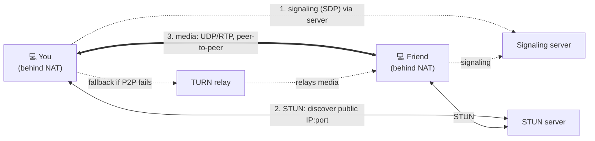

# A video call over a flaky network (WebRTC)

> A live video call is the opposite of loading a web page. The web wants **perfect, complete**
> data and will wait for it; a call wants **timely** data and will happily throw some away.
> This case study traces a WebRTC call to show why real-time media chooses
> [UDP](../1-knowledge/transport-layer/ports-and-udp.md) over [TCP](../1-knowledge/transport-layer/tcp.md),
> how two laptops behind [NATs](../1-knowledge/network-layer/nat-and-dhcp.md) ever connect, and
> how the call survives packet loss and jitter.

## The scenario
You start a browser video call with a friend on the other side of the country, both on home
Wi-Fi behind home routers. Their face and voice must reach you with ~150 ms of "mouth-to-ear"
delay or it feels broken — while packets drop and latency wobbles the whole time. How does the
network deliver *acceptable live media* over a best-effort Internet that guarantees nothing?

## Requirements
- **Low, stable latency** — interactivity dies past ~200 ms; **jitter** must be smoothed.
- **Loss tolerance** — a late packet is useless, so prefer dropping it to waiting.
- **Peer-to-peer if possible** — route media directly between the two users to cut delay.
- **Work through NAT/firewalls** — neither laptop has a public address.

## How it works — end to end

### Step 1 — Signaling (the introduction)
Before any media, the peers must exchange "here's how to reach me and what codecs I support."
This **signaling** (often over [WebSockets](../1-knowledge/application-layer/other-protocols.md))
carries **SDP** descriptions through a server. *Signaling is not the media path* — it's just the
introduction; the media will flow directly.

### Step 2 — NAT traversal (the hard part)
Both laptops are [behind NAT](../1-knowledge/network-layer/nat-and-dhcp.md) with only private
addresses — neither can be *reached* from outside by default. **ICE** coordinates the fix:
- **STUN** — each peer asks a STUN server "what public IP:port do I look like from outside?"
  (NAT assigned one when the STUN packet went out). They swap these candidates via signaling.
- **Hole punching** — both peers send packets to each other's discovered public IP:port
  *simultaneously*, so each one's NAT sees the outbound packet and opens a mapping that lets the
  other's packets in. Now a direct path exists.
- **TURN (fallback)** — if hole punching fails (strict/symmetric NATs), media is **relayed**
  through a public TURN server. Reliable, but adds a hop and latency, so it's last resort.

This dance is why a "TURN relay" line item shows up in every real-time architecture — see
[NAT & DHCP](../1-knowledge/network-layer/nat-and-dhcp.md).

### Step 3 — Media over UDP/RTP (why not TCP)
Now the audio/video flows **peer-to-peer over [UDP](../1-knowledge/transport-layer/ports-and-udp.md)**,
using **RTP** (Real-time Transport Protocol) for timestamped, sequenced media packets. Why not
TCP? Because TCP's [reliability is the wrong trade](../1-knowledge/transport-layer/tcp.md): if a
packet is lost, TCP **stalls everything to retransmit it** ([head-of-line blocking](../1-knowledge/transport-layer/tcp.md)) —
and by the time the resend arrives, that video frame is already in the past. **Late data is
worse than lost data.** UDP lets the app *choose* to skip the lost packet and keep going.

## Deep dives

**Surviving loss — concealment, not retransmission.** Instead of waiting for resends, the
receiver hides gaps: audio codecs interpolate over a missing 20 ms; video shows the last frame
or briefly blurs until the next **keyframe**. Senders add **FEC** (forward error correction —
redundant data so some loss is recoverable without asking) and **adaptive bitrate** (drop video
quality when [throughput](../1-knowledge/fundamentals/latency-bandwidth-throughput.md) falls).
This is congestion control reimagined for media: react to loss by **lowering quality**, not by
stalling.

**Smoothing jitter — the jitter buffer.** Packets arrive with variable delay
([jitter](../1-knowledge/fundamentals/latency-bandwidth-throughput.md)) and even out of order.
The receiver holds a small **jitter buffer** (tens of ms) to reorder and release media at a
steady cadence. Bigger buffer = smoother but more delay; smaller = snappier but choppier — a
direct latency-vs-quality dial the app tunes live.

**It's all encrypted.** WebRTC mandates **DTLS** (TLS for UDP) to exchange keys and **SRTP** to
encrypt the media — so even peer-to-peer media is private, the same authentication-and-encryption
principles as [TLS](../1-knowledge/security/tls-https.md), adapted to UDP.

## Trade-offs & failure modes
- ✅ **Low latency & interactivity** by using UDP and concealing loss instead of retransmitting.
- ✅ **Peer-to-peer** cuts delay and server cost when NAT traversal succeeds.
- ⚠️ **TURN relay fallback** adds latency and server bandwidth — and a chunk of calls need it.
- ⚠️ **Quality degrades under load** (blocky video, robotic audio) — by design; it trades
  fidelity for timeliness.
- ⚠️ **NAT traversal is fragile:** symmetric NATs, strict firewalls, and corporate networks
  often force TURN or block UDP entirely (some apps then tunnel media over TCP/443 as a last
  resort — accepting the head-of-line penalty to get through).
- ⚠️ **Scaling many participants** P2P explodes connections (N×N), so group calls use a central
  **SFU** (media router) instead of full mesh.

## See it yourself
- In a browser call, open `chrome://webrtc-internals` to watch live RTP stats: packets lost,
  jitter, bitrate adapting in real time.
- Use the [traceroute lab](../3-practice/lab-traceroute.md) to compare the path to a TURN server
  vs your peer.
- Recall the [UDP vs TCP table](../1-knowledge/transport-layer/ports-and-udp.md) — this case
  study is that trade-off, lived.

## References
- [Ports & UDP](../1-knowledge/transport-layer/ports-and-udp.md) ·
  [NAT traversal](../1-knowledge/network-layer/nat-and-dhcp.md)
- [WebRTC overview (MDN)](https://developer.mozilla.org/en-US/docs/Web/API/WebRTC_API)
- [How NAT traversal works (Tailscale)](https://tailscale.com/blog/how-nat-traversal-works/)
- RFC 8825 (WebRTC), RFC 5389 (STUN), RFC 8656 (TURN), RFC 3550 (RTP)
