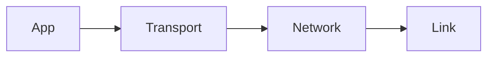

# <Topic Title>

> One-sentence summary of what this topic is about.

## Top-down: where you already meet this
Start from something the reader already does (open a site, send a message) and pull
the thread down to *this* concept. Why does the layer above need it?

## Problem
What problem does this part of the network solve? Why does it matter?

## Core concepts
The key ideas. Add a diagram where it helps:

## Essential terminology
Define the words a beginner needs before they can read anything else on this topic.

| Term | Meaning |
| --- | --- |
| ... | ... |

## Example
A concrete, minimal example — a packet trace, a `dig`/`curl` output, a worked
calculation — that makes the concept click.

## Common tools
| Tool | What it is | Use it for |
| --- | --- | --- |
| `tool` | ... | ... |

## Trade-offs
- ✅ Pros
- ⚠️ Cons
- When it applies / when it doesn't

## Real-world examples
How the real Internet (browsers, ISPs, big services) applies this in practice.

## References
- [Link](https://example.com)
