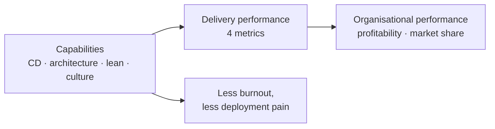

# Accelerate

> Nicole Forsgren, Jez Humble & Gene Kim, 2018. The book that made "does this
> practice actually help?" an empirical question.

<!--
  Provenance: this summary is a machine-written distillation, not the author's
  words and not reviewed by them. It is a map, and a map is wrong in the places
  that matter most. Check anything you are about to bet on against the book.
-->

| | |
| --- | --- |
| **Authors** | Nicole Forsgren, Jez Humble, Gene Kim |
| **Published** | 2018 (the basis of the annual State of DevOps / DORA reports) |
| **Shape** | ~250 pages: findings, then the research method, then a case study |
| **Read it for** | Four metrics, and a list of capabilities that predict them |
| **Skip it if** | You will not tolerate survey-based research. Part II exists to argue with you. |

## The argument in one paragraph

Across four years and tens of thousands of survey responses, software delivery
performance can be measured by a small number of outcomes, and high performers
are **not** trading speed for stability — they get both, and the gap compounds.
What predicts performance is a set of **capabilities** (technical, process,
cultural) that can be adopted deliberately: continuous delivery, loosely
coupled architecture, trunk-based development, monitoring, and a culture that
treats failure as information. Delivery performance in turn predicts
organisational performance — profitability, market share, productivity.

## The four key metrics (DORA)

| Metric | Question | Elite, roughly |
| --- | --- | --- |
| **Deployment frequency** | How often do you ship? | On demand, many times a day |
| **Lead time for changes** | Commit to running in production? | Less than an hour |
| **Time to restore service** | How fast after an incident? | Less than an hour |
| **Change failure rate** | What share of changes cause a problem? | 0–15% |

The first two are **throughput**, the last two are **stability**, and the
central empirical finding is that they move *together*. (A fifth, reliability,
was added in later DORA reports.)

## The capabilities that predict it

**Continuous delivery.** Version control for everything including
infrastructure, deployment automation, trunk-based development (short-lived
branches, merged daily), continuous integration, test automation with
*developers* owning the tests, shifting security left, and a deployment
pipeline that gives fast feedback.

**Architecture.** The strongest architectural finding: what matters is not
microservices versus monolith but whether teams can **test and deploy
independently** of other teams — loosely coupled, and empowered to choose
their own tools.

**Product and lean.** Small batches, visible work, customer feedback gathered
and acted on, and teams able to change specifications without approval from
outside.

**Culture.** Using Westrum's typology, **generative** cultures — high
cooperation, messengers trained not shot, failure leading to enquiry — predict
delivery performance and organisational outcomes. Bureaucracy is not the same
as documentation: rules that clarify responsibility help, rules that protect
departments do not.

**Lean management and monitoring.** Lightweight change approval (peer review
beats an external change-advisory board — the CAB result is one of the book's
sharpest findings), WIP limits, monitoring that informs business decisions, and
proactive notification.

## Ideas worth stealing

| Idea | What it means | Where it bites |
| --- | --- | --- |
| **Speed and stability go together** | The trade-off is a false one | "We can't deploy often, we need quality" |
| **Four metrics** | A small dashboard everyone can agree on | Velocity points as a proxy for value |
| **Deploy independence is the architecture test** | Not service count | Microservices released in lockstep |
| **Trunk-based development** | Short-lived branches, merged daily | A three-week feature branch and a merge day |
| **External CAB doesn't help** | Peer review does; approval boards add delay, not safety | A weekly change board |
| **Westrum generative culture** | Information flows; failure prompts enquiry | Blame, and incidents that go unreported |
| **Burnout is structural** | Deployment pain predicts it | Fixing people rather than the process |
| **Measure outcomes, not output** | Throughput and stability, not lines or hours | Counting commits |

## The criticism worth knowing

The data is **self-reported survey data** from a self-selected population, and
the analysis is structural equation modelling on latent constructs, so the
causal claims are contested — Part II is an unusually good defence of the
method, but it remains correlational at heart. The metrics are also easy to
game: deployment frequency rises quickly if you slice deploys thinner, and
"elite" became a marketing badge. Later DORA reports revised several findings
(including adding reliability and softening some cluster boundaries), so treat
the 2018 numbers as a snapshot rather than a standard.

Used well, though, the four metrics do something rare: they give engineers and
executives one small set of numbers that neither side can dismiss.

## How to read it

Part I is the findings — read it all, it is short. Read Part II if you intend
to quote the book at someone who will push back on method. Then read the
current year's DORA report, because the capability list has moved on.

## Where it touches this knowledge base

- [Continuous integration](../devops-infrastructure/1-knowledge/ci-cd/continuous-integration.md) · [Continuous delivery and deployment](../devops-infrastructure/1-knowledge/ci-cd/continuous-delivery-deployment.md)
- [What is DevOps](../devops-infrastructure/1-knowledge/fundamentals/what-is-devops.md) · [Environments and release flow](../devops-infrastructure/1-knowledge/fundamentals/environments-and-release-flow.md)
- [Git and workflows](../best-practices/1-knowledge/version-control/git-and-workflows.md) — trunk-based development, concretely
- [SRE and reliability](../devops-infrastructure/1-knowledge/observability/sre-reliability.md) — where the fifth metric went
- [Monolith vs microservices](../system-design/1-knowledge/patterns/monolith-vs-microservices.md) — the deploy-independence finding

## If you liked this

[Team Topologies](../book-team-topologies/README.md) is the structural companion, and
[Site Reliability Engineering](../book-site-reliability-engineering/README.md)
is where the stability half of the metrics gets its mechanism.
