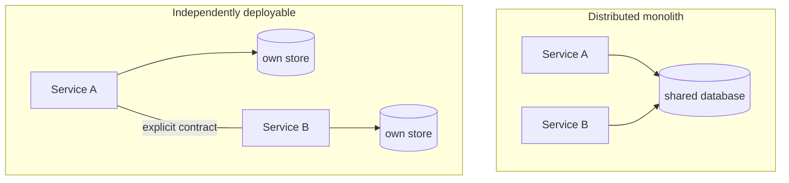

# Building Microservices

> Sam Newman, 2015 — 2nd edition 2021. The unusual architecture book that
> spends most of its length on what the style costs you.

<!--
  Provenance: this summary is a machine-written distillation, not the author's
  words and not reviewed by them. It is a map, and a map is wrong in the places
  that matter most. Check anything you are about to bet on against the book.
-->

| | |
| --- | --- |
| **Author** | Sam Newman |
| **Editions** | 1st, 2015 · 2nd, 2021 (much more on data, testing, and "should you?") |
| **Shape** | ~600 pages in the 2nd edition |
| **Read it for** | An honest bill of costs, and the patterns that pay them down |
| **Skip it if** | You are looking for permission. The book mostly advises waiting. |

## The argument in one paragraph

Microservices are **independently deployable services modelled around a
business domain**. The benefit is independent deployability and team autonomy;
the price is that every in-process call you replace becomes a network call that
can be slow, fail, or half-succeed, and every consistent transaction becomes a
distributed one. The style is worth it when organisational scale demands
autonomous teams — and the second edition is blunt that for most teams a
**well-modularised monolith is the right first answer**.

## Where the boundaries come from

Straight out of Evans: a service per **bounded context**, sized by business
capability rather than by technical layer or by lines of code. The tests
Newman offers for a good boundary:

- **High cohesion** — things that change together live together.
- **Loose coupling** — you can deploy one without deploying the others. If you
  cannot, you have a distributed monolith, which is strictly worse than a
  monolith.
- **Information hiding** — the service's database is private, always. Shared
  databases are the single most common way the whole thing fails.

## Communication, and the choice that shapes everything

| Style | Examples | Buys you | Costs you |
| --- | --- | --- | --- |
| Synchronous request/response | REST, gRPC | Simplicity, easy reasoning | Temporal coupling, cascading failure, latency addition |
| Asynchronous event-driven | Broker, event streams | Decoupling, elasticity | Harder debugging, eventual consistency, choreography sprawl |

Newman's practical position: default to whatever your team can operate, prefer
events where the coupling actually hurts, and never let "async" mean "nobody
owns the workflow". Orchestration (a visible coordinator, often a saga) is
easier to reason about than choreography at scale, even though choreography is
more fashionable.

## Data, which is the hard part

Splitting the database is harder than splitting the code and gets a large share
of the second edition: shared tables to be untangled, foreign keys that must
become API calls, reporting that no longer has a single place to join, and
**sagas** replacing distributed transactions — with compensating actions,
because rollback no longer exists. The migration patterns (strangler fig,
parallel run, change data capture, branch by abstraction) are the most
practically useful pages in the book.

## Operating them

- **Deployment** — one service per container, independent pipelines, and a
  platform is not optional past a handful of services.
- **Progressive delivery** — feature flags, canaries, blue/green; separating
  deployment from release is the mechanism that makes frequent deploys safe.
- **Testing** — the pyramid stretches: end-to-end tests across services become
  slow and flaky, so push toward **consumer-driven contract testing**, plus
  testing in production (synthetics, smoke tests) rather than pretending a full
  integration environment can exist.
- **Observability** — logs, metrics, and distributed tracing with correlation
  IDs; "which service caused this?" is a question a monolith never asks.
- **Resilience** — timeouts on everything, circuit breakers, bulkheads,
  back-pressure, idempotent retries. Newman leans on Nygard here; see
  [Release It!](../book-release-it/README.md).
- **Security** — the network is no longer a trust boundary; identity has to
  propagate.

## Conway's law, which is the real argument

Architecture and organisation mirror each other, so a service boundary that
cuts across team boundaries will be eroded. The *inverse Conway manoeuvre* —
shape teams to the architecture you want — is a central recommendation, and the
reason this book and [Team Topologies](../book-team-topologies/README.md) are
usually read together.

## Ideas worth stealing

| Idea | What it means | Where it bites |
| --- | --- | --- |
| **Independent deployability is the test** | If you deploy together, you're a monolith with latency | Coordinated release trains |
| **A service owns its data** | No shared schema, ever | The "just read our table" shortcut |
| **Start with a monolith** | Extract when a real pressure appears | Twelve services and four engineers |
| **Contract tests over E2E** | Verify the promise, not the universe | A flaky pipeline nobody trusts |
| **Sagas, not transactions** | Compensate, don't roll back | A distributed two-phase commit |
| **Strangler fig** | Migrate incrementally behind a facade | The 18-month rewrite |
| **Inverse Conway** | Change the org chart to get the architecture | Boundaries that dissolve under pressure |

## What has aged, and what hasn't

The first edition arrived at the peak of the hype and was read selectively as
encouragement; the second edition reads like a correction, and is the one to
read. Some tooling detail dates fast (service meshes, in particular, moved
after publication). The fundamentals — boundaries from the domain, private
data, independent deployment, and the operational bill — have not moved at all,
because they follow from the network, not from fashion.

## How to read it

Second edition. Chapters on modelling boundaries, splitting the monolith, and
the data chapters are the core. If you are deciding whether to adopt the style
at all, read the "should I?" material and the migration patterns first, and be
honest about whether you have the platform and on-call capacity the rest of the
book assumes.

## Where it touches this knowledge base

- [Monolith vs microservices](../system-design/1-knowledge/patterns/monolith-vs-microservices.md)
- [Saga](../system-design/1-knowledge/patterns/saga.md) · [Event-driven](../system-design/1-knowledge/patterns/event-driven.md) · [Resilience patterns](../system-design/1-knowledge/patterns/resilience-patterns.md)
- [Service networking and load balancing](../devops-infrastructure/1-knowledge/containers/service-networking-load-balancing.md) · [Kubernetes](../devops-infrastructure/1-knowledge/containers/kubernetes.md)
- [Observability](../system-design/1-knowledge/reliability/observability.md)
- [Why distributed is hard](../distributed-systems/1-knowledge/fundamentals/why-distributed-is-hard.md) — the physics underneath the advice

## If you liked this

[Domain-Driven Design](../book-domain-driven-design/README.md) for the boundaries,
[Release It!](../book-release-it/README.md) for the failure modes, and
[Team Topologies](../book-team-topologies/README.md) for the organisation that
has to run them.
