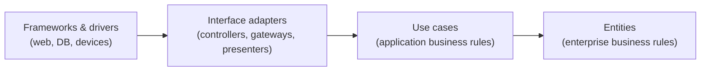

# Clean Architecture

> Robert C. Martin, 2017. One rule — source-code dependencies point inward,
> toward policy — stated at book length, with the SOLID principles rebuilt on
> top of it.

<!--
  Provenance: this summary is a machine-written distillation, not the author's
  words and not reviewed by them. It is a map, and a map is wrong in the places
  that matter most. Check anything you are about to bet on against the book.
-->

| | |
| --- | --- |
| **Author** | Robert C. Martin |
| **Published** | 2017 |
| **Shape** | ~400 pages of short chapters; a lot of them are history |
| **Read it for** | The dependency rule, and component-level cohesion/coupling principles |
| **Read it with** | Scepticism about the diagram — the layers are a sketch, not a spec |

## The argument in one paragraph

The goal of architecture is to **minimise the human cost of change** — to keep
options open for as long as possible. Everything that can vary (the database,
the web framework, the UI, the message broker) is a **detail**; the business
rules are not. So structure the system in concentric circles and enforce one
rule: **source code dependencies may only point inward**. Details depend on
policy; policy knows nothing about details. When they must communicate outward,
invert the dependency with an interface owned by the inner circle.

The arrow direction is the whole book. Crossing inward is a call; crossing
outward is an interface the inner layer defines and the outer layer implements.

## The three levels of the argument

**Paradigms as restrictions.** Structured programming took away `goto`,
object-orientation took away unrestricted function pointers, functional
programming took away assignment. Each paradigm *removes* power, and
architecture is built from what is left: structured programming gives you
decomposability, OO gives you safe polymorphism — hence plugin architectures —
and immutability makes concurrency tractable.

**SOLID, at the class level.** Single Responsibility (restated precisely:
*a module should have one reason to change, meaning one actor it answers to* —
which is a much better rule than "do one thing"), Open–Closed, Liskov
Substitution, Interface Segregation, Dependency Inversion. Martin's own
framing: SOLID's purpose is to produce mid-level structures that tolerate
change and are separable into components.

**Component principles, at the level above classes.** The most underrated
chapters in the book:

| Cohesion | |
| --- | --- |
| **REP** — Release/Reuse Equivalence | The unit of reuse is the unit of release |
| **CCP** — Common Closure | Classes that change together belong together |
| **CRP** — Common Reuse | Classes used together belong together; don't force users to depend on what they don't use |

| Coupling | |
| --- | --- |
| **ADP** — Acyclic Dependencies | No cycles in the component graph; break them with DIP or a new component |
| **SDP** — Stable Dependencies | Depend in the direction of stability |
| **SAP** — Stable Abstractions | A stable component should be abstract; an unstable one concrete |

REP, CCP, and CRP pull against each other — that tension is the point, and
"which corner of this triangle are we on?" is one of the more useful questions
you can ask about a module layout.

## Ideas worth stealing

| Idea | What it means | Where it bites |
| --- | --- | --- |
| **The dependency rule** | Source dependencies point at policy | `import psycopg2` inside a pricing rule |
| **The database is a detail** | Persistence is an implementation choice, deferred | A schema designed before anyone knew the rules |
| **The web is a delivery mechanism** | HTTP is an adapter, not the application | Business logic inside controllers |
| **Humble Object** | Split hard-to-test edges into a thin shell plus testable logic | Untestable view/controller code |
| **Boundaries cost, so draw few** | Every boundary is machinery | A hexagon-shaped CRUD app with nine ports |
| **Screaming architecture** | The top-level folders should say what the system does, not which framework it uses | `controllers/ models/ services/` |
| **Component cycles** | Break them or the build order owns you | The "utils" package everything depends on |

## What has aged, and what hasn't

Roughly a third of the book is autobiography and 1970s–90s systems, which is
charming and skippable. The famous circle diagram is routinely over-applied:
teams build four layers of DTOs and mapping code for an application whose
business rules would fit in a page, and then blame "clean architecture" for the
ceremony. Martin does say boundaries are expensive and should be deferred — but
that caution is a paragraph and the diagram is a poster.

The durable parts are the dependency rule (the same insight as hexagonal
architecture and ports-and-adapters, with clearer reasoning about *why* the
arrow direction matters), the precise restatement of SRP, and the component
cohesion and coupling principles, which are still the best short treatment of
how to package code above the class level.

## How to read it

Skim parts I–II. Read the SOLID chapters (especially SRP and DIP), read part
IV on component principles carefully — it is the most original material — then
part V's chapters on boundaries, the humble object, and screaming
architecture. Ignore the case study at the end unless you enjoy period detail.

## Where it touches this knowledge base

- [Layered, hexagonal, clean](../architecture-patterns/1-knowledge/architectural-styles/layered-hexagonal-clean.md)
- [SOLID principles](../architecture-patterns/1-knowledge/fundamentals/solid-principles.md)
- [Dependency injection](../architecture-patterns/1-knowledge/architectural-styles/dependency-injection.md) — the mechanism the rule needs
- [Refactoring to hexagonal](../architecture-patterns/2-case-studies/refactoring-to-hexagonal.md) — the same move, done on real code
- [Coupling and cohesion](../architecture-patterns/1-knowledge/fundamentals/coupling-and-cohesion.md)

## If you liked this

[Domain-Driven Design](../book-domain-driven-design/README.md) tells you where to draw the
boundaries this book tells you how to cross. *Fundamentals of Software
Architecture* — the distilled edition is
[here](../book-fundamentals-of-architecture/README.md) — is the broader,
trade-off-first treatment of the same subject.
