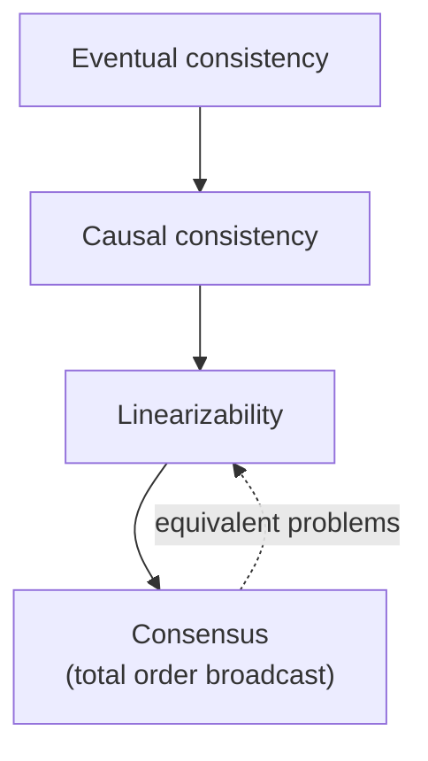

# Designing Data-Intensive Applications

> Martin Kleppmann, 2017. The rare book that is both the best introduction and
> the best reference for its subject. If you read one book on this shelf, this
> one.

<!--
  Provenance: this summary is a machine-written distillation, not the author's
  words and not reviewed by them. It is a map, and a map is wrong in the places
  that matter most. Check anything you are about to bet on against the book.
-->

| | |
| --- | --- |
| **Author** | Martin Kleppmann |
| **Published** | 2017 (a second edition has been in progress) |
| **Shape** | ~550 pages, three parts, with references that are half the value |
| **Read it for** | Understanding what your database actually promises, and what it cannot |
| **Skip it if** | Nothing you build stores anything. Otherwise, no excuse. |

## The argument in one paragraph

Most systems are limited by **data**, not compute — by how it is stored,
queried, replicated, and kept consistent under failure. There is no
general-purpose right answer, only a space of trade-offs with names, and the
job is knowing the space: what a log-structured store is good at, what
replication lag does to your users, why "consistency" means four different
things, and which guarantees survive a network partition. The book's three
recurring questions are **reliability, scalability, and maintainability**.

## Part I — Foundations of data systems

- **Reliability, scalability, maintainability** — defined usefully. Scalability
  is not a property, it is a question: "if load grows this way, what do we do?"
  And load is described by parameters, with **percentile latency** (p95, p99,
  tail amplification) rather than averages.
- **Data models** — relational, document, graph. The object-relational mismatch,
  when document stores win (one-to-many, locality) and when they lose (many-to-
  many, joins), and why the schema debate is really *schema-on-write* vs
  *schema-on-read*.
- **Storage and retrieval** — the chapter that changes how you read a database
  manual. **B-trees vs LSM-trees**: in-place update versus append-and-compact,
  read amplification versus write amplification, and why your write-heavy
  workload might want an LSM engine. Then OLTP versus OLAP, column-oriented
  storage, and compression.
- **Encoding and evolution** — JSON, Protocol Buffers, Avro, Thrift, and the
  thing that actually matters: **backward and forward compatibility**, because
  during a rolling deploy both versions run at once.

## Part II — Distributed data

- **Replication** — single-leader, multi-leader, leaderless. Replication lag and
  the guarantees you need to hide it: read-your-writes, monotonic reads,
  consistent prefix reads. Quorums, and why `w + r > n` is not as strong as it
  looks.
- **Partitioning** — by key range or by hash, secondary indexes local vs
  global, rebalancing, and request routing.
- **Transactions** — the best short treatment of isolation levels anywhere.
  Read committed, snapshot isolation (and how MVCC implements it), and the
  anomalies: dirty reads, non-repeatable reads, lost updates, **write skew**,
  and phantoms. Serializability, and the three ways to get it: literal serial
  execution, two-phase locking, and serializable snapshot isolation.
- **The trouble with distributed systems** — partial failure, unbounded delays,
  unreliable clocks, process pauses, and why **you cannot trust a timestamp**.
  Fencing tokens as the fix for a lease-holder that went to sleep.
- **Consistency and consensus** — linearizability (what "strong consistency"
  usually means, and its cost), causality and total order broadcast, CAP stated
  precisely enough to stop being a slogan, and consensus as the primitive
  underneath leader election, locks, and uniqueness constraints.

## Part III — Derived data

Batch processing (MapReduce and its successors, and why the Unix philosophy is
the right analogy), stream processing (event logs, change data capture, windows,
exactly-once as an end-to-end property rather than a checkbox), and the closing
argument: **unbundling the database** — treating logs, indexes, caches, and
search as derived views of a stream of facts, which is also the intellectual
case for event sourcing and CQRS.

## Ideas worth stealing

| Idea | What it means | Where it bites |
| --- | --- | --- |
| **Percentiles, not averages** | Tail latency is the user experience | A p50 dashboard while p99 times out |
| **LSM vs B-tree** | Write amplification vs read amplification | Choosing a store by popularity |
| **Compatibility both ways** | Old and new code run simultaneously | A deploy that requires ordering |
| **Replication lag anomalies** | Read-your-writes must be designed | "I saved it and it vanished" |
| **Write skew** | Snapshot isolation is not serializable | Two doctors both going off-call |
| **Don't trust clocks** | Wall-clock ordering is not ordering | Last-write-wins silently dropping data |
| **Fencing tokens** | Leases need monotonic proof | A paused process resuming with a stale lock |
| **Exactly-once is end-to-end** | Idempotence plus deduplication, not a flag | A retried payment |
| **Derived data** | Indexes, caches, and search are views of a log | Dual writes that drift apart |

## What has aged, and what hasn't

The concepts have not aged; the product landscape has. Kafka, Spark, and the
NoSQL market moved on after 2017, cloud-native stores (Spanner-likes,
serverless OLAP, object-storage-backed engines) got much more common, and the
book barely mentions them. Read the product examples as illustrations of
mechanisms, not as a buyer's guide.

The bibliography is an underrated feature: nearly every claim links to the
paper, so the book doubles as a reading list for the whole field.

## How to read it

Slowly, and in order — the parts build. Chapters 5 (replication), 7
(transactions), 8 (the trouble with distributed systems) and 9 (consistency and
consensus) are the heart; if you are short on time, read those four and the
storage chapter. Do the exercises in your head against a system you operate:
"what does *our* store do on a partition?" is the question that makes it stick.

## Where it touches this knowledge base

- [Replication](../system-design/1-knowledge/data-storage/replication.md) · [Sharding](../system-design/1-knowledge/data-storage/sharding.md) · [Indexing](../system-design/1-knowledge/data-storage/indexing.md)
- [Consistency models](../system-design/1-knowledge/fundamentals/consistency-models.md) · [CAP theorem](../system-design/1-knowledge/fundamentals/cap-theorem.md)
- [Quorums and replication](../distributed-systems/1-knowledge/replication/quorums-and-replication.md) · [Logical clocks](../distributed-systems/1-knowledge/time-order/logical-clocks.md) · [Consensus and Raft](../distributed-systems/1-knowledge/consensus/consensus-and-raft.md)
- [Eventual consistency and CRDTs](../distributed-systems/1-knowledge/replication/eventual-consistency-crdts.md)
- [CQRS and event sourcing](../system-design/1-knowledge/patterns/cqrs-event-sourcing.md) — part III, applied

## If you liked this

[Database Internals](../book-database-internals/README.md) goes one level deeper into
storage and cluster protocols. The papers in the bibliography — Dynamo,
Spanner, Raft — are covered as case studies in
[Distributed Systems](../distributed-systems/2-case-studies/README.md).
