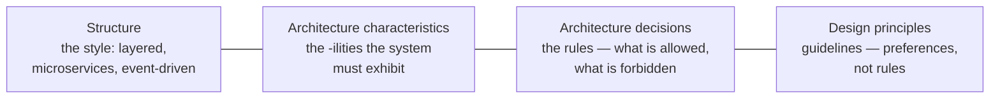
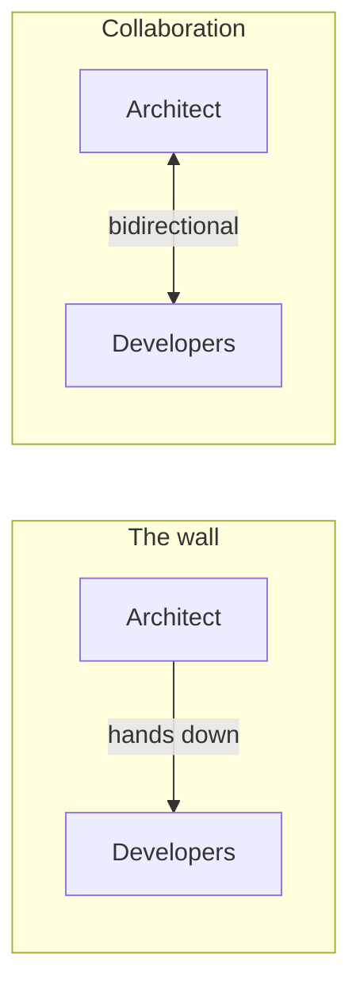

# What software architecture is

> No definition has ever stuck, because the job keeps moving. What *does* hold
> is a shape: architecture is the set of decisions that are expensive to
> reverse.

## Four things at once

Richards and Ford refuse a one-line definition and describe architecture as
four things considered together:

- **Structure** is only the style — "we are microservices" tells you the
  topology and nothing else.
- **Architecture characteristics** are what the system must *be*: available,
  scalable, auditable, testable. These are non-domain requirements, and they
  drive the structure more than the features do.
- **Architecture decisions** are rules with teeth: *only the business layer may
  talk to the database*. Break one and you have violated the architecture.
- **Design principles** are guidance without teeth: *prefer asynchronous
  messaging between services where the caller does not need an answer*. A team
  may reasonably deviate.

The distinction between the last two is worth internalising early: if
everything is a rule you get bureaucracy, and if everything is a preference you
get a big ball of mud. Decide which each statement is, and say so.

## Expectations of an architect

The book lists eight, and the interesting part is how few are technical:

1. **Make architecture decisions** — guide, rather than specify technology.
2. **Continually analyse the architecture** — it decays; check that it still
   matches the system and the business.
3. **Keep current with trends** — your decisions are long-lived, so the cost of
   being three years behind compounds.
4. **Ensure compliance with decisions** — a decision nobody enforces was a
   suggestion.
5. **Diverse exposure and experience** — breadth, not another year of the same
   stack.
6. **Have business domain knowledge** — without it you cannot tell which
   characteristics matter, and you cannot talk to the people who decide.
7. **Possess interpersonal skills** — most of the work is explaining, listening
   and negotiating.
8. **Understand and navigate politics** — nearly every architectural decision
   removes an option from someone. Expect to defend it.

## The two laws

> **First law of software architecture:** Everything in software architecture
> is a trade-off.

If you cannot state what a decision costs, you have not finished analysing it.
Its corollary is a good interview question to ask yourself: *if this looks like
a free win, what am I not seeing?* Usually the answer is operational cost,
cognitive load, or a coupling you have not named yet.

> **Second law:** *Why* is more important than *how*.

Anyone can read the code and reconstruct *how*. Nobody can reconstruct *why*,
and *why* is exactly what the next team needs in order to know whether the
decision still holds. This is the entire justification for
[architecture decision records](../4-practice/01-decisions-and-adrs.md).

## Architecture versus design, and why the line is fake

The traditional picture has architects deciding and developers implementing,
with a one-way wall between them. It does not work: architectural decisions
that never meet reality become fiction, and developers who do not know the
*why* route around the rules.

The practical test for whether something is "architecture" is not who decided
it but **how hard it is to change**. Choosing a message broker, a service
boundary, or a consistency model is architecture. Choosing a class hierarchy
inside one service is design. The border moves by context, and arguing about
where it sits is usually less useful than asking *how expensive is it to
reverse this?*

## Essential terminology

| Term | Meaning |
| --- | --- |
| **Architecture characteristic** | A non-domain requirement the system must exhibit ("-ility") |
| **Architecture decision** | A rule about structure that must be followed |
| **Design principle** | A guideline that should usually be followed |
| **Architecture style** | The overall topology: layered, microservices, event-driven, … |
| **Architecture pattern** | A lower-level, reusable arrangement within a style |
| **Trade-off** | What a decision costs — never zero |

## What to take away

- Architecture is structure **plus** characteristics **plus** decisions
  **plus** principles. Naming only the first is how teams end up with
  microservices that deliver nothing they wanted.
- Rules and preferences are different artifacts. Say which you are writing.
- Every decision costs something. Find the cost before someone else does.

---

Next: [Architectural thinking](./02-architectural-thinking.md)
