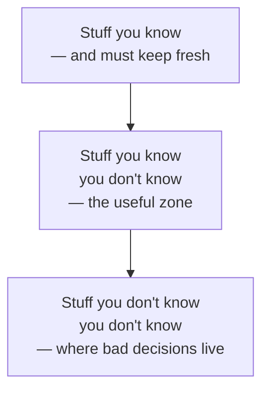
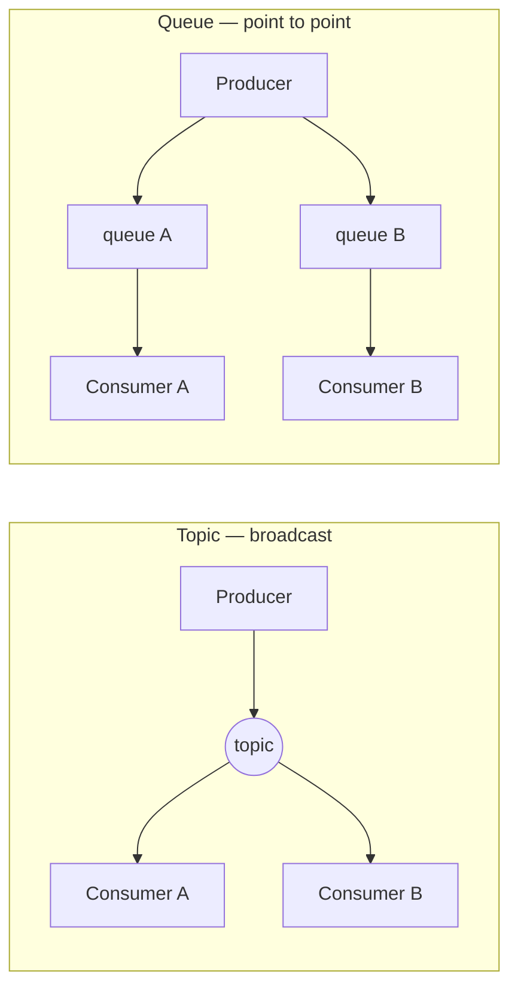

# Architectural thinking

> The shift is not "know more". It is: know *wider*, see the trade-off first,
> and stay close enough to the code that your decisions survive contact with
> it.

## Breadth beats depth

A developer is paid for **depth**: knowing one stack well enough to make it do
difficult things. An architect is paid for **breadth**: knowing that a dozen
things exist, roughly what each is for, and which ones are wrong here.

The pyramid has a maintenance cost that nobody warns you about: **the top is
perishable**. Everything you know deeply is decaying, and keeping it fresh eats
the time you need for widening the middle. The architect's move is deliberate:
let some depth go, and convert it into "I know that exists, and when it
applies".

The danger zone is the bottom. Decisions are not wrong because you chose badly
between two options — they are wrong because there was a third option you had
never heard of.

### The frozen caveman

The book names the behaviour that comes from letting one bad memory stand in
for analysis: the architect who reverts to the same pet irrational concern on
every system. The authors' example is a colleague who met every centralised
design with *"but what if we lose Italy?"* — because years earlier a freak
outage had cut headquarters off from its Italian stores, and the fear outlived
the odds.

Everyone has one. The tell is that the concern arrives before the requirements
do, at the same volume regardless of the system. The cure is the risk matrix
from [analysing risk](../4-practice/02-risk-and-fitness-functions.md): make
yourself put a *likelihood* next to the impact, and say the number out loud.

## Trade-off analysis, concretely

The book's teaching example is small enough to remember. Should a producer talk
to a consumer through a **queue** (point to point) or a **topic**
(publish/subscribe)?

| | Topic | Queue |
| --- | --- | --- |
| Adding a new consumer | Free — nobody changes | Producer must publish to another queue |
| Coupling | Producer is decoupled from consumers | Producer knows each consumer |
| Per-consumer contract | One contract for everybody | Contract can differ per consumer |
| Security / access control | Anyone subscribed sees everything | Per-queue permissions |
| Monitoring back-pressure | Harder — which subscriber is behind? | Easy — queue depth per consumer |
| Heterogeneous payloads | Hard | Natural |

Neither wins. That is the point: architectural thinking is the habit of
producing this table *before* having an opinion, and then choosing with the
cost stated out loud.

## Understanding business drivers

Characteristics like availability, scalability and auditability come from the
business, not from the code, and they arrive in business language — "we're
expanding into the EU", "we're acquiring three companies a year", "traffic is
seasonal". Translating those into
[architecture characteristics](../2-characteristics/01-architecture-characteristics.md)
is a core skill, and it requires knowing the domain and its vocabulary well
enough to hear the requirement inside the sentence.

## Stay hands-on

An architect who stops writing code stops getting feedback, and drifts into
decisions that are unimplementable, unfashionable, or simply wrong. But you
cannot be the bottleneck on the critical path. The compromise the book
recommends:

- **Don't own critical-path work.** If the release waits for you, you will be
  interrupted out of both jobs.
- **Do proofs of concept** — and write them as if they were production code,
  because somebody will ship them. This is also the best way to make a
  trade-off table honest.
- **Take the bug backlog and the technical debt stories.** You learn where the
  pain is, and the team gets time back.
- **Automate something.** Repetitive team pain is an architectural signal;
  automating it is both useful and diagnostic.
- **Do code reviews.** Not as a gate — as the cheapest way to see whether the
  architecture is being followed, and whether it deserves to be.
- **Practise deliberately.** Architecture katas: take a fictional system, pick
  characteristics, choose a style, defend it in fifteen minutes. This is the
  only way to get reps at a decision you otherwise make twice a year.

## What to take away

- Widen the middle of the pyramid; accept that some depth will rot.
- No decision is finished until you can state what it costs.
- Code enough to stay honest; never enough to become the bottleneck.

---

Previous: [What architecture is](./01-what-architecture-is.md) ·
Next: [Modularity and connascence](./03-modularity-and-connascence.md)
