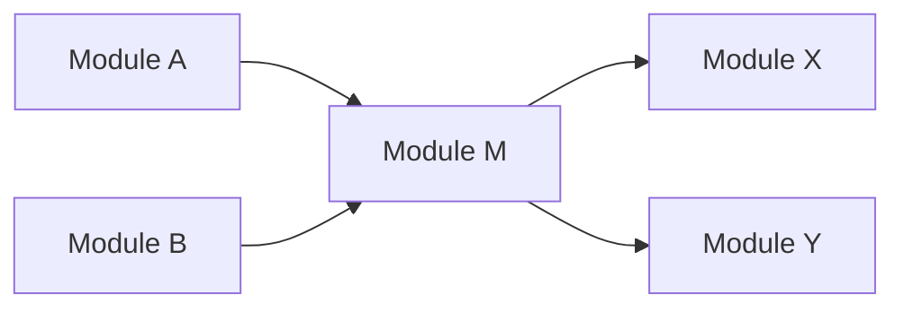
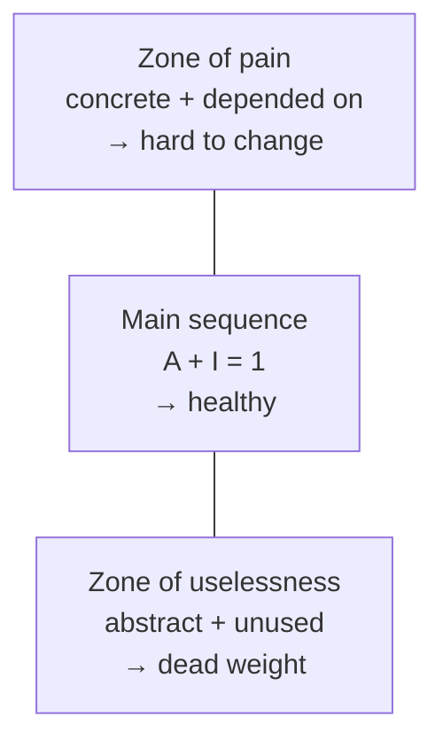

# Modularity and connascence

> "Coupling" and "cohesion" are the right ideas with imprecise names.
> Connascence is the same subject with enough vocabulary to end an argument.

## Why modularity is the measurable part

Architecture characteristics like maintainability, testability and
extensibility are not directly measurable — but they are all consequences of
how the code is divided. **Modularity is the proxy you can actually measure**,
which is why it gets a chapter before anything is built.

A *module* here means a logical grouping (a package, a namespace); a
[component](./04-components.md) is its physical packaging. Both can be measured.

## Cohesion and coupling

**Cohesion** — how much the parts of a module belong together. From best to
worst: functional (everything needed for one well-defined task), sequential
(one's output is the next's input), communicational (operating on the same
data), procedural (must run in order), temporal (related only by timing),
logical (related only by category — a `utils` package), coincidental (no
relationship at all).

**Coupling** — how much modules depend on each other. Two directions worth
naming, because the metrics use them:

- **Afferent coupling (Ca)** — incoming: who depends on me.
- **Efferent coupling (Ce)** — outgoing: who I depend on.

M has afferent coupling 2 and efferent coupling 2. High afferent coupling means
M is hard to change; high efferent coupling means M is easy to break.

## The derived metrics

| Metric | Formula | Reading |
| --- | --- | --- |
| **Abstractness** | abstract elements ÷ total elements | How much of this is interface versus implementation |
| **Instability** | *I* = Ce ÷ (Ce + Ca) | How likely it is to be forced to change |
| **Distance from the main sequence** | *D* = \|*A* + *I* − 1\| | How far from a healthy balance |

The main sequence is the line *A + I = 1*. Stable things should be abstract;
unstable things should be concrete. Two failure corners:

- **Zone of pain** (low abstractness, low instability): concrete code that
  everything depends on and nothing can change. A hand-rolled shared utility
  library, or a database schema used directly by twelve services.
- **Zone of uselessness** (high abstractness, high instability): elaborate
  abstraction nobody uses.

These are computable — there are tools for most language ecosystems — which
means they can be turned into
[fitness functions](../4-practice/02-risk-and-fitness-functions.md) that fail
the build when a module drifts.

## Connascence: the precise version

Meilir Page-Jones's idea, which the book adopts: two components are
**connascent** if changing one requires changing the other for the system to
remain correct. It splits into static (visible in the source) and dynamic
(only visible at runtime), and the entries are ordered from least to most
harmful.

**Static connascence**

| Kind | Meaning | Example |
| --- | --- | --- |
| **Name** | Both must agree on a name | A method called by name — the weakest and most acceptable |
| **Type** | Both must agree on a type | A shared parameter type |
| **Meaning** | Both must agree what a value means | `1` means "active" — fix with a named constant or enum |
| **Position** | Both must agree on order | Positional arguments; fix with named parameters or a value object |
| **Algorithm** | Both must use the same algorithm | Client and server hashing a password identically |

**Dynamic connascence** — worse, because the compiler cannot see it:

| Kind | Meaning | Example |
| --- | --- | --- |
| **Execution** | Order of execution matters | `open()` must precede `write()` |
| **Timing** | Timing of execution matters | A race between two threads |
| **Values** | Several values must change together | Latitude and longitude; an invariant across two tables |
| **Identity** | Both must reference the same instance | Two components sharing one queue object |

Three properties tell you what to do about any instance:

- **Strength** — how hard it is to refactor away. Prefer stronger forms to be
  converted into weaker ones: connascence of meaning → connascence of name by
  introducing an enum.
- **Locality** — the same connascence is much worse across a service boundary
  than inside one class. Proximity buys tolerance.
- **Degree** — how many places are affected. Connascence of position between
  two functions is trivial; between forty callers it is a migration.

The rules that follow: **minimise overall connascence; keep what remains
inside a boundary; and convert strong forms to weak ones.** That is a rule you
can apply in a code review in ten seconds, which is more than "reduce
coupling" ever gave you.

## What to take away

- Modularity is the measurable proxy for the qualities you actually want.
- Afferent coupling makes you rigid; efferent coupling makes you fragile.
- Connascence gives you the words: *kind*, *strength*, *locality*, *degree*.
  Use them instead of "this feels coupled".

---

Previous: [Architectural thinking](./02-architectural-thinking.md) ·
Next: [Components](./04-components.md)
