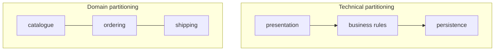
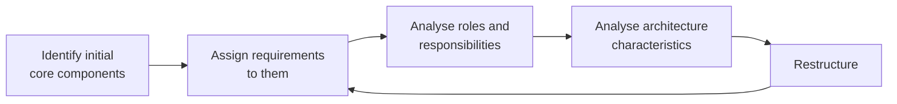

# Components

> A module is a logical grouping. A **component** is the physical thing you
> ship: a package, a library, a subsystem, a service. Architecture is mostly
> decided by where you put the component boundaries.

## The architect's job here

Identifying components — and their roles, responsibilities, and the
characteristics they must exhibit — is one of the few tasks that is
unambiguously the architect's. Everything below the boundary (classes,
functions, patterns) belongs to the developers.

## Two ways to partition, and you must pick one

**Technical partitioning** groups by *what kind of code it is* — the classic
layered arrangement. Separation of concerns is crisp, and the layers are a
clean place to enforce rules. The cost: any single business change touches
every layer, so the blast radius of a feature is the whole system, and no team
owns a domain.

**Domain partitioning** groups by *what part of the business it is*. A change
to ordering lives in ordering. This is what
[DDD](../../architecture-patterns/1-knowledge/architectural-styles/domain-driven-design.md) argues for, what
microservices assume, and — through Conway's law — what most cross-functional
teams naturally produce. The cost: technical concerns (persistence, auth) are
duplicated or must be factored into a shared platform, and the database is
usually harder to split than the code.

The book's practical position is that domain partitioning is the better default
for most modern systems, and that the choice should be conscious — a codebase
that is half one and half the other is the worst case.

## Finding components without falling in the trap

The identification loop is deliberately iterative:

**The entity trap** is the anti-pattern to watch for: creating one component
per database entity — `CustomerManager`, `OrderManager`, `ItemManager`. It
looks like a domain decomposition and is actually a table layout with an object
wrapped around it. The symptoms are a blizzard of "manager" components, no
alignment with any user's workflow, and a design that could have been generated
from the schema.

Better ways in:

- **Actor/actions** — identify who uses the system and what each of them does;
  components follow the actions. Works well when there are distinct roles.
- **Event storming** — gather the domain events the business cares about, then
  group them. Works well with domain-partitioned designs and DDD.
- **Workflow approach** — follow the business workflows end to end; components
  fall out of the steps.

## Granularity

The hardest question, and the one with no formula. Two forces pull opposite
ways:

| Toward fewer, larger components | Toward more, smaller components |
| --- | --- |
| Simpler deployment and testing | Independent deployability |
| Fewer network calls, easier transactions | Independent scaling |
| Lower cognitive load per change | Smaller blast radius |
| Easier data consistency | Team autonomy |

Signals that a component should be split: it has more than one reason to
change; two parts of it need different architecture characteristics (one needs
elasticity, the other does not); or two teams keep colliding in it. Signals it
should not: the only argument is "it feels big".

## What to take away

- Components are the physical boundaries; drawing them is the architect's
  core deliverable.
- Choose technical *or* domain partitioning deliberately. Domain is the usual
  modern default.
- Avoid the entity trap: components should mirror workflows and
  responsibilities, not tables.
- Granularity is a trade-off between deployability and simplicity — not a
  number.

---

Previous: [Modularity and connascence](./03-modularity-and-connascence.md) ·
Next: [Part 2 — Architecture characteristics](../2-characteristics/README.md)
