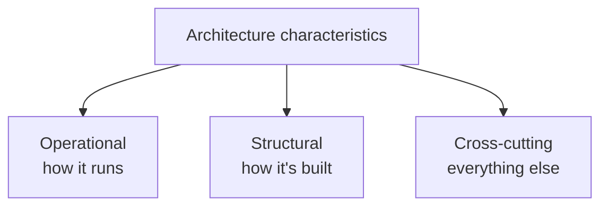

# Architecture characteristics

> Requirements say what the system *does*. Characteristics say what it must
> *be*. The second list is shorter, harder to change later, and it is the one
> that picks your architecture style.

## The definition, with three tests

An architecture characteristic:

1. **specifies a non-domain design consideration** — "process orders" is a
   requirement; "process them within 500 ms at the 99th percentile" is a
   characteristic;
2. **influences some structural aspect of the design** — if it needs no special
   structure, it is not architectural;
3. **is critical or important to application success** — and the emphasis is on
   *few*. Every characteristic you add costs complexity, and they conflict.

That third test is the one teams skip. A list of fifteen "must-haves" is not an
architecture, it is a wish. The book gives no number — the guidance is to keep
the final list **as short as possible**, because an architecture that supports
everything is the *generic architecture* anti-pattern and each characteristic
you add complicates the design.

Do not try to rank the whole list, either: stakeholders will not agree, and the
argument is expensive and produces nothing. Ask them instead for the **top
three, in any order**. That much people can agree on, and it is enough to
settle the trade-offs you will actually face.

## The three families

**Operational** — overlapping heavily with what operations and SRE care about:
availability, continuity (disaster recovery), performance, recoverability,
reliability and safety, robustness, scalability.

**Structural** — the developer-facing ones: configurability, extensibility,
installability, reusability (leverageability), localisation, maintainability,
portability, supportability, upgradeability.

**Cross-cutting** — the ones that fit no box and are often legally mandatory:
accessibility, archivability, authentication, authorisation, legal, privacy,
security, usability.

There is no canonical list — ISO 25010 has one, every consultancy has another,
and the names are inconsistent across all of them (is "reliability" the same as
"availability"? not quite, and not everyone agrees how). The useful discipline
is not finding the true taxonomy; it is **agreeing on the definitions with your
own team and writing them down**.

## The ones people confuse

| Pair | The difference |
| --- | --- |
| **Availability** vs **reliability** | Availability: is it up? Reliability: does it give the right answer, consistently, without dropping work? |
| **Scalability** vs **elasticity** | Scalability: handles a growing number of users over time. Elasticity: handles sudden bursts — minute-to-minute. A system can be scalable and not elastic. |
| **Performance** vs **scalability** | Performance is one request's latency; scalability is what happens to that latency as load grows. |
| **Maintainability** vs **extensibility** | Maintainability: how easy to change what exists. Extensibility: how easy to add what does not. |
| **Interoperability** vs **integratability** | Interoperability: exchanging information with other systems generally. Integratability: connecting to a *specific* other system. |

The elasticity/scalability distinction is the one that changes architecture
decisions most often — it is why
[space-based architecture](../3-styles/06-space-based.md) exists.

## They fight each other

This is the first law with names attached:

- More **security** costs **performance** (encryption, checks, indirection).
- More **elasticity** usually costs **simplicity** and **cost**.
- More **availability** (redundancy everywhere) costs **consistency** — see
  [CAP](../../system-design/1-knowledge/fundamentals/cap-theorem.md).
- More **configurability** costs **testability** — the number of possible
  states multiplies.
- More **performance** often costs **modularity** — the fastest design is
  frequently the one that does not cross a boundary.

Which is why the target is never "all of them, maximised" but the book's
memorable phrase: aim for the **least worst architecture**. You are choosing
which pains to have.

## Where they come from

- **Explicitly**, from requirements: "must support 50,000 concurrent users".
- **Implicitly**, from the domain: a payments system needs auditability and
  security whether or not anyone wrote it down.
- **From business concerns**, translated. This is the skill:

| The business says | You should hear |
| --- | --- |
| "We're acquiring companies every year" | Interoperability, extensibility, scalability |
| "We must be first to market" | Agility: testability, deployability, maintainability |
| "Cost is the constraint" | Simplicity, feasibility — and a monolith |
| "We're regulated" | Auditability, traceability, security, archivability |
| "Traffic triples on Black Friday" | Elasticity, not just scalability |

Notice that "agility" is not itself an architecture characteristic — it is a
composite that decomposes into testability, deployability and maintainability,
each of which you can actually design and measure.

## What to take away

- Characteristics are non-domain, structural, and *few*.
- Learn the confusable pairs; the difference between scalability and
  elasticity is worth real money.
- They conflict by nature. Aim for least-worst, and write down what you traded.

---

Next: [Identifying and measuring](./02-identifying-and-measuring.md)
