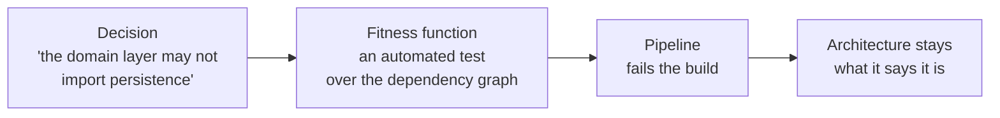

# Identifying, measuring and governing characteristics

> A characteristic nobody measures is an aspiration. A characteristic nobody
> enforces is a memory.

## Getting to a short list

Drive the list out of three sources — the explicit requirements, the implicit
domain knowledge, and the business's own concerns — and then **cut it**. The
technique the book recommends is deliberately uncomfortable:

1. List the candidates with the stakeholders in the room.
2. Ask each stakeholder to pick their **top three**.
3. Argue about the overlap, in front of everybody.

The argument is the deliverable. Stakeholders discover that their favourite
characteristic costs somebody else's favourite characteristic, and the
conversation shifts from "we want everything" to "we want this, at the cost of
that" — which is the only conversation that produces a designable system.

Two rules that make it stick:

- **Prefer the last-responsible-moment**: decide a characteristic when you must,
  not when you first could.
- **Name one dominant characteristic.** If everything is equally important, you
  cannot choose a style.

## Making them measurable

Vague characteristics cannot be governed, so turn each one into a number with a
method.

| Kind | Example measure |
| --- | --- |
| **Operational** | p99 page load < 1 s; 99.9% availability over 28 days; recovery < 15 minutes |
| **Structural** | cyclomatic complexity under a threshold; no cyclic dependencies; distance from the main sequence under 0.2 |
| **Process** | lead time from commit to production; deployment frequency; change failure rate |

"Performance" is the classic trap: it means first paint to one stakeholder,
p99 API latency to another, and throughput under load to a third. Pick the one
you mean, state the percentile and the window, and the arguments stop.

Structural measures are the underused half: **cyclomatic complexity** (roughly,
the number of independent paths through a function — the book treats values
under 10 as fine and rising values as a maintainability signal), the coupling
metrics from
[modularity](../1-foundations/03-modularity-and-connascence.md), and
package/layer dependency rules.

## Governance by fitness function

A **fitness function** is any mechanism that gives an objective assessment of
whether the architecture still has a characteristic. It is the idea that turns
architecture from a document into something a build can verify.

Examples that cost almost nothing to add:

- **Cyclic dependency check** — fail if the component graph contains a cycle
  (ArchUnit in Java, NetArchTest in .NET, import-linter in Python, dependency
  cruiser in JavaScript).
- **Layer rules** — "presentation may not reference persistence", as a test.
- **Distance from the main sequence** — fail if a component moves into the zone
  of pain.
- **Performance budget** — fail the pipeline if p99 regresses beyond a
  threshold.
- **Security** — dependency scanning, or a check that no endpoint is
  unauthenticated.
- **Chaos-style runtime functions** — deliberately kill an instance and assert
  the system still serves.

Fitness functions should be **few, cheap, and in the pipeline**. A suite of
forty that nobody maintains is worse than three that always run, because a red
build people ignore is how governance dies.

## What to take away

- Force the list down to a handful with an explicit ranking exercise.
- Every characteristic gets a number, a percentile and a window — or it is not
  a requirement.
- Automate the checks. An architecture that is not verified is an architecture
  that was true once.

---

Previous: [Architecture characteristics](./01-architecture-characteristics.md) ·
Next: [Scope and the architecture quantum](./03-scope-and-quanta.md)
