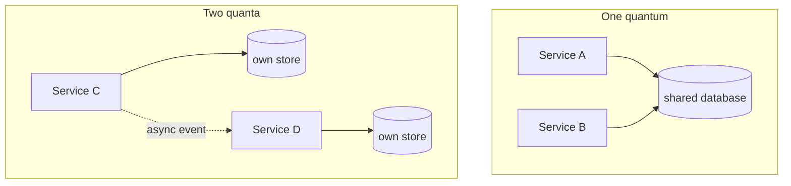

# Scope and the architecture quantum

> Characteristics are not properties of "the system". They apply to a part of
> it — and naming that part precisely is one of the book's most reused ideas.

## Why the system-wide view fails

"The system must be highly available and elastic" is almost always false as
stated. The checkout path must be; the admin reporting screen must not, and
paying for it there is waste. Once you accept that different parts need
different characteristics, you need a unit to attach them to — something
smaller than the system and bigger than a class.

## The architecture quantum

> An **architecture quantum** is an independently deployable artifact with high
> functional cohesion and synchronous connascence.

Three conditions, each doing work:

- **Independently deployable** — it can be released on its own. Two services
  that must ship together are one quantum, not two.
- **High functional cohesion** — it does one coherent thing. In practice this
  is very close to a
  [bounded context](../../books-design/domain-driven-design.md).
- **Synchronous connascence** — anything that must respond synchronously for a
  request to succeed is inside the same quantum. A shared database dragged into
  the request path pulls both callers into one quantum, whatever the deployment
  diagram says.

The left-hand picture is the standard disappointment: two deployables, one
quantum, and therefore one availability number, one scaling decision, and one
release schedule. The database is what makes it so — which is why "each service
owns its data" is not dogma but the definition of getting two quanta.

## Static and dynamic coupling

The quantum definition distinguishes them, and the distinction is useful on its
own:

- **Static coupling** — what a component needs to *boot and exist*: its
  libraries, its database, its configuration service. This is what decides the
  quantum boundary.
- **Dynamic coupling** — how quanta talk at runtime: synchronous or
  asynchronous, and how tolerant they are of each other's failure.

A microservice with its own database is statically independent. If it then
makes a blocking call to another service in every request, it is dynamically
coupled, and its availability is the product of both. Many "microservice"
systems fail here: static independence achieved, dynamic independence never
attempted.

## What this buys you

Once you think in quanta, several questions become answerable:

- **Which characteristics where?** Attach them per quantum. Checkout: high
  availability, elasticity. Reporting: high archivability, low elasticity. That
  is not inconsistency, it is design.
- **Is this really microservices?** Count the quanta, not the repositories.
- **Where does the architecture style apply?** A monolith is one quantum by
  definition. Microservices claim many. Service-based sits in between — many
  deployables, one database, so far fewer quanta than services.
- **What will a change cost?** A change inside a quantum is local; a change
  that crosses one requires coordination, versioning and a migration plan.

## What to take away

- Scope characteristics to a quantum, not to "the system".
- The quantum test is: independently deployable, functionally cohesive,
  synchronously self-contained.
- A shared database collapses quanta. If you want independence, that is the
  first thing to split — and the hardest.

---

Previous: [Identifying and measuring](./02-identifying-and-measuring.md) ·
Next: [Part 3 — Architecture styles](../3-styles/README.md)
