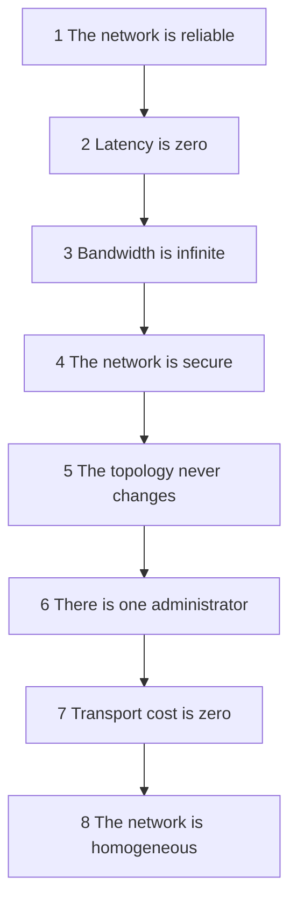

# Style fundamentals, and the fallacies of distributed computing

> Before the eight styles: the one decision that dominates all of them, and the
> eight assumptions that make distributed systems cost more than anyone budgets.

## Fundamental patterns

Three arrangements predate the styles and still describe a lot of real
software:

- **Big ball of mud** — no discernible structure. Not a style, a diagnosis: it
  is what you get when nobody enforces
  [architecture decisions](../4-practice/01-decisions-and-adrs.md). Cheap to
  start, impossible to change, and every deployment is the whole system.
- **Unitary / monolithic** — everything in one deployable. The starting point
  for most systems and, in 2020 as much as 1990, the right answer for many.
- **Client/server** — a two-tier split: desktop client and database server, or
  browser and web server. The ancestor of everything below.

## The decision that dominates: monolithic or distributed

| | Monolithic | Distributed |
| --- | --- | --- |
| Deployment | One artifact | Many artifacts |
| Communication | In-process calls | Network calls |
| Consistency | A database transaction | Sagas, compensation, eventual consistency |
| Failure | It is up or it is down | Partial failure is the normal case |
| Scaling | The whole thing | Per-component |
| Debugging | A stack trace | A trace across services, if you built one |
| Cost | Low | High — operations, platform, expertise |

Richards and Ford are blunt: distributed architectures buy scalability,
elasticity, fault tolerance and deployability, and they charge in complexity,
cost and every problem listed below. Take the deal only when you know which
characteristic you are buying.

## The eight fallacies of distributed computing

Peter Deutsch's list, and the reason distributed systems surprise people who
learned on monoliths.

1. **The network is reliable.** It is not. Every remote call needs a timeout
   and a decision about what to do when it fails — which means every remote
   call is a design question, not a function call.
2. **Latency is zero.** An in-process call is nanoseconds; a remote call is
   milliseconds. Know your system's *average round trip*, and then ask how many
   of them one user request makes. A request that fans out to ten services with
   a 100 ms p99 each does not take 100 ms.
3. **Bandwidth is infinite.** Chatty services exchanging whole objects saturate
   links and drive up latency. This is the argument for coarse-grained
   contracts and for sending only what the caller needs.
4. **The network is secure.** Every endpoint is an attack surface; the
   perimeter is no longer a boundary you can trust. Security in a distributed
   system is per-hop, and it costs latency.
5. **The topology never changes.** Routers, load balancers and instances move,
   are replaced, and are reconfigured by people you have never met — usually
   without telling you, and usually at the moment your latency budget was
   already tight.
6. **There is one administrator.** There are dozens, across networks, clouds
   and vendors. Coordinating a change is a project.
7. **Transport cost is zero.** Beyond latency, there is money and machinery:
   load balancers, gateways, meshes, egress charges, and the servers that run
   them.
8. **The network is homogeneous.** Different vendors, protocol versions and
   configurations interact in ways nobody tested.

## The other distributed problems

Beyond the fallacies, four issues appear in every distributed system and in no
monolith:

- **Distributed logging.** With logs in twenty places, an incident begins with
  an archaeology project. Correlation IDs and aggregation are not optional
  extras; they are part of the architecture.
- **Distributed transactions.** There is no `BEGIN`/`COMMIT` across services.
  You get eventual consistency and
  [sagas](../../system-design/1-knowledge/patterns/saga.md), with compensating
  actions instead of rollback — and the business has to agree to the
  intermediate states being visible.
- **Contract maintenance.** Services evolve separately, so contracts must be
  versioned and changed in expand–migrate–contract steps. Consumer-driven
  contract tests are the usual mechanism.
- **Data ownership.** Which service owns which data, and who may read it, is
  the hardest question in the whole style. Get it wrong and you rebuild a
  monolith with network latency.

## What to take away

- The monolith/distributed choice dominates everything else. Make it on
  purpose, with a named characteristic as the reason.
- The fallacies are the bill. Read them as a checklist before the first
  service split.
- Logging, transactions, contracts and data ownership are architectural work
  that appears the moment you distribute — budget for them.

---

Next: [Layered architecture](./02-layered.md)
