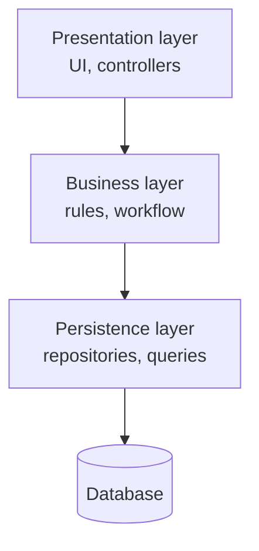

# Layered architecture

> Technically partitioned, universally understood, and the default that most
> systems arrive at without anyone choosing it. Which is exactly why it should
> be chosen on purpose.

## The shape

Each layer has a role, and requests flow downward. It is a **monolithic,
technically partitioned** style: components are grouped by what kind of code
they are, not by what part of the business they serve.

## How it works

**Layers of isolation** is the governing principle: a change in one layer
should not force a change in another. That holds only if layers are **closed** —
a request must pass through each layer rather than skipping one. Closed layers
feel wasteful (a pass-through method that only delegates) and buy you the
ability to replace the layer beneath.

An **open layer** is the deliberate exception: a shared services layer that the
business layer may use directly, but which persistence may not reach up into.
Mark open layers explicitly, or the rule erodes until the structure is
decorative.

**The architecture sinkhole anti-pattern**: requests that pass through every
layer doing nothing except delegating. Some is inevitable; the book's rule of
thumb is that if a large share of your requests are pure pass-through — say,
more than about 20% — the layering is not earning its cost and a different
style may fit better.

## Where it hurts

- **Domain changes are expensive.** Adding a field to an order touches the
  controller, the service, the repository and the schema. Nothing is grouped by
  business capability, so features are always cross-cutting.
- **Deployment is all-or-nothing.** Every change redeploys the whole
  application, so deployment frequency stays low and risk per deploy stays
  high.
- **Scaling is all-or-nothing.** You scale the entire application to relieve
  one hot path.
- **Testability suffers as it grows** because the unit of testing keeps
  growing with the application.

## Ratings

| Characteristic | Rating |
| --- | --- |
| Cost | **Low** — the cheapest style to build and run |
| Simplicity | **High** — everyone already knows it |
| Overall reliability | Medium — few moving parts, no network failure modes |
| Deployability | **Low** — one artifact, coordinated releases |
| Testability | Low–medium |
| Performance | Low–medium — in-process, but layers add hops and a single database |
| Scalability | **Low** — scale the whole app |
| Elasticity | **Low** |
| Fault tolerance | **Low** — one process, one fate |
| Evolutionary / modularity | **Low** — technical partitioning fights domain change |

## Choose it when

- The system is small, or the team is.
- You are starting and do not yet know the domain well enough to draw service
  boundaries — this is the honest majority of new projects.
- Budget and simplicity are the dominant characteristics.
- You want a stepping stone: a well-kept layered monolith with clean modules is
  the cheapest thing to later split into
  [service-based](./04-service-based.md) or
  [microservices](./07-soa-and-microservices.md).

## Avoid it when

Elasticity, independent deployability, fault isolation or per-domain scaling
are among your top three characteristics. No amount of discipline gets those
out of one deployable.

---

Previous: [Fundamentals and fallacies](./01-fundamentals-and-fallacies.md) ·
Next: [Pipeline and microkernel](./03-pipeline-and-microkernel.md)
