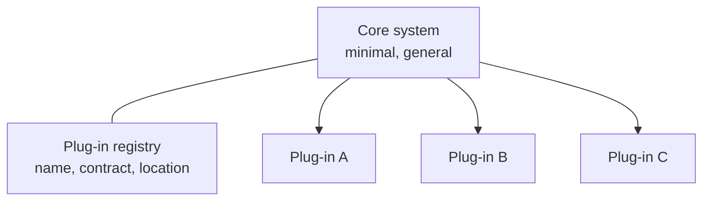

# Pipeline and microkernel

> Two monolithic styles with narrow purposes and exceptional fit when the
> purpose matches: one for transformation, one for extension.

## Pipeline architecture (pipes and filters)

Data flows one way through **filters** connected by **pipes**. Each filter is
independent, stateless, and does one thing; each pipe is unidirectional and
usually point-to-point. Four filter types:

| Filter | Job |
| --- | --- |
| **Producer** | The starting point — emits data |
| **Transformer** | Changes some or all of the data |
| **Tester** | Examines and optionally discards or routes |
| **Consumer** | The terminal point — stores or emits the result |

You have used this: Unix shell pipelines, ETL jobs, compiler passes, log
processing, and most streaming frameworks' programming models.

**Good at:** simplicity, low cost, and composability — new behaviour is a new
filter. Testing individual filters is easy because they are pure.

**Bad at:** everything that needs elasticity or fault tolerance. It is one
deployment unit; a failure anywhere stops the line, and scaling means scaling
all of it.

| Characteristic | Rating |
| --- | --- |
| Cost / simplicity | **High** (cheap and simple) |
| Modularity / evolutionary | Medium–high — filters are replaceable |
| Testability | Medium–high |
| Deployability, elasticity, scalability, fault tolerance | **Low** |
| Performance | Low — sequential stages, each adding latency |

**Choose it when** the problem really is a transformation flow: ingest, enrich,
validate, emit. **Avoid it when** the work is interactive, transactional, or
needs independent scaling of a stage.

## Microkernel architecture (plug-in)

A **core system** does the general job; **plug-in components** add specialised,
independent behaviour. The core knows plug-ins only through a **contract** and
finds them through a **registry** (what exists, and how to reach it). Plug-ins
should not know about each other — the moment two plug-ins depend on one
another, the style's benefit is gone.

Real examples: IDEs and editors, browsers and their extensions, build tools,
and — the domain example the book uses — insurance claim processing, where each
jurisdiction's rules are a plug-in instead of a branch in a giant conditional.

**Plug-in contracts and data.** Plug-ins may be compiled in (a library) or
remote (a service, making the style distributed). Where plug-ins need their own
data, each gets its own store rather than sharing the core's — that is how the
independence is kept.

| Characteristic | Rating |
| --- | --- |
| Cost / simplicity | **High** (cheap and simple) |
| Extensibility | **High** — the reason to pick it |
| Testability, deployability, modularity | Medium |
| Performance | Medium — small core, no network by default |
| Scalability, elasticity, fault tolerance | **Low** — monolithic core |

**Choose it when** the system is one thing with many variations: rules per
country, importers per file format, tools per language, features per customer.
The alternative — conditionals threaded through the core — is the thing this
style exists to prevent.

**Avoid it when** the variation is not really independent, or when you need
independent scaling and deployment of the variations.

## What to take away

- Both are monoliths; both are cheap and simple; neither scales or tolerates
  failure on its own.
- Pipeline fits transformation flows. Microkernel fits "one core, many
  variants".
- The microkernel's discipline is the contract plus the registry — plug-ins
  that know each other are no longer plug-ins.

---

Previous: [Layered](./02-layered.md) · Next: [Service-based](./04-service-based.md)
