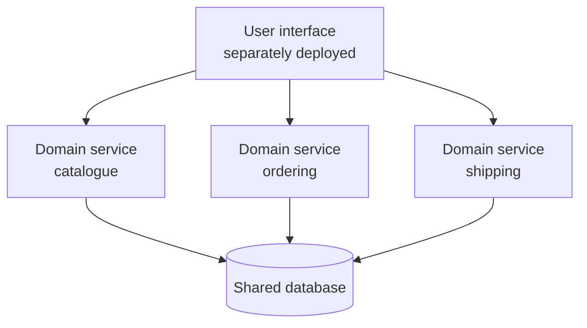

# Service-based architecture

> The most pragmatic distributed style: a handful of coarse services, usually
> one database, and most of the benefits of microservices at a fraction of the
> cost.

## The shape

Three ingredients:

1. A **separately deployed user interface** (sometimes one per domain).
2. **Coarse-grained domain services** — typically four to a dozen, each a
   whole business domain, each deployed independently. They are *portions of a
   monolith*, not microservices: internally they are usually layered.
3. **A shared database**, often with a single schema.

Variants: a UI per domain, an API layer in front of the services, or the
database split into a few schemas as the design matures.

## Why it is the pragmatic middle

Because the services are **domain-scoped and independently deployable**, you
get agility: a change to ordering redeploys ordering. Because there are **few
of them**, and they share a database, you avoid the two hardest parts of
microservices — distributed data and fine-grained service coordination. A
business transaction usually completes inside one service, so **ACID
transactions still work**, and sagas are rarely needed.

That single property — database transactions still exist — is what makes this
style so much cheaper than microservices, and why the book presents it as the
one to reach for first when a monolith stops being enough.

## Where it hurts

- **The shared database is the coupling.** A schema change may affect every
  service, so database change management becomes a coordinated, versioned
  process. In quantum terms, the shared database makes this **one quantum** —
  see [scope and quanta](../2-characteristics/03-scope-and-quanta.md).
- **Fault tolerance is partial.** One service failing does not take the others
  down, but a database failure takes everything down.
- **Scaling is coarse.** You scale a whole domain service, not a function
  inside it.

## Ratings

| Characteristic | Rating |
| --- | --- |
| Cost / simplicity | Medium–high (still relatively cheap and simple) |
| Deployability | Medium–high |
| Testability | Medium–high — a service is a testable unit |
| Modularity / evolutionary | Medium–high — domain partitioned |
| Fault tolerance | Medium — services isolate, the database does not |
| Availability | Medium–high |
| Scalability / elasticity | Medium–low — coarse units, shared store |
| Performance | Medium — few network hops, local transactions |

## Choose it when

- A monolith has become painful to deploy, but microservices are more machinery
  than the team can run.
- The domain decomposes cleanly into a few big pieces.
- Business transactions must stay ACID.
- You want the option to go further later: splitting the database per service
  is the natural next step, and it turns this into microservices without
  redrawing the domains.

## Avoid it when

Extreme elasticity, per-function scaling, or true fault isolation are the
dominant characteristics — the shared database will not allow them.

---

Previous: [Pipeline and microkernel](./03-pipeline-and-microkernel.md) ·
Next: [Event-driven](./05-event-driven.md)
