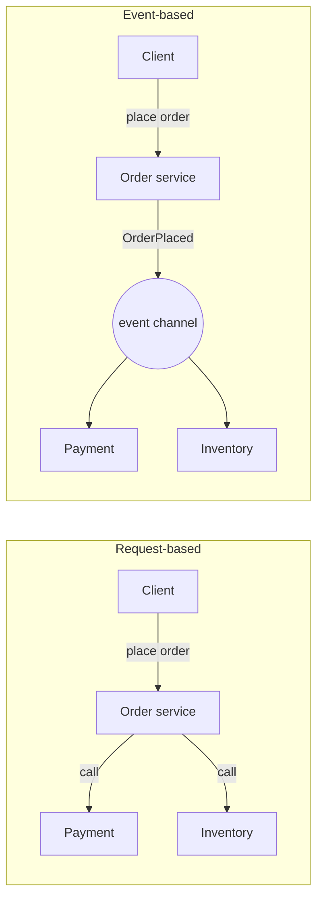
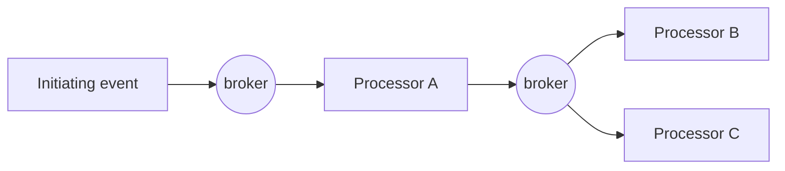
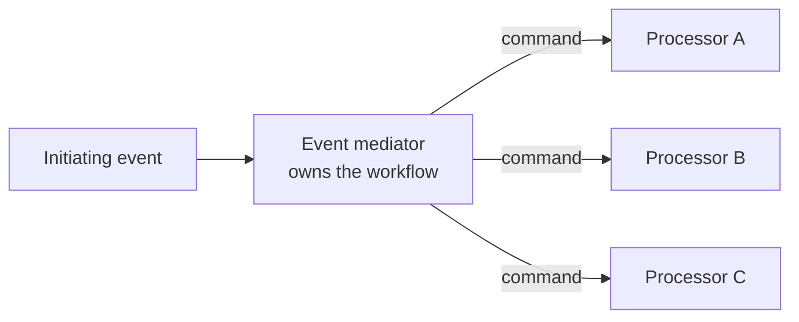

# Event-driven architecture

> Components react to things that happened instead of being told what to do.
> Extremely scalable, extremely decoupled, and the hardest of all the styles to
> reason about at three in the morning.

## Request-based versus event-based

In the request model, the initiator knows who must act and waits. In the event
model, it announces a fact and stops caring. The first is predictable and
coupled; the second is decoupled and unpredictable. Most real systems are
**hybrid**: request-based where the user is waiting for an answer, event-based
for everything downstream.

## Two topologies

**Broker topology** — events are published to a channel and any interested
processor consumes them; there is no central coordinator. Processors do their
work and publish new events, so the workflow emerges from the chain
(*choreography*).

- **Good at:** extreme decoupling, scalability, easy extension — a new
  consumer subscribes and nobody changes.
- **Bad at:** error handling, restart, and answering "where did this order get
  to?" Nothing owns the workflow, so nothing knows its state.

**Mediator topology** — an initiating event goes to a **mediator** that knows
the steps and issues commands to processors (*orchestration*).

- **Good at:** workflow control, error handling, compensation, visibility.
- **Bad at:** coupling — the mediator knows everybody — and it can become a
  bottleneck, both in throughput and in development.

The practical rule: choreograph simple flows, orchestrate complex ones, and be
prepared to have both in one system.

## Asynchronous problems you have to solve

- **Error handling.** The *workflow event pattern*: a failed message goes to a
  dedicated error processor that repairs and resubmits it, or parks it for a
  human. Without this you get silent loss.
- **Preventing data loss.** Three gaps — producer to broker, broker itself,
  broker to consumer — closed by persistent message queues, publisher
  confirmations and client acknowledgement modes. Every one of them is a
  configuration choice someone must make deliberately.
- **Request–reply.** When a caller does need an answer over messaging: a reply
  queue plus a correlation ID.
- **Eventual consistency.** The caller returns before the work is done. The
  business has to agree that "accepted" is not "completed", and the UI has to
  show it.
- **Duplicate and out-of-order messages.** Consumers must be **idempotent**;
  ordering guarantees are per-partition at best.

## Ratings

| Characteristic | Rating |
| --- | --- |
| Performance | **High** — no synchronous waiting, work runs in parallel |
| Scalability / elasticity | **High** — add consumers |
| Fault tolerance | **High** — with persistence and retries, a dead consumer delays work rather than losing it |
| Evolutionary | **High** — new consumers cost nothing |
| Deployability | Medium–high |
| Simplicity | **Low** — the hardest style to understand |
| Testability | **Low** — asynchronous flows resist end-to-end testing |
| Cost | Medium–high |

## Choose it when

Work can be done in the background, throughput matters more than a synchronous
answer, consumers come and go, or the domain is genuinely about things that
happen — orders, payments, sensor readings, user activity.

## Avoid it when

The domain needs a synchronous answer and strong consistency, the team has no
experience operating brokers, or nobody is prepared to invest in tracing and
observability. Debugging an event-driven system without correlation IDs and
distributed tracing is close to impossible, and that tooling is part of the
cost of the style.

---

Previous: [Service-based](./04-service-based.md) · Next: [Space-based](./06-space-based.md)
