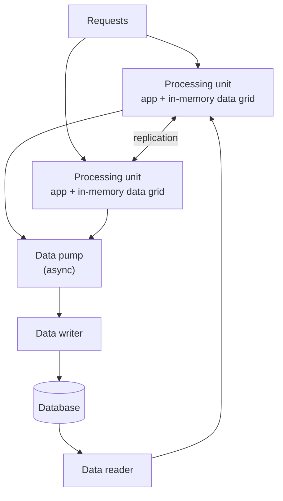

# Space-based architecture

> The style with one idea: the database is the bottleneck, so take it out of
> the request path entirely.

## The problem it solves

Every other style eventually hits the same wall. You scale the web tier, then
the application tier, then the services — and the database cannot follow.
Concurrent user growth is fine until the moment it is not, and then the whole
system falls over at once.

Space-based architecture (the name comes from *tuple space* — a shared,
distributed memory space) removes the constraint by keeping application data in
**replicated in-memory grids** inside the processing units, and writing to the
database asynchronously.

## The parts

- **Processing unit** — the application module plus an in-memory data grid
  holding the data it needs. Units are identical and replicate data between
  themselves; start another one and it joins.
- **Virtualised middleware** — the plumbing that makes that work:
  - *messaging grid* — routes requests to units,
  - *data grid* — keeps the in-memory data replicated and consistent across
    units (the most important piece),
  - *processing grid* — coordinates requests that span unit types,
  - *deployment manager* — starts and stops units in response to load.
- **Data pumps, writers and readers** — the asynchronous path to and from the
  actual database. Writes go through a pump so no user request waits on a disk.

## What you get, and what it costs

Because requests never touch the database, throughput scales with the number of
processing units, and elasticity becomes a matter of starting more of them —
in seconds, not minutes. This is the style behind systems that must absorb
sudden, extreme bursts: ticket sales the moment they open, auctions closing,
flash retail events.

The costs are real and large:

- **Complexity and cost** are the highest of any style here.
- **Eventual consistency by construction** — the database lags the grid, so
  reporting and any external consumer sees stale data.
- **Data collisions** during replication: two units updating the same item
  before replication completes. The rate is calculable from update rate,
  replication latency and number of units, and it must be designed for.
- **Memory bounds** — the working set has to fit, replicated, in RAM.
- **Testing at scale is nearly impossible.** Behaviour under real elasticity
  cannot be reproduced on a laptop.

## Ratings

| Characteristic | Rating |
| --- | --- |
| Elasticity | **High** — the reason the style exists |
| Scalability | **High** |
| Performance | **High** — in-memory reads and writes |
| Cost | **High** (expensive) |
| Simplicity | **Low** |
| Testability | **Low** |
| Deployability / evolutionary | Medium |
| Overall reliability | Medium — sophisticated machinery to operate |

## Choose it when

Elasticity is the single dominant characteristic — variable, spiky, very high
concurrency — and the business can tolerate eventual consistency in its
reporting. It is a specialist answer to a specialist problem.

## Avoid it when

You are reaching for it because the database is slow. Caching, read replicas,
[sharding](../../system-design/1-knowledge/data-storage/sharding.md) and query
work are cheaper by orders of magnitude, and exhausting them first is the
responsible order of operations.

---

Previous: [Event-driven](./05-event-driven.md) ·
Next: [SOA and microservices](./07-soa-and-microservices.md)
