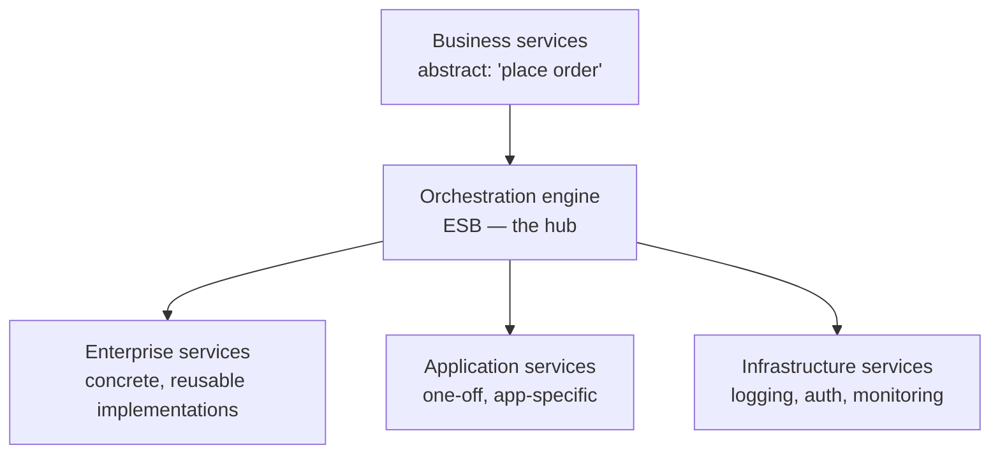
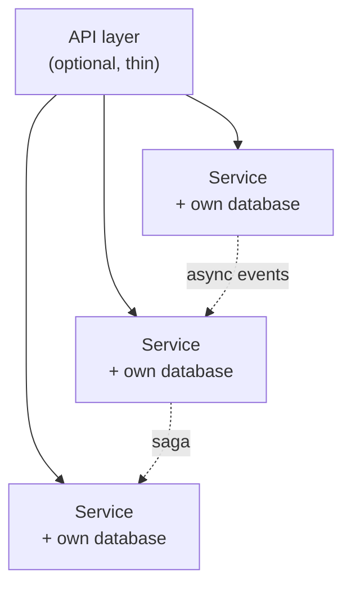

# Orchestration-driven SOA, and microservices

> One style organised around reuse, which failed. One organised around
> isolation, which did not. The contrast is the most instructive pair in the
> book.

## Orchestration-driven service-oriented architecture

The enterprise style of roughly 1995–2010, built when hardware and licences
were expensive and **reuse** was therefore the dominant goal.

The taxonomy is the style: business services define *what the enterprise does*
(often with no code at all), enterprise services implement shared capability,
application services cover what only one application needs, and infrastructure
services handle the operational concerns. The **orchestration engine** — the
enterprise service bus — stitches them together, owns transactions, and does
the protocol and message transformation.

**Why it failed.** Reuse maximised *shared* code, and shared code is coupling.
A single `Customer` service used by every department had to satisfy all of
them, so every change required every consumer's agreement, and change slowed to
a crawl. The orchestration engine became a single point of failure, a
bottleneck, and a place where business logic hid in vendor tooling. Domain
changes cut across all four layers of the taxonomy.

Ratings are poor almost everywhere except abstraction: cost high, simplicity
low, deployability low, testability low, evolutionary low. It is here as
history, and as the origin of a warning that is easy to forget: **reuse
increases coupling**.

## Microservices

The reaction. Where SOA optimised for reuse, microservices optimise for
**isolation** and independent change — and accept duplication as the price.

The defining properties:

- **Bounded context.** Each service is a domain boundary in the
  [DDD](../../book-domain-driven-design/README.md) sense, owning its data and
  its code.
- **Data isolation.** No shared database — the rule that makes each service its
  own [quantum](../2-characteristics/03-scope-and-quanta.md), and the one most
  often broken.
- **Granularity is the hard part.** Too fine and you pay network latency,
  orchestration and transactional pain for nothing; too coarse and you are
  service-based. Useful guides: a service should cover one purpose, its
  transactions should not routinely span services, and two services that
  always deploy together should be one.
- **Distributed transactions become sagas.** Compensating actions, not
  rollback.
- **Communication** is either choreographed (events) or orchestrated (a
  coordinator). Choreography decouples; orchestration is comprehensible.
- **Operational reuse** without code coupling: the *sidecar pattern* — put
  monitoring, logging, auth and routing in a companion process beside each
  service — which generalises to a **service mesh**. This is the microservices
  answer to the concerns that SOA solved with a bus.
- **Frontends** can be monolithic or **micro-frontends**, one per service, so
  the vertical slice is complete.

**Ratings:** scalability, elasticity, fault tolerance, deployability,
testability, evolutionary and modularity are all **high** — these are the
reasons to choose it. Performance is **low** (every hop is a network call),
simplicity is **low**, and cost is **high**. You are buying change agility with
runtime efficiency and money.

## The contrast, stated plainly

| | SOA (orchestration-driven) | Microservices |
| --- | --- | --- |
| Optimised for | Reuse | Isolation and independent change |
| Data | Shared, enterprise-wide | Private per service |
| Coordination | Central bus | Choreography or per-workflow orchestration |
| Duplication | Avoided at all costs | Accepted deliberately |
| Result | Coupled, slow to change | Decoupled, expensive to run |

## Choose microservices when

Independent deployability and team autonomy are the dominant characteristics,
you have or will build the operational platform (CI/CD, observability,
automated infrastructure), and the domain is understood well enough to draw
boundaries. The book, like everyone with experience, advises starting
monolithic or [service-based](./04-service-based.md) and extracting when a
specific pressure appears.

## What to take away

- Reuse is not free: shared services buy efficiency with coupling.
- Microservices trade performance, simplicity and money for the ability to
  change one thing without touching the rest.
- Data isolation is the load-bearing rule. A shared database turns
  microservices into a distributed monolith, which is the worst of both.

---

Previous: [Space-based](./06-space-based.md) · Next: [Choosing a style](./08-choosing-a-style.md)
