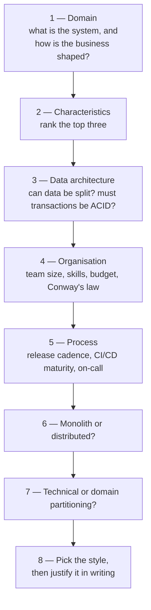

# Choosing an architecture style

> There is no best style, and fashion is not an input. There is a procedure,
> and it starts with the characteristics, not the diagram.

## The comparison, side by side

Ratings are relative between styles: **H** high, **M** medium, **L** low.

| Style | Partitioning | Quanta | Cost | Simplicity | Deployability | Testability | Performance | Scalability | Elasticity | Fault tolerance | Evolutionary |
| --- | --- | --- | --- | --- | --- | --- | --- | --- | --- | --- | --- |
| [Layered](./02-layered.md) | technical | 1 | L | H | L | L | L–M | L | L | L | L |
| [Pipeline](./03-pipeline-and-microkernel.md) | technical | 1 | L | H | L | M | L | L | L | L | M |
| [Microkernel](./03-pipeline-and-microkernel.md) | domain / technical | 1 | L | H | M | M | M | L | L | L | H |
| [Service-based](./04-service-based.md) | domain | 1 (shared DB) | M | M | M–H | M–H | M | M | M–L | M | M–H |
| [Event-driven](./05-event-driven.md) | technical | many | M–H | L | M–H | L | H | H | H | H | H |
| [Space-based](./06-space-based.md) | domain | many | H | L | M | L | H | H | H | M | M |
| [SOA](./07-soa-and-microservices.md) | technical | 1 | H | L | L | L | L | M | M | M | L |
| [Microservices](./07-soa-and-microservices.md) | domain | many | H | L | H | H | L | H | H | H | H |

Two patterns fall out of the table immediately. **Simplicity and cost move
together, and both move against everything else.** And **quanta count is the
dividing line**: one quantum means shared fate — one deployment, one
availability number, one scaling decision.

## The decision procedure

The order matters. Teams that start at step 8 pick the style they read about
last week and then reverse-engineer justifications; teams that start at step 2
usually discover that their dominant characteristics are simplicity and cost,
and that a monolith is the answer.

Step 6 is the pivotal one. Ask: **does any top-three characteristic require
independent deployment, independent scaling, or fault isolation?** If not,
stay monolithic. If yes, only then pay the
[distributed bill](./01-fundamentals-and-fallacies.md).

## Common situations, and where they land

| Situation | Usually |
| --- | --- |
| New product, unknown domain, small team | Layered monolith, kept modular |
| Monolith painful to deploy, domain now clear | [Service-based](./04-service-based.md) |
| Many teams, independent release cadence, platform in place | [Microservices](./07-soa-and-microservices.md) |
| Background work, spiky throughput, decoupled consumers | [Event-driven](./05-event-driven.md), often hybrid |
| Extreme, sudden concurrency; stale reporting acceptable | [Space-based](./06-space-based.md) |
| One core with many variants (rules, formats, customers) | [Microkernel](./03-pipeline-and-microkernel.md) |
| Ingest → transform → emit | [Pipeline](./03-pipeline-and-microkernel.md) |

Hybrids are normal and not a failure: a service-based system with event-driven
edges, or microservices with a microkernel inside one service, is a common and
healthy outcome.

## Fashion is not an input

Styles rise and fall with hardware economics and organisational fashion — SOA
made sense when a server was a capital expense; microservices make sense when
a container is a command. The honest version of "why this style?" always
mentions a characteristic and a cost, never a conference talk.

## What to take away

- Characteristics first, style last.
- Simplicity and cost are characteristics too, and usually the highest-ranked
  ones for a new system.
- The monolith/distributed decision is the one that is genuinely expensive to
  reverse. Spend your analysis there.

---

Previous: [SOA and microservices](./07-soa-and-microservices.md) ·
Next: [Part 4 — In practice](../4-practice/README.md)
