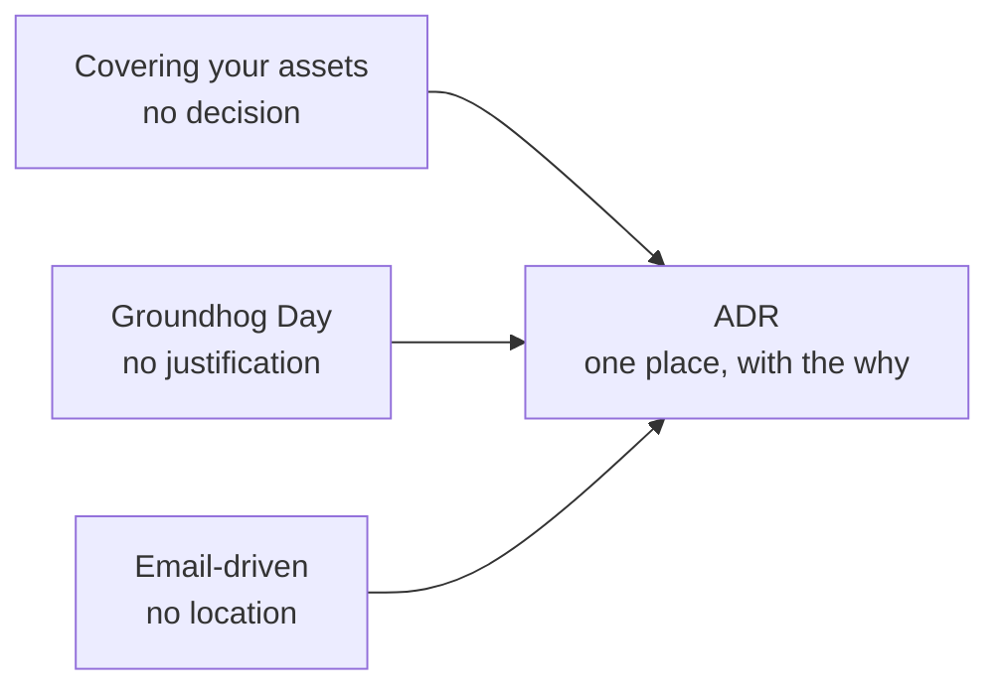

# Architecture decisions and ADRs

> The second law says *why* matters more than *how*. This is the chapter where
> that becomes an artifact.

## Three anti-patterns

**Covering your assets.** Avoiding or deferring a decision so that you cannot
be blamed for it. The cure is two rules: wait for the **last responsible
moment** — the point past which delay costs more than deciding — and then
*collaborate* with the teams who will implement it, so the decision is tested
against reality before it is published.

**Groundhog Day.** The decision is made, and then re-litigated every few weeks
because nobody remembers the reasoning. The cure is to record both the
**technical** justification and the **business** justification — in particular
the cost and the benefit in business terms, because "it's cleaner" loses every
argument against "it's cheaper".

**Email-driven architecture.** The decision exists, but only in someone's inbox.
People do not know it was made, cannot find it, or have a version from three
threads ago. The cure is a single known location, with the decision stated
once and the email carrying only a link.



All three have the same fix, which is why the ADR is the most portable idea in
the book.

## What makes a decision architectural

It is architectural if it affects structure, characteristics, dependencies,
interfaces or construction techniques. The practical test remains: **how
expensive is this to reverse?** "We will use Kafka" is architectural; "this
class will be a builder" is not.

## The ADR format

An **architecture decision record** is a short, immutable document — one per
decision, numbered, stored beside the code or in a wiki with a stable index.

```markdown
# ADR 014: Use asynchronous messaging between order and shipping

## Status
Accepted   (Proposed | Accepted | Superseded by ADR 021)

## Context
Order completion currently calls shipping synchronously. Shipping's p99 is
900 ms and its availability is 99.5%, so order completion inherits both.
Peak load triples on promotion days.

## Decision
Order will publish an OrderCompleted event to the broker. Shipping will
consume it. Order will not wait for shipping.

## Consequences
+ Order completion no longer fails when shipping is down; p99 drops ~900 ms.
+ Each side scales independently.
− The customer sees "shipping pending" for up to a few seconds.
− We must handle duplicate events (shipping must be idempotent) and add a
  dead-letter path with an alert.
− Support tooling needs a way to see events in flight.

## Compliance
A fitness function asserts that the order module has no compile-time
dependency on the shipping client library.

## Notes
Author: …   Date: 2026-02-11   Supersedes: ADR 009
```

The sections that people skip are the ones that matter. **Consequences** is
where the first law lives — a record with no negative consequences is a record
nobody thought about. **Compliance** answers "how will we know if this stops
being true?", and links the decision to a
[fitness function](./02-risk-and-fitness-functions.md).

Status matters too: an ADR is never edited after acceptance. When the decision
changes, write a new one and mark the old **superseded**, with links both ways.
The history is the point — you want to see what was believed and why it
changed.

## Where to keep them

One place, versioned, searchable, linkable: a `docs/adr/` directory in the
repository for a single system, or a wiki section for cross-cutting decisions.
Number them sequentially, never renumber, and put the index where a new
engineer will find it in their first week.

## What to take away

- Decide at the last responsible moment, with the implementers in the room.
- Record the business justification, not only the technical one.
- One place. Immutable records. Supersede rather than edit.
- Consequences and compliance are the sections that make an ADR worth writing.

---

Next: [Risk and fitness functions](./02-risk-and-fitness-functions.md)
