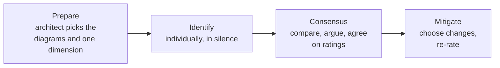

# Analysing risk, and automating governance

> Two techniques: one for finding the risks a design carries, one for making
> sure the design you agreed is still the design you have.

## Rating risk

Risk is **impact × likelihood**, and the book's matrix keeps both to three
levels, which is enough to argue with and small enough to fill in.

| | Low impact | Medium impact | High impact |
| --- | --- | --- | --- |
| **High likelihood** | 3 (medium) | 6 (high) | 9 (high) |
| **Medium likelihood** | 2 (low) | 4 (medium) | 6 (high) |
| **Low likelihood** | 1 (low) | 2 (low) | 3 (medium) |

Scores 1–2 are low, 3–4 medium, 6–9 high. The value is not the arithmetic; it
is that two people who disagree about a risk usually disagree about *which
axis*, and the matrix surfaces that in one sentence.

Track the assessment over time — a risk rising from 3 to 6 across two quarters
is a signal that a characteristic is eroding.

## Risk storming

A collaborative exercise, deliberately structured so that the loudest person
does not set the agenda.

1. **Identification is individual and private.** Each participant marks risks
   on the architecture diagram alone, for one dimension at a time —
   availability, then elasticity, then security. Separating the dimensions
   stops the exercise from becoming a general moan; separating the people stops
   anchoring.
2. **Consensus is collective.** Everyone's marks go on one diagram. Where two
   people rated the same area differently, the discussion is the deliverable —
   usually one of them knows something the other does not.
3. **Mitigation is a design change**, and it is itself a trade-off: mitigating
   an availability risk with redundancy costs money and consistency. Re-rate
   after mitigating.

Run it early enough to change the design, and repeat it when the design
changes materially.

## Fitness functions: governance that runs

An architecture decision that is not verified decays quietly. A **fitness
function** is any objective, automated assessment of a characteristic, run in
the pipeline like a test.

| Characteristic | Fitness function |
| --- | --- |
| Modularity | No cyclic dependencies between components |
| Layering | Presentation must not reference persistence |
| Maintainability | Cyclomatic complexity under threshold; distance from the main sequence bounded |
| Performance | p99 latency budget per endpoint, asserted in the pipeline |
| Security | Dependency vulnerability scan; no unauthenticated routes |
| Scalability | Load test at target concurrency, failing on regression |
| Availability | Chaos-style instance termination, asserting the system still serves |
| Data integrity | Schema compatibility check against consumers' contracts |

Practical rules:

- **Few.** Three that run every build beat forty that nobody maintains.
- **Fast enough to be in the pipeline.** A check that runs monthly is a report,
  not governance.
- **Attached to an ADR.** Every fitness function should trace back to a
  decision it defends — that is what the *compliance* section of an
  [ADR](./01-decisions-and-adrs.md) is for.
- **Fail loudly.** A red build people routinely override is worse than no
  check, because it teaches the team that architecture rules are advisory.

## What to take away

- Risk is impact × likelihood; the matrix exists to locate the disagreement.
- Risk storm individually first, then together, one dimension at a time.
- Turn decisions into automated checks, or watch them evaporate over a year.

---

Previous: [Decisions and ADRs](./01-decisions-and-adrs.md) ·
Next: [Diagramming and presenting](./03-diagramming-and-presenting.md)
