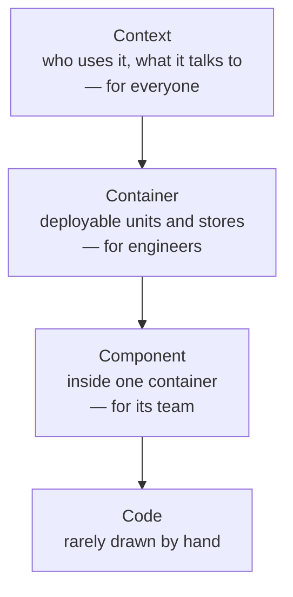

# Diagramming and presenting architecture

> Two skills that decide whether the architecture you designed is the
> architecture that gets built: drawing it so it is understood, and saying it
> so it is accepted.

## Diagramming

The book's guidance is unglamorous and immediately useful.

- **Title everything.** Every diagram, and every element that is not obvious.
  A diagram found later without a title is a puzzle.
- **Be consistent about lines.** Solid versus dashed, arrowheads at one end or
  both — pick meanings and keep them. An arrow should say who initiates, not
  who is more important.
- **Label the lines.** "HTTPS/JSON, synchronous" versus "Kafka, async" is the
  difference between a picture and a specification.
- **Include a key** whenever shapes or colours carry meaning. If the key would
  be large, the diagram is doing too much.
- **Be consistent about shapes** across every diagram in the system.

### Which notation

| Notation | Good for |
| --- | --- |
| **C4** (context, container, component, code) | The default for most teams: four zoom levels, each for a different audience |
| **UML** | Sequence diagrams are still the best way to show a distributed interaction; class diagrams less so |
| **ArchiMate** | Enterprise-scale modelling, where you need formality |
| **Ad hoc box-and-line** | Fine, if it has a title, a key and labelled lines |

C4's central insight is **one diagram per zoom level and audience**: a context
diagram for people who do not work on the system, a container diagram for
engineers who do, a component diagram for those inside one container. One
diagram that tries to be all three is the most common failure.

Irrational artifact attachment is worth knowing by name: the more effort you
put into a diagram, the less willing you are to change it. Keep early diagrams
cheap — a whiteboard photo — precisely so you will throw them away.

## Presenting

An architecture is accepted in a room, and most architects lose the room for
avoidable reasons.

**Slides are half the story.** A slide and a speaker are two channels; if the
slide contains the whole argument, the audience reads ahead and stops
listening. The pathological case is the **bullet-riddled corpse** — a wall of
text read aloud.

**Control the flow with incremental builds.** Reveal one element at a time so
attention is where you are. Use **invisibility** — a blank or dimmed slide —
when you want the room looking at you rather than the screen.

**Transitions carry meaning.** A dissolve implies continuity, a hard cut
implies a change of subject. Being consistent about this is a cheap way to make
a deck feel structured.

**Know which artifact you are making.** A *presentation* needs a presenter and
should be sparse. An *infodeck* is meant to be read alone and needs to be
dense. Handing out a presentation, or presenting an infodeck, fails both ways —
build the one the situation needs.

**Time and rehearse.** Architecture presentations are usually to people with
less context and less patience than the presenter assumes. Lead with the
decision and its business justification; the trade-off analysis is the second
slide, not the tenth.

## What to take away

- A diagram with an unlabelled line is a rumour.
- One zoom level, one audience, one diagram. C4 if you want a ready-made
  vocabulary.
- Slides are half the story; if they are the whole story, write a document
  instead.

---

Previous: [Risk and fitness functions](./02-risk-and-fitness-functions.md) ·
Next: [Making teams effective](./04-teams-and-effectiveness.md)
