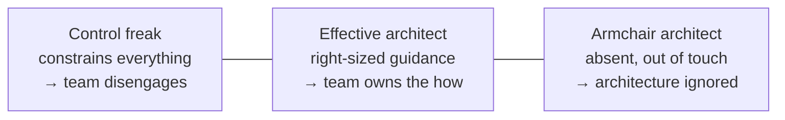

# Making teams effective

> The architecture is implemented by people who did not attend the meeting
> where it was decided. Whether it survives them is an architectural concern.

## Three architect personalities

- **Control freak** — restricts choices down to class design and library
  versions. Developers stop thinking, then stop caring, and the architect
  becomes the bottleneck on every decision.
- **Armchair architect** — has not written code in years, does not attend the
  team's meetings, produces diagrams that cannot be built. The team routes
  around them and the real architecture is whatever got written.
- **Effective architect** — sets the constraints that matter (the decisions),
  leaves the rest as principles, and is present enough to notice when reality
  disagrees.

## How much control?

Elastic leadership: the amount of guidance should vary with the situation, not
with the architect's temperament. Five factors push it up or down.

| Factor | More control when… | Less control when… |
| --- | --- | --- |
| **Team familiarity** | People have just met | The team has worked together for years |
| **Team size** | Large (say, twelve or more) | Small (four or fewer) |
| **Overall experience** | Mostly junior | Mostly senior |
| **Project complexity** | High | Low |
| **Project duration** | Short — no time to recover | Long — there is room to learn |

The practical reading: a new, large, junior team on a short, complex project
needs explicit rules. A small, senior, long-standing team needs a direction and
then to be left alone. Applying the same level to both is the mistake.

## Team warning signs

Three failure modes to watch for, borrowed from organisational psychology:

- **Process loss** — the whole team produces less than the sum of the people.
  Usually a coordination cost: too many hand-offs, too much waiting, too many
  people on one thing.
- **Pluralistic ignorance** — everyone privately disagrees with a decision but
  assumes everyone else agrees, so nobody objects. The architect's job here is
  to make dissent cheap: ask for objections directly, and in private if
  necessary.
- **Diffusion of responsibility** — everyone assumes someone else owns it, so
  nobody does. Unclear ownership of a component or a workflow is the usual
  cause, and the fix is a name against each boundary.

## Checklists, used properly

Checklists work for tasks that are frequent, error-prone, and easy to skip
under pressure — not for creative work. The three the book recommends:

- **Developer code completion** — what "done" means before a pull request:
  tests, logging, error handling, configuration, documentation.
- **Unit and functional testing** — the unusual cases that always get
  forgotten: boundary values, error paths, concurrency, large inputs.
- **Software release** — the deployment steps that vary rarely and break badly:
  configuration, migrations, feature flags, rollback plan.

Two rules make them work: keep them short (if it is exhaustive, nobody reads
it), and **do not put things on a checklist that are already automated**. A
checklist item that a pipeline could enforce is a pipeline item.

## Providing guidance through design principles

The lever the effective architect uses most is the **design principle**: a
guideline that explains the boundary without dictating the interior.

> *Use a library when it is a simple, single-purpose utility. Bring the
> architect in when a framework is under consideration, because a framework
> makes decisions the architecture must live with.*

That principle constrains what matters (frameworks are architectural), leaves
what does not (libraries are the team's call), and — crucially — says *why*, so
a developer can apply it to a case nobody anticipated.

## What to take away

- Right-size control to the team and the project, and re-evaluate as both
  change.
- Watch for process loss, pluralistic ignorance and diffused responsibility —
  they look like "the team is slow".
- Guide with principles that explain themselves; reserve rules for decisions
  that are genuinely expensive to reverse.

---

Previous: [Diagramming and presenting](./03-diagramming-and-presenting.md) ·
Next: [Negotiation and career](./05-negotiation-and-career.md)
