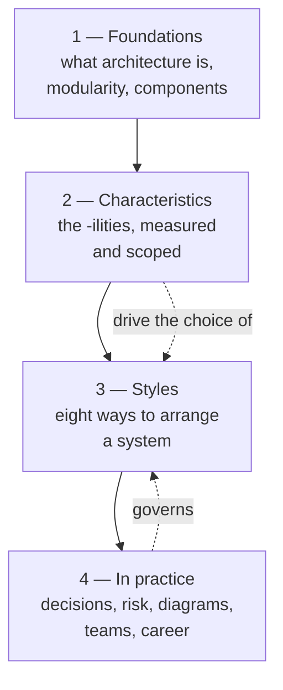

# Fundamentals of Software Architecture — Distilled

> Mark Richards & Neal Ford, *Fundamentals of Software Architecture*
> (O'Reilly, 2020), rewritten as a short book: every core idea, in order, with
> diagrams, for an engineer who is good at code and new to architecture.

## What this is

The original is ~400 pages across 24 chapters. This is the same skeleton at
roughly a fifth of the length: the definitions, the trade-off tables, the eight
architecture styles and what each one is actually for, and the working
practices — decisions, risk, diagrams, teams — that the book treats as part of
the job rather than an afterthought.

It is a **distillation written in our own words**, not a copy of the text. No
passage of the book is reproduced here; the source was read to check that the
definitions, the chapter order and the characteristic ratings match what the
authors actually wrote. Where the authors' framing has become
industry vocabulary — architecture characteristics, the architecture quantum,
connascence, fitness functions — the terms are kept, because using different
words would make this harder to take to work. Buy the book: it has the worked
case studies, the full star ratings, and the arguments behind what is asserted
here.

## Who it is for

Someone who has shipped features for a few years, can read a system, and now
has to *decide* one: pick a style, defend it, write it down, and live with the
consequences. You need no prior architecture vocabulary. You do need to have
been bitten by something.

## The two laws everything else hangs from

> **First law:** Everything in software architecture is a trade-off.
>
> *Corollary:* if you think you have found something that is not a trade-off,
> you have not found the trade-off yet.
>
> **Second law:** *Why* is more important than *how*.

Most of this book is a way of making those two sentences operational: how to
see the trade-off, how to name what you are trading, how to record why.

## The shape of it

| Part | What it answers |
| --- | --- |
| [1 — Foundations](./1-foundations/README.md) | What is architecture, how is it different from design, and how do you measure structure? |
| [2 — Architecture characteristics](./2-characteristics/README.md) | What are the "-ilities", how do you pick the few that matter, and how do you keep them? |
| [3 — Architecture styles](./3-styles/README.md) | Eight named arrangements, what each is good at, and how to choose |
| [4 — In practice](./4-practice/README.md) | Decisions, risk, diagrams, teams, negotiation, and how to get better |

## How to read it

Straight through takes an evening or two. If you have one hour and a decision
to make: read [architecture characteristics](./2-characteristics/01-architecture-characteristics.md),
[choosing a style](./3-styles/08-choosing-a-style.md), and
[decisions and ADRs](./4-practice/01-decisions-and-adrs.md). That is the
minimum kit for defending a choice in a room.

## Where it sits in this knowledge base

- [Architecture & Patterns](../architecture-patterns/README.md) — the same material as reference docs
- [System Design](../system-design/README.md) — the building blocks the styles are assembled from
- [Distributed Systems](../distributed-systems/README.md) — why the distributed styles cost what they cost
- [Clean Architecture](../book-clean-architecture/README.md) and [Building Microservices](../book-building-microservices/README.md) — the neighbouring books, in one-page form
