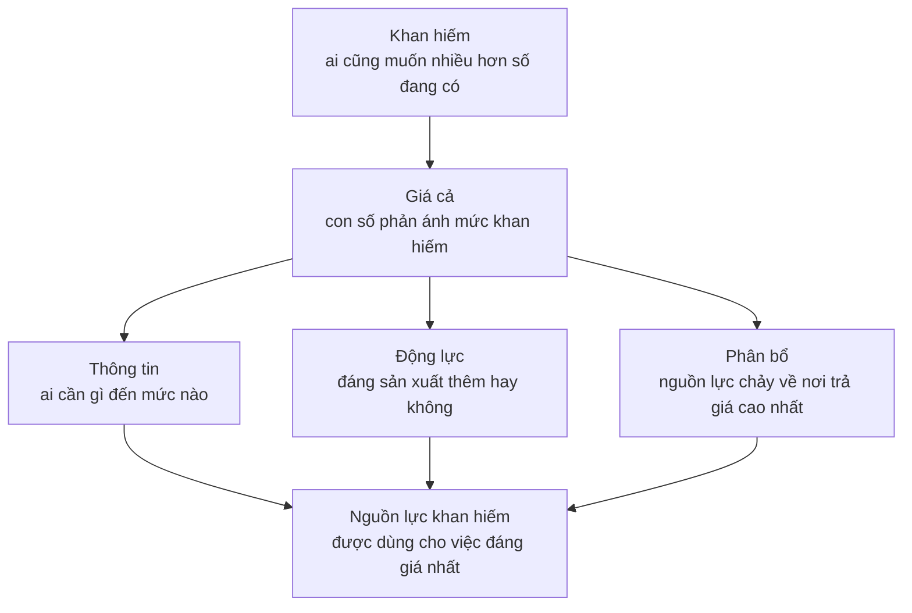

# Luận điểm của cuốn sách

> Sowell chỉ có một luận điểm, lặp lại suốt 27 chương: **giá cả là thông tin**.
> Khi chính sách ép giá đi chệch khỏi mức thị trường, hậu quả gần như luôn
> ngược với ý định tốt đẹp ban đầu — và hậu quả đó dự đoán được.

## Bốn câu hỏi để định vị cuốn sách

Đọc một cuốn sách kinh tế mà không biết ai viết, viết khi nào và cãi với ai
thì rất dễ nhầm quan điểm của một người thành quy luật vật lý. Bốn câu này trả
lời trước:

| Câu hỏi | Trả lời |
| --- | --- |
| **Viết khi nào?** | Ấn bản thứ 5 ra năm 2014, sau khủng hoảng tài chính 2008. Nhưng bộ khung của sách có từ ấn bản đầu năm 2000, và phần lớn ví dụ lấy từ thế kỷ 20. |
| **Tranh luận với ai?** | Với những người tin rằng có thể cải thiện kết quả kinh tế bằng cách ra lệnh cho giá: áp trần tiền thuê nhà, đặt sàn lương, dựng hàng rào thuế quan. Và với báo chí thường giải thích giá cao bằng lòng tham. |
| **Thuộc trường phái nào?** | Thị trường tự do, truyền thống Chicago — gần Milton Friedman và Friedrich Hayek. Sowell làm việc tại Hoover Institution, Đại học Stanford. |
| **Luận điểm sẵn sàng đánh đổi tất cả để bảo vệ?** | Rằng giá không phải là con số ai đó nghĩ ra, mà là **kết quả của sự khan hiếm** — và can thiệp vào nó không xóa được khan hiếm, chỉ giấu nó đi rồi đẩy chi phí sang chỗ khác. |

Một người biết *"đây là sách thị trường tự do viết năm 2014, phản bác việc
kiểm soát giá"* sẽ đặt đúng chỗ từng chương. Một người chỉ được bảo *"sách này
giải thích kinh tế học"* thì đang nhận quan điểm của một trường phái như thể
đó là định luật.

## Lập luận cốt lõi, trong một hình

Sowell lập luận rằng ba việc ở giữa — truyền thông tin, tạo động lực, phân bổ
nguồn lực — là những việc giá làm **đồng thời**, và không cơ quan nhà nước nào
làm thay nổi, vì không ai tập hợp được lượng thông tin nằm rải rác trong đầu
hàng triệu người mua và người bán.

Từ đó suy ra hệ quả xuất hiện đi xuất hiện lại trong sách: ép giá xuống dưới
mức thị trường thì mất cả ba chức năng cùng lúc, nên sinh ra thiếu hụt; ép giá
lên trên thì sinh ra dư thừa. Không phải vì ai đó ác ý, mà vì cơ chế bị tắt.

## Hai câu hỏi Sowell bắt người đọc hỏi mãi

**"Rồi sau đó thì sao?"** Sowell gọi việc chỉ nhìn hậu quả trước mắt là *tư
duy giai đoạn một* (stage-one thinking). Một chính sách nghe hợp lý ở giai
đoạn một thường đổi dấu ở giai đoạn hai và ba. Trần tiền thuê nhà làm tiền
thuê rẻ đi ngay lập tức — rồi làm số căn hộ xây mới giảm dần trong mười năm
sau.

**"Đánh đổi cái gì?"** Câu nói ông nhắc lại nhiều lần: trong kinh tế học không
có **giải pháp** (solutions), chỉ có **đánh đổi** (trade-offs). Bất cứ ai chào
bán một chính sách mà không nói nó tốn gì thì hoặc chưa phân tích xong, hoặc
đang bán hàng.

## Bốn loại phát biểu — công cụ đọc quan trọng nhất

Mỗi đoạn trong một cuốn sách kinh tế là một trong bốn thứ dưới đây. Người mới
học thường không phân biệt được, và đó chính là chỗ dễ bị dắt đi nhất. Trong
bản rút gọn này, bốn loại được viết khác nhau có chủ ý:

| Loại | Ví dụ | Đáng tin tới đâu |
| --- | --- | --- |
| **Định nghĩa** | "Khan hiếm nghĩa là tổng thứ mọi người muốn lớn hơn số đang có" | An toàn. Đây chỉ là quy ước về từ ngữ. |
| **Cơ chế** (một mô hình) | Lãi suất tăng → vay mượn giảm → tổng cầu giảm | Là công cụ tư duy, không phải sự thật. Luôn kèm giả định. |
| **Khẳng định thực nghiệm** | "Kiểm soát tiền thuê nhà làm giảm nguồn cung nhà ở" | Phải hỏi: ai đo, ở đâu, năm nào, có ai đo ra kết quả khác không. |
| **Dự báo và khuyến nghị chính sách** | "Nên bỏ luật lương tối thiểu" | Đây là **quan điểm**. Dựa trên ba loại trên, nhưng không tự động suy ra từ chúng. |

Sowell rất mạnh ở loại 1 và loại 2 — định nghĩa của ông sắc và cơ chế ông mô
tả rõ ràng. Ở loại 3, ông chọn bằng chứng ủng hộ lập luận của mình, điều mà
mọi tác giả có luận điểm đều làm. Ở loại 4, ông là một người tranh luận chính
trị, và nên được đọc như vậy.

Khi bạn tự đọc bản gốc, hãy thử gắn nhãn từng đoạn. Sau vài chương việc đó
thành phản xạ, và đó là món bạn mang ra khỏi cuốn sách này.

## Những chỗ cần biết là có tranh cãi

Không phải để bác bỏ Sowell, mà để bạn biết mình đang đứng ở đâu:

- **Lương tối thiểu.** Sowell trình bày tác động làm tăng thất nghiệp như một
  kết luận đã ngã ngũ. Trên thực tế đây là một trong những câu hỏi còn tranh
  cãi gay gắt nhất: nghiên cứu năm 1994 của David Card và Alan Krueger về
  ngành ăn nhanh ở New Jersey không tìm thấy tác động việc làm tiêu cực, và
  Card được trao giải Nobel kinh tế năm 2021 một phần vì nhóm công trình này.
  Xem [chương về lương tối thiểu](./3-lao-dong-va-tien-luong/02-luat-luong-toi-thieu.md).
- **Vai trò của nhà nước khi khủng hoảng.** Sowell nghi ngờ các gói kích thích.
  Dòng chính Keynes mới thì không. Cuốn sách không trình bày phía bên kia một
  cách đầy đủ.
- **Bất bình đẳng.** Sowell nhấn mạnh sự dịch chuyển của các cá nhân giữa các
  nhóm thu nhập. Những người như Thomas Piketty nhấn mạnh khoảng cách giữa các
  nhóm. Hai bên đo hai thứ khác nhau và đều có dữ liệu.

## Điều cuốn sách làm tốt hơn hầu hết sách nhập môn

Nó dạy bạn hỏi *"rồi sau đó thì sao?"*. Đó là thói quen tư duy hữu ích bất kể
bạn cuối cùng đồng ý với chính trị của tác giả hay không — và nó đúng với cả
những chính sách mà chính Sowell ủng hộ.

## Tự kiểm tra

1. Ba việc mà giá cả làm cùng lúc là gì?
2. "Tư duy giai đoạn một" nghĩa là gì, và ví dụ nào trong chương này minh họa?
3. Trong bốn loại phát biểu, loại nào bạn nên kiểm tra kỹ nhất trước khi tin?

---

Tiếp: [Phần I — Giá cả và thị trường](./1-gia-ca-va-thi-truong/)
