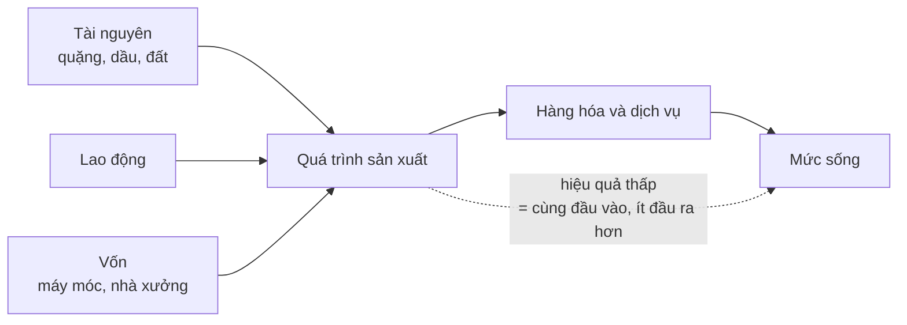

# Kinh tế học là gì?

> Kinh tế học là môn học về cách dùng những **nguồn lực khan hiếm có nhiều
> công dụng khác nhau**. Chỉ cần thiếu một trong hai vế — khan hiếm, hoặc
> nhiều công dụng — là không còn gì để nghiên cứu.

## Bắt đầu từ chuyện bạn đã biết

Bạn có một buổi tối rảnh. Bạn có thể học, gặp bạn bè, hay ngủ sớm. Chọn cái
này là mất cái kia. Không ai in thêm được giờ cho bạn.

Đó đã là một bài toán kinh tế hoàn chỉnh, dù không có đồng nào đổi chủ.

## Định nghĩa

Sowell mượn định nghĩa kinh điển của nhà kinh tế học người Anh **Lionel
Robbins**: kinh tế học nghiên cứu việc sử dụng những nguồn lực **khan hiếm**
(scarce) có **nhiều công dụng thay thế nhau** (alternative uses).

Hai chữ đó gánh toàn bộ phần còn lại của cuốn sách:

- **Khan hiếm** không có nghĩa là "hiếm" hay "nghèo". Nó có nghĩa là tổng số
  thứ mà mọi người muốn **lớn hơn** số đang có. Theo nghĩa này, nước ở một
  thành phố ven sông vẫn là khan hiếm.
- **Nhiều công dụng** là lý do phải có sự lựa chọn. Dầu mỏ làm ra xăng, dầu
  sưởi, nhựa, nhựa đường. Quặng sắt làm ra từ cái kẹp giấy tới khung nhà cao
  tầng. Nếu mỗi nguồn lực chỉ dùng được một việc, sẽ chẳng còn gì để tính.

Sowell dùng hình ảnh Vườn Địa Đàng để cho thấy vế đầu là bắt buộc: ở đó vẫn có
sản xuất và phân phối, nhưng vì mọi thứ đều vô tận nên không có gì để tiết
kiệm, và do đó không có kinh tế học.

## Hệ quả đầu tiên: "nhu cầu chưa được đáp ứng" là chuyện đương nhiên

Đây là chỗ Sowell đi ngược lại cách báo chí hay viết. Nếu tổng mong muốn luôn
lớn hơn tổng nguồn lực, thì việc còn những **nhu cầu chưa được đáp ứng**
("unmet needs") không phải là dấu hiệu hệ thống hỏng — nó là định nghĩa của
việc sống trong một thế giới hữu hạn.

Ông dẫn một bài báo trên *New York Times* mô tả các gia đình trung lưu Mỹ
"chỉ vừa đủ sống", kèm ảnh một gia đình bên bể bơi riêng của họ. Điều gò bó họ,
Sowell lập luận, không phải là một cuốn sổ chi tiêu do con người nghĩ ra, mà
là thực tế: chưa bao giờ có đủ để thỏa mãn hoàn toàn tất cả mọi người.

Cần cẩn thận ở đây: đó là một **lập luận tu từ** sắc sảo, và nó đúng ở mức
định nghĩa. Nó không tự động trả lời câu hỏi liệu một xã hội cụ thể có phân
phối phần khan hiếm ấy một cách hợp lý hay không. Sowell sẽ bàn chuyện phân
phối, nhưng ông bắt đầu bằng cách gạt khỏi bàn ý tưởng rằng *thiếu thốn tự nó*
là bằng chứng của sai lầm.

## Hệ quả thứ hai: tài nguyên không quyết định mức sống

Đây là một trong những con số dễ nhớ nhất của chương:

- Giá trị tài nguyên thiên nhiên tính trên đầu người của **Uruguay** và
  **Venezuela** cao gấp nhiều lần **Nhật Bản** và **Thụy Sĩ**.
- Nhưng thu nhập thực tế trên đầu người của Nhật và Thụy Sĩ **cao hơn gấp đôi**
  Uruguay, và cao gấp nhiều lần Venezuela.

Cái quyết định mức sống không phải là bạn có gì, mà là bạn biến đầu vào thành
đầu ra hiệu quả tới đâu. Sowell dẫn Liên Xô làm ví dụ ngược: công nghiệp Liên
Xô dùng **nhiều điện hơn** công nghiệp Mỹ trong khi tạo ra **ít sản lượng
hơn** — ở một đất nước có lẽ giàu tài nguyên bậc nhất thế giới.

## Hệ quả thứ ba: tiền không phải là của cải

Với cả một xã hội, tiền chỉ là công cụ nhân tạo để hàng hóa thật được luân
chuyển. Nếu tiền là của cải, chính phủ đã có thể làm mọi người giàu lên bằng
cách in thêm. Cái quyết định một nước nghèo hay giàu là **khối lượng hàng hóa
và dịch vụ**, không phải số tiền đang lưu hành.

Hãy giữ câu này lại. Nó sẽ quay lại nguyên vẹn ở
[chương về tiền tệ và ngân hàng](../5-kinh-te-quoc-gia/02-tien-te-va-he-thong-ngan-hang.md),
nơi nó giải thích lạm phát.

## Kinh tế học không phải là cái mà nhiều người tưởng

Sowell dành một mục để gạt bỏ vài hiểu lầm phổ biến. Kinh tế học **không phải**
là cách kiếm tiền, không phải quản trị kinh doanh, và không phải công cụ dự
báo thị trường chứng khoán — việc dự báo lên xuống của chứng khoán đến nay vẫn
chưa quy được về một công thức đáng tin.

Nó là **nghiên cứu có hệ thống về nhân và quả**: làm việc A theo cách B thì
chuyện gì xảy ra. Sowell nhấn mạnh rằng đây là chuyện phương pháp chứ không
phải chuyện lập trường, và dẫn ví dụ: nhà kinh tế học marxist **Oskar Lange**
dùng phương pháp phân tích không khác về căn bản so với nhà kinh tế học bảo
thủ **Milton Friedman**.

Từ đó là quy tắc đọc quan trọng nhất của cả cuốn sách:

> Xem xét một chính sách qua **động lực** (incentives) mà nó tạo ra, chứ không
> qua **mục tiêu** (goals) mà nó tuyên bố. Hậu quả quan trọng hơn ý định — và
> không chỉ hậu quả trước mắt, mà cả những gì dội lại về sau.

Phần lớn thảm họa kinh tế, Sowell lập luận, xuất phát từ những chính sách được
thiết kế với ý định tốt.

## Không cần có tiền thì mới là bài toán kinh tế

Ví dụ ông dùng để chốt chương: một tổ quân y đến chiến trường. Không bao giờ
đủ bác sĩ, y tá và thuốc cho tất cả. Một số thương binh gần như chắc chắn
không qua khỏi; một số sẽ sống nếu được cứu ngay; một số bị thương nhẹ và sẽ
hồi phục dù có được chăm sóc ngay hay không.

Phân bổ sai thì có người chết oan. Đó là bài toán phân bổ nguồn lực khan hiếm
có nhiều công dụng, đúng định nghĩa — mà không có một xu nào đổi chủ.

## Vì sao chuyện này đáng quan tâm

Sowell đưa ra con số về Trung Quốc để cho thấy chính sách kinh tế không phải
chuyện lý thuyết suông: số người sống với một đô la một ngày trở xuống giảm từ
**374 triệu** — một phần ba dân số nước này năm **1990** — xuống còn **128
triệu** vào năm **2004**, tức khoảng 10 phần trăm của một dân số đang tăng.
Ở Ấn Độ, ước tính có **20 triệu** người thoát cảnh bần cùng trong một thập kỷ.

## Chỗ cần thận trọng

Lập luận "đây là khoa học về nhân quả, không phải quan điểm" là đúng về
phương pháp, nhưng nó cũng là một nước đi tu từ mạnh: nó đặt kết luận của tác
giả về phía sự thật và đặt phía phản bác về phía cảm tính. Hãy giữ lại phương
pháp, và vẫn hỏi ở từng chương: *khẳng định này là định nghĩa, là mô hình, hay
là bằng chứng thực nghiệm mà người khác có thể đo ra kết quả khác?*

## Điều cần nhớ

- Kinh tế học = nguồn lực **khan hiếm** + **nhiều công dụng**. Thiếu vế nào
  cũng không còn môn học.
- Khan hiếm nghĩa là tổng mong muốn vượt tổng nguồn lực — nên luôn có nhu cầu
  chưa được đáp ứng, ở mọi kiểu nền kinh tế.
- Mức sống do **hiệu quả biến đầu vào thành đầu ra** quyết định, không phải do
  tài nguyên. Nhật và Thụy Sĩ so với Uruguay và Venezuela.
- Tiền không phải của cải. Hàng hóa và dịch vụ mới là.
- Đánh giá chính sách bằng **động lực nó tạo ra**, không bằng **mục tiêu nó
  tuyên bố**.

## Tự kiểm tra

1. Vì sao nước vẫn là nguồn lực khan hiếm ngay cả ở một thành phố ven sông?
2. Vì sao Nhật Bản giàu hơn Venezuela dù ít tài nguyên hơn nhiều?
3. Tổ quân y trên chiến trường giải bài toán kinh tế nào, khi không có tiền?

---

Trước: [Phần I](./README.md) ·
Tiếp: [Giá cả để làm gì?](./02-vai-tro-cua-gia-ca.md)
