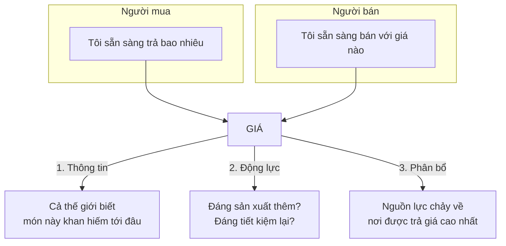
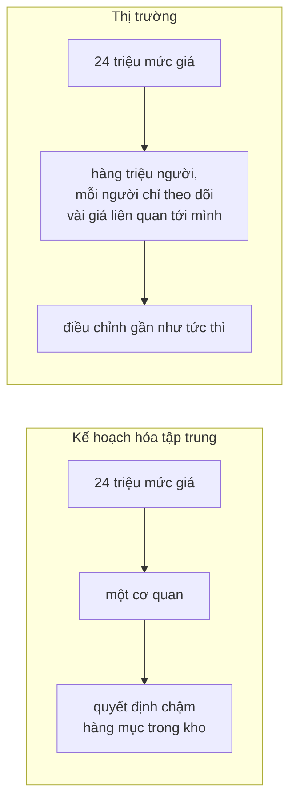

# Giá cả để làm gì?

> Không ai điều phối việc cung cấp thực phẩm cho London, vậy mà London vẫn
> được ăn mỗi ngày. Giá cả làm việc đó — bằng cách **truyền thông tin**, **tạo
> động lực** và **phân bổ nguồn lực**, cả ba cùng lúc.

## Bắt đầu từ chuyện bạn đã biết

Sáng nay siêu thị gần nhà bạn có rau. Không có cơ quan nào ra lệnh cho người
nông dân trồng đúng lượng rau đó, cho tài xế chở đúng chuyến đó, cho siêu thị
nhập đúng số đó. Không ai trong chuỗi ấy biết bạn tồn tại.

Vậy ai đã sắp xếp?

## Câu hỏi mà Gorbachev đã hỏi

Sowell kể lại rằng Mikhail Gorbachev, tổng thống cuối cùng của Liên Xô, từng
hỏi thủ tướng Anh Margaret Thatcher: bà làm thế nào để bảo đảm người dân có
lương thực? Câu trả lời là bà không làm gì cả. Giá cả làm việc đó.

Và người Anh được ăn uống đầy đủ hơn người Liên Xô, dù hơn một thế kỷ qua nước
Anh không tự sản xuất đủ lương thực cho mình. Giá cả kéo thực phẩm từ các nước
khác về.

Hãy hình dung bộ máy hành chính khổng lồ cần có chỉ để bảo đảm riêng thành phố
London mỗi ngày nhận đủ hàng tấn thực phẩm đủ loại. Cả đạo quân công chức ấy
không cần tồn tại — và những người đó có thể làm việc có ích ở chỗ khác — vì
một cơ chế đơn giản là giá cả làm cùng công việc đó nhanh hơn, rẻ hơn, tốt hơn.

## Ba việc giá cả làm cùng lúc

**Thông tin.** Nếu ai đó ở Fiji tìm ra cách làm giày tốt hơn với chi phí thấp
hơn, chẳng bao lâu bạn sẽ thấy đôi giày đó bày bán với giá hấp dẫn ở Mỹ hay ở
Ấn Độ. Không cần ai ra thông báo.

Ví dụ rõ nhất của Sowell: giả sử người ta phát hiện những mỏ quặng sắt lớn ở
đâu đó. Có lẽ chưa tới một phần trăm dân số biết tin. Nhưng mọi người sẽ nhận
ra đồ làm bằng thép rẻ đi. Người định mua bàn làm việc thấy bàn thép bỗng hời
hơn bàn gỗ, và một số đổi ý. Cả xã hội tự động điều chỉnh theo một phát hiện
mà 99% trong số họ hoàn toàn không hay biết.

**Động lực.** Giá không chỉ chuyển tiền, nó thay đổi hành vi. Nhà sản xuất ô
tô không thể biết hàng triệu người tiêu dùng muốn gì. Họ chỉ biết rằng mẫu xe
với tổ hợp tính năng này thì bán được ở mức giá đủ bù chi phí và còn lãi, còn
mẫu kia thì ế.

**Phân bổ.** Khi cung vượt cầu, người bán cạnh tranh để đẩy hàng tồn, giá giảm,
sản xuất trong tương lai bị nản, và nguồn lực được giải phóng cho việc khác.
Khi cầu vượt cung, giá tăng, sản xuất được khuyến khích, nguồn lực bị hút từ
những nơi khác của nền kinh tế về.

## Thứ bị hiểu lầm nhiều nhất: giá cao không tạo ra khan hiếm

Nhiều người coi giá là vật cản giữa họ và thứ họ muốn. Người mơ một căn nhà
sát biển sẽ bỏ ý định khi biết giá.

Nhưng giá cao **không phải là lý do** khiến chúng ta không thể ai cũng sống
sát biển. Lý do là **không có đủ nhà sát biển cho tất cả**. Giá chỉ đang nói
lại sự thật đó.

Sowell đẩy lập luận tới cùng: giả sử nhà nước đặt trần giá bất động sản ven
biển và tuyên bố "ai cũng có quyền tiếp cận". Tỉ lệ giữa số người và diện tích
bờ biển không đổi một chút nào. Việc **phân phối phần khan hiếm vẫn phải xảy
ra** — chỉ là bây giờ nó diễn ra bằng quyết định hành chính, quan hệ chính trị
hoặc may rủi, thay vì bằng giá. Gọi nó là "quyền cơ bản" cũng không làm ra
thêm một mét bờ biển nào.

Đây là khuôn mẫu lặp lại suốt cuốn sách. Hãy nhớ nó: **giá là người đưa tin,
không phải nguyên nhân**.

## Đây là hệ thống lãi **và lỗ**

Kinh tế thị trường đôi khi được gọi là "hệ thống lợi nhuận". Sowell nhấn mạnh
đó là cách gọi sai một nửa: nó là **hệ thống lãi và lỗ**, và phần lỗ quan
trọng ngang phần lãi.

Lợi nhuận nói với nhà sản xuất nên làm thêm cái gì. **Thua lỗ nói với họ nên
dừng cái gì** — ngừng sản xuất thứ gì, ngừng rót nguồn lực vào đâu, ngừng đầu
tư vào cái gì. Thua lỗ buộc người sản xuất phải thôi làm ra thứ mà người tiêu
dùng không muốn.

Và nếu họ quá bướng để thay đổi, thua lỗ kéo dài sẽ đẩy doanh nghiệp tới phá
sản — lãng phí bị chặn lại theo cách đó.

Điểm mấu chốt trong so sánh của Sowell: trong nền kinh tế thị trường, người
lao động và chủ nợ đòi được trả tiền bất kể ban lãnh đạo có sai lầm hay không.
Nghĩa là doanh nghiệp chỉ được sai tới một mức nào đó, trong một thời gian nào
đó, rồi buộc phải dừng. Trong nền kinh tế phong kiến hoặc kế hoạch hóa, người
đứng đầu có thể lặp lại cùng một sai lầm vô thời hạn, và cái giá do người khác
trả dưới dạng mức sống thấp hơn.

## Câu chuyện những tấm da chuột chũi

Ví dụ hay nhất của chương, lấy từ hai nhà kinh tế học Liên Xô Nikolai Shmelev
và Vladimir Popov:

Nhà nước Liên Xô nâng giá thu mua da chuột chũi. Thợ săn phản ứng đúng như
động lực đòi hỏi: săn và bán nhiều hơn. Các trung tâm thu mua chất đầy da.
Ngành công nghiệp nhẹ không dùng hết, và da mục dần trong kho trước khi kịp
chế biến. Bộ Công nghiệp nhẹ đã hai lần đề nghị cơ quan giá hạ giá thu mua
xuống. Đề nghị vẫn chưa được xử lý.

Lý do rất con người: cơ quan đó, ngoài việc định giá cho mấy tấm da này, còn
phải theo dõi **24 triệu mức giá** khác.

Đây là luận điểm sâu nhất của chương: **tri thức mới là nguồn lực khan hiếm
nhất**. Hệ thống giá tiết kiệm tri thức bằng cách buộc người biết rõ hoàn cảnh
của chính mình phải đặt giá dựa trên hiểu biết đó — thay vì dựa vào khả năng
thuyết phục người khác trong một ủy ban kế hoạch. Nói hay không phải là cách
truyền tin chính xác; phải bỏ tiền ra thì người ta mới moi ra thông tin thật
nhất của mình thay vì lời lẽ nghe hợp lý nhất.

Con người sẽ mắc sai lầm trong mọi hệ thống. Câu hỏi thật sự là: **hệ thống
nào buộc người ta phải sửa sai?**

## Bằng chứng mà Sowell đưa ra

Đây là loại **khẳng định thực nghiệm** — hãy đọc kèm năm tháng:

- **Ghana và Bờ Biển Ngà** đổi vai cho nhau sau khi đổi hướng chính sách: khi
  Ghana nới kiểm soát nhà nước, kinh tế Ghana bắt đầu tăng trưởng, còn Bờ Biển
  Ngà đi xuống.
- **Miến Điện và Thái Lan**: Miến Điện có mức sống cao hơn trước khi theo con
  đường xã hội chủ nghĩa; sau đó Thái Lan vượt xa.
- **Ấn Độ và Hàn Quốc**: năm **1960** hai nước ở mức tương đương. Tới cuối thập
  niên **1980**, thu nhập bình quân đầu người của Hàn Quốc gấp **mười lần** Ấn
  Độ.
- **Ấn Độ** độc lập năm 1947 và theo mô hình kinh tế nhà nước chỉ huy suốt bốn
  thập kỷ. Giai đoạn 1950–1990 tăng trưởng trung bình **2%/năm**. Sau cải cách
  thập niên 1990, tăng trưởng lên **6%/năm**.
- **Trung Quốc**: năm **1978**, chưa tới **10%** sản lượng nông nghiệp được bán
  trên thị trường mở; tới năm **1990** con số đó là **80%**. Thu nhập nông dân
  tăng hơn **50%** trong vài năm. Tăng trưởng đạt khoảng **9%/năm** giai đoạn
  **1978–1995**. Mao Trạch Đông mất năm **1976**.

Cần nói thẳng một điều mà Sowell không nói: đây là những so sánh được chọn, và
mỗi trường hợp còn có các yếu tố khác cùng tác động — chiến tranh, viện trợ,
nhân khẩu học, thể chế. Hướng của lập luận được nhiều nhà kinh tế học đồng
tình; mức độ chắc chắn thì không.

## Marx và Engels đã thấy trước

Chi tiết thú vị nhất chương. Sowell chỉ ra rằng chính **Karl Marx** và
**Friedrich Engels** ở thế kỷ 19 đã thấy trước vấn đề của việc điều hành kinh
tế bằng mệnh lệnh. Engels lập luận rằng biến động giá là thứ buộc từng người
sản xuất phải nhận ra xã hội đang cần hay không cần thứ gì và cần bao nhiêu;
không có cơ chế ấy thì lấy gì bảo đảm sẽ không rơi vào cảnh thiếu lương thực
trong khi thừa mứa những món chẳng ai cần.

Dưới thời Stalin, một số nhà kinh tế học bị xử bắn vì nói những điều ông không
muốn nghe.

## Cung và cầu, phát biểu đơn giản nhất

- Người ta mua **nhiều hơn khi giá thấp**, mua **ít hơn khi giá cao**. Lượng
  cầu biến thiên **ngược chiều** với giá.
- Người ta cung ứng **nhiều hơn khi giá cao**. Lượng cung biến thiên **cùng
  chiều** với giá.

Hai câu này tầm thường tới mức dễ bị bỏ qua. Phần còn lại của mục là Sowell
chỉ ra hai hệ quả mà hầu hết người ta không rút ra.

### Hệ quả 1 — không có "nhu cầu" cố định

Khi ai đó tính toán một đất nước "cần" bao nhiêu đơn vị của một thứ gì, họ đang
giả định có một con số khách quan. Không có con số đó.

Ví dụ của Sowell: một kibbutz ở Israel sống theo lối cộng đồng, cung cấp điện
và thực phẩm cho các thành viên mà không tính tiền. Kết quả là người ta thường
không buồn tắt đèn ban ngày, và mời bạn bè từ ngoài vào ăn cùng. Sau khi
kibbutz bắt đầu thu tiền điện và tiền ăn, mức tiêu thụ cả hai **giảm mạnh**.

Điện và thực phẩm đều thiết yếu. Vậy mà lượng "cần" vẫn thay đổi theo giá.

### Hệ quả 2 — không có nguồn cung cố định

Người ta hay nghĩ trữ lượng dầu là chuyện vật lý: dưới đất có bao nhiêu thì có
bấy nhiêu. Thực tế, chi phí tìm kiếm, khai thác và chế biến chênh nhau rất xa
giữa các nơi. Có dầu khai thác được ở mức 20 đô la một thùng; có dầu ở nơi khác
không bù nổi chi phí ở mức 40 đô la, nhưng bù được ở mức 60.

Khi giá dầu xuống dưới một ngưỡng, các giếng năng suất thấp đóng cửa. Khi giá
lên lại — hoặc khi công nghệ hạ được chi phí — chúng mở lại.

Ví dụ rõ nhất: **cát dầu ở Venezuela và Canada** từng bị coi là không khai
thác nổi về mặt kinh tế, và **không được tính vào trữ lượng dầu thế giới**.
Khi giá dầu lập đỉnh mới vào đầu thế kỷ 21, chúng được tính lại — và điều đó
đẩy Venezuela lên vị trí thứ nhất và Canada thứ ba trong bảng trữ lượng toàn
cầu. Riêng cát dầu Canada chứa khoảng **174 tỉ thùng** có thể khai thác có
lãi, cộng thêm khoảng **141 tỉ thùng** nữa sẽ đáng khai thác nếu giá lên hoặc
chi phí giảm.

Trữ lượng không tăng vì có thêm dầu dưới đất. Nó tăng vì **giá đổi**.

Đó là lý do hàng loạt dự báo suốt hơn một thế kỷ rằng loài người "sắp cạn"
tài nguyên này nọ đều sai: chúng lẫn lộn giữa lượng khai thác được **ở mức giá
hiện tại** với lượng thực có trong lòng đất.

Điều này áp dụng cả cho con người. Khi ai đó dự báo vài năm nữa sẽ thiếu kỹ sư
hay giáo viên, họ thường ngầm giả định *thiếu ở mức lương hôm nay*. Nhưng
thiếu hụt chính là thứ làm giá tăng.

## Không có "giá trị thật"

Người ta hay nói một món bị bán **cao hơn giá trị thật** của nó, hay một người
được trả **ít hơn giá trị thật** của họ. Sowell lập luận rằng khái niệm đó
không tồn tại — và lý do rất gọn:

> Nếu có một giá trị khách quan, sẽ **không có lý do gì để trao đổi**.

Bạn trả một đô la mua tờ báo chỉ vì tờ báo đáng giá hơn một đô la **đối với
bạn**. Người bán bán nó chỉ vì một đô la đáng giá hơn tờ báo **đối với họ**.
Hai bên đánh giá ngược nhau — và chính vì thế cả hai đều được lợi. Nếu tồn tại
một con số đúng duy nhất, giao dịch sẽ vô nghĩa.

Hệ quả: khi giá nhà ở một thị trấn sụt xuống sau khi nhà máy lớn đóng cửa, đó
không phải là chuyện người ta bán rẻ hơn "giá trị thật". Giá trị của việc sống
ở thị trấn đó đã thật sự giảm, vì cơ hội việc làm đã giảm.

## "Nhu cầu chưa được đáp ứng" — cái bẫy ngôn ngữ

Phần cuối chương, và là phần dễ dùng nhất trong đời sống hằng ngày.

Chính trị gia và báo chí liên tục chỉ ra những **nhu cầu chưa được đáp ứng** mà
nhà nước nên giải quyết. Nếu kinh tế học là môn học về nguồn lực khan hiếm có
nhiều công dụng, thì **luôn luôn** có nhu cầu chưa được đáp ứng. Đáp ứng 100%
một mong muốn cụ thể chỉ có nghĩa là những mong muốn khác còn bị bỏ dở nhiều
hơn hiện nay.

Ví dụ chỗ đỗ xe: về mặt kỹ thuật lẫn kinh tế, hoàn toàn có thể xây một thành
phố sao cho ai cũng có chỗ đỗ, ở bất cứ đâu, bất cứ giờ nào. Câu hỏi là **đổi
cái gì lấy nó?** Ít bệnh viện hơn? Ít trạm cứu hỏa hơn? Bỏ thư viện công?

Và đây là định nghĩa quan trọng nhất của cả cuốn sách:

> **Chi phí là những cơ hội bị bỏ qua** (foregone opportunities), không phải là
> khoản tiền nhà nước chi ra.

Cấm ô tô trong thành phố nghe có vẻ "rẻ" nếu chỉ đếm ngân sách nhà nước. Nhưng
nó buộc hàng nghìn người từ bỏ những thứ họ đã tự nguyện bỏ tiền mua. Chi phí
đó không xuất hiện trong bất kỳ bảng ngân sách nào, và nó có thể lớn hơn nhiều
khoản tiền tiết kiệm được.

Sowell cũng tấn công chính từ **"nhu cầu"**: nó tùy tiện đặt một số mong muốn
lên hàng quan trọng hơn hẳn các mong muốn khác. Nhưng ngay cả thứ cấp thiết
nhất cũng chỉ cần thiết **trong một khoảng**. Thức ăn vượt quá một mức thì gây
béo phì; nước vượt quá một mức thì là lũ lụt; ôxy vượt quá một nồng độ cũng
gây hại — đó là lý do bệnh viện không mở bình ôxy tùy tiện.

Kết luận: không có gì là "nhu cầu" một cách tuyệt đối. Kinh tế học nói về
**đánh đổi từng phần**, không nói về "giải pháp".

Đây là phần lập luận mạnh, nhưng hãy nhận ra nó làm gì: nó chuyển câu hỏi từ
*"chúng ta có nên cung cấp thứ này không"* sang *"đổi cái gì lấy nó"*. Đó là
một cải tiến thật về mặt tư duy. Nó không tự động trả lời câu hỏi thứ nhất.

## Điều cần nhớ

- Giá làm ba việc cùng lúc: **truyền thông tin, tạo động lực, phân bổ nguồn
  lực**. Bỏ giá đi là mất cả ba.
- **Giá là người đưa tin, không phải nguyên nhân** của khan hiếm. Áp trần giá
  không tạo thêm nhà sát biển.
- Đây là hệ thống **lãi và lỗ**. Thua lỗ là tín hiệu dừng, và quan trọng ngang
  lợi nhuận.
- Tri thức là nguồn lực khan hiếm nhất. 24 triệu mức giá không thể do một cơ
  quan theo dõi, nhưng hàng triệu người mỗi người theo dõi vài giá thì được.
- **Không có nhu cầu cố định, không có nguồn cung cố định, không có giá trị
  thật.** Cả ba đều biến thiên theo giá.
- **Chi phí là cơ hội bị bỏ qua**, không phải khoản chi ngân sách.

## Tự kiểm tra

1. Nếu áp trần giá nhà ven biển, việc phân phối số nhà ít ỏi đó sẽ diễn ra
   bằng cách nào?
2. Vì sao trữ lượng dầu của Canada tăng vọt mà không ai tìm thêm được mỏ nào?
3. Câu "món này bị bán cao hơn giá trị thật của nó" sai ở đâu?
4. Nếu một chính trị gia nói về một nhu cầu chưa được đáp ứng, câu hỏi bạn nên
   hỏi lại là gì?

---

Trước: [Kinh tế học là gì?](./01-kinh-te-hoc-la-gi.md) ·
Tiếp: [Chuyện gì xảy ra khi ép giá?](./03-kiem-soat-gia.md)
