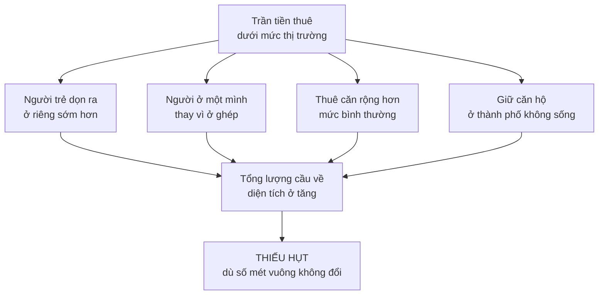
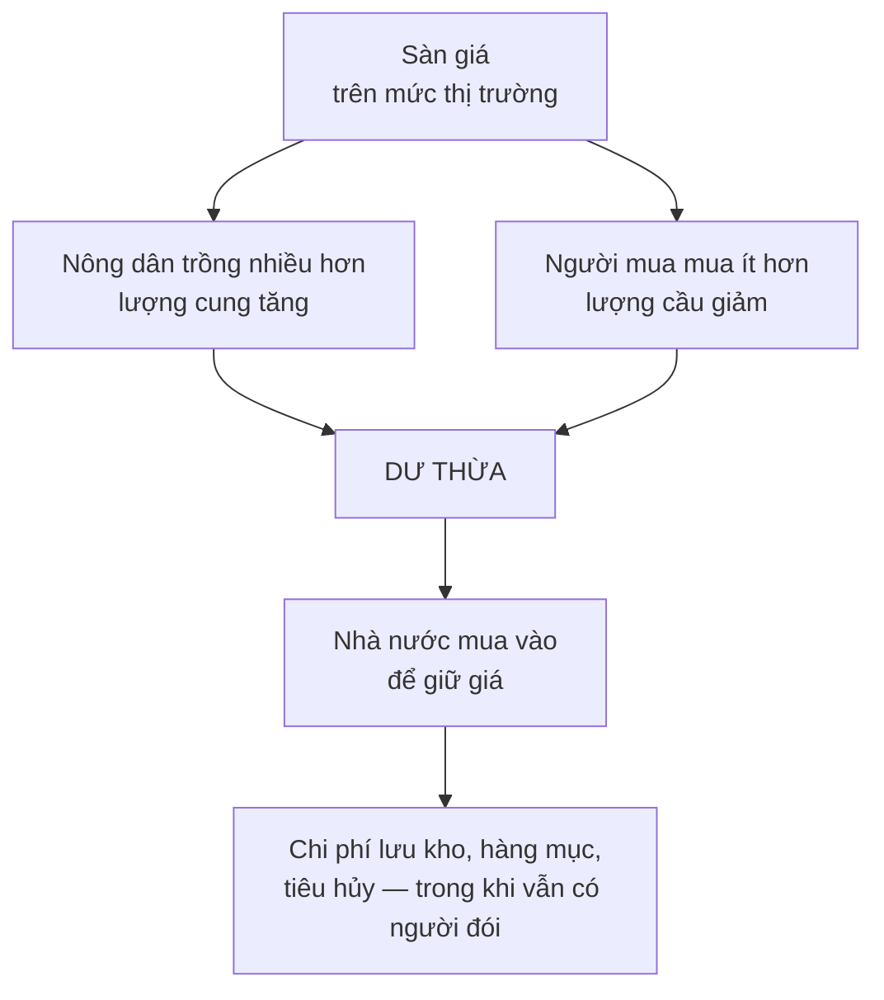

# Chuyện gì xảy ra khi ép giá?

> Ép giá xuống dưới mức thị trường sinh ra **thiếu hụt**. Ép giá lên trên sinh
> ra **dư thừa**. Cả hai đều không phải vì có ít hàng hơn — mà vì cơ chế điều
> tiết đã bị tắt.

## Bắt đầu từ chuyện bạn đã biết

Mất điện là lúc bạn hiểu rõ nhất điện dùng để làm gì. Kiểm soát giá cũng vậy:
nó là cách rõ ràng nhất để thấy giá cả vốn đang làm những gì.

Kiểm soát giá không phải chuyện mới. Nó có từ thời các pharaoh Ai Cập, được
vua Hammurabi của Babylon ban hành từ thế kỷ 18 trước Công nguyên, và đã được
thử ở Athens cổ đại.

## Hai từ cần định nghĩa chính xác

Đây là chỗ hầu hết người mới học hiểu sai, nên đọc chậm:

- **Thiếu hụt** (shortage): lượng cầu vượt lượng cung **ở mức giá hiện tại**.
- **Dư thừa** (surplus): lượng cung vượt lượng cầu **ở mức giá hiện tại**.

Cụm "ở mức giá hiện tại" là toàn bộ nội dung. Thiếu hụt **không** có nghĩa là
có ít hàng hơn. Dư thừa **không** có nghĩa là có nhiều hàng hơn mức người ta
cần. Cả hai đều là **hiện tượng của giá**.

Nếu bạn chỉ mang một câu ra khỏi chương này, hãy mang câu đó.

## Trần giá: chuyện tiền thuê nhà

### Bằng chứng mở đầu

Sau Thế chiến thứ hai, nước Mỹ có một cuộc khủng hoảng nhà ở nghiêm trọng.
Người ta mất hàng tuần, hàng tháng tìm chỗ ở, hối lộ chủ nhà để được đẩy lên
đầu danh sách chờ, ở ghép với họ hàng, ngủ trong nhà để xe, mua lại lán quân
sự cũ hoặc toa xe điện cũ để ở.

Nhưng con số thì thế này: so với trước chiến tranh, **dân số Mỹ tăng khoảng
10%, và nguồn cung nhà ở cũng tăng khoảng 10%**. Tỉ lệ giữa nhà và người **không
đổi**. Và khi chiến tranh bắt đầu thì không có khủng hoảng nào cả.

Cái đã thay đổi là luật kiểm soát tiền thuê nhà được ban hành trong chiến
tranh. Khi kiểm soát tiền thuê chấm dứt, cuộc khủng hoảng biến mất rất nhanh —
trước cả khi kịp xây thêm bất kỳ căn nhà nào.

Chuyện đó chỉ có thể giải thích bằng giá.

### Vì sao phía cầu phình ra

Mỗi mũi tên là một người phản ứng hoàn toàn hợp lý với mức giá họ nhìn thấy.
Không ai làm gì sai. Đó chính là điểm của lập luận.

Con số Sowell đưa ra:

- Một nghiên cứu ở San Francisco cho thấy **49%** số căn hộ thuộc diện kiểm
  soát tiền thuê chỉ có **một người ở** — trong khi hàng nghìn người phải sống
  cách đó rất xa và đi làm đường dài vào thành phố.
- Báo cáo điều tra dân số cho thấy ở Manhattan — nơi gần một nửa số căn hộ
  chịu một hình thức kiểm soát tiền thuê nào đó — **46%** hộ gia đình chỉ có
  một người, so với **27%** trên toàn nước Mỹ.

### Vì sao nhà không được nhường lại

Bình thường, nhu cầu về diện tích của một người thay đổi theo đời: tăng khi
lập gia đình và có con, giảm khi con cái trưởng thành ra ở riêng, giảm nữa khi
góa bụa. Nhờ vậy tổng quỹ nhà của xã hội được luân chuyển giữa những người
đang cần nó nhiều nhất.

Việc luân chuyển đó xảy ra không phải vì mọi người có tinh thần hợp tác, mà vì
**tiền thuê đặt trước mặt họ một lựa chọn**. Trả ít hơn thì có thêm tiền cho
việc khác.

Kiểm soát tiền thuê làm phần thưởng đó teo lại, đồng thời làm việc đi tìm căn
nhỏ hơn tốn công hơn vì đang thiếu nhà. Kết quả là **tốc độ luân chuyển giảm**.
New York áp dụng kiểm soát tiền thuê lâu hơn và chặt hơn bất kỳ thành phố lớn
nào khác ở Mỹ; tỉ lệ luân chuyển căn hộ hằng năm ở đó **chưa bằng một nửa**
mức trung bình toàn quốc, còn tỉ lệ người thuê ở cùng một căn từ 20 năm trở
lên thì **hơn gấp đôi** mức trung bình.

### Rồi phía cung teo lại

Đây là "giai đoạn hai", và nó mất nhiều năm mới lộ ra:

| Nơi | Chuyện đã xảy ra |
| --- | --- |
| **Melbourne, Úc** | Chín năm sau Thế chiến thứ hai, không một chung cư mới nào được xây, vì luật kiểm soát tiền thuê khiến việc đó không có lãi |
| **Ai Cập** (áp dụng từ **1960**) | Người ta ngừng đầu tư vào chung cư; nhiều gia đình phải chen nhau trong một căn hộ nhỏ. Hậu quả kéo dài qua nhiều thế hệ |
| **Santa Monica, California** (từ **1979**) | Giấy phép xây dựng giảm xuống **dưới một phần mười** so với năm năm trước đó |
| **San Francisco** | Ba phần tư quỹ nhà thuộc diện kiểm soát đã hơn nửa thế kỷ tuổi; **44%** đã hơn 70 năm tuổi |
| **Anh và xứ Wales** | Nhà cho thuê do tư nhân xây giảm từ **61%** tổng quỹ nhà năm **1947** xuống còn **14%** vào năm **1977** |
| **Washington D.C.** (8 năm kiểm soát, thập niên 1970) | Quỹ nhà cho thuê giảm từ hơn **199.000** căn xuống dưới **176.000** căn |
| **Berkeley, California** | Số căn cho thuê tư nhân dành cho sinh viên giảm **31%** trong năm năm |

Một bằng chứng gián tiếp rất sắc: xây văn phòng, nhà máy và kho bãi dùng gần
như cùng loại nhân công và vật liệu với xây chung cư. Luật kiểm soát tiền thuê
thường **không áp dụng** cho bất động sản thương mại. Kết quả là ngay ở những
thành phố thiếu nhà ở trầm trọng, cao ốc văn phòng vẫn mọc lên — và một khảo
sát toàn nước Mỹ năm **2003** cho thấy tỉ lệ trống ở các tòa nhà thương mại và
công nghiệp gần **12%**, cao nhất trong hơn hai thập kỷ.

Nguồn lực có sẵn. Chúng chỉ chảy đi chỗ khác.

Và đây là kết luận đắt nhất của phần này: một chính sách nhằm làm cho nhà ở
vừa túi tiền người nghèo lại có tác dụng ròng là đẩy nguồn lực về phía xây nhà
mà chỉ người khá giả mới mua nổi — vì nhà hạng sang thường được miễn trừ khỏi
kiểm soát giá, giống như bất động sản thương mại.

> Phân tích chính sách theo **động lực nó tạo ra**, không theo **hy vọng đã
> sinh ra nó**.

## Ba hậu quả đi kèm mọi hình thức kiểm soát giá

### 1. Chất lượng đi xuống

Đây là chi phí bị giấu kỹ nhất, và là một lý do khiến kiểm soát giá được lòng
dân về mặt chính trị.

Vấn đề gốc: **rất khó định nghĩa thứ đang bị kiểm soát giá là gì**. Ngay cả
quả táo cũng khác nhau về kích cỡ, độ tươi, hình thức. Bình thường cửa hàng
phải tốn công và tiền để phân loại và bỏ đi những quả dưới chuẩn. Khi bị kiểm
soát giá, lượng cầu vượt lượng cung — bán kiểu gì cũng hết — nên chẳng còn lý
do gì để phân loại nữa.

Trong thời kỳ kiểm soát giá Thế chiến thứ hai, tạp chí *Consumer Reports* kiểm
tra 20 loại thanh kẹo năm **1943** và thấy **19 trong số 20** loại đã nhỏ hơn
so với bốn năm trước đó. Giá giữ nguyên. Thanh kẹo teo lại.

Với **nhà ở**, chất lượng đi xuống có nghĩa là chủ nhà bớt sửa chữa và bảo
trì: đang thiếu nhà thì cần gì giữ cho căn hộ đẹp để hút khách. Các nghiên cứu
ở Mỹ, Anh và Pháp đều thấy nhà thuộc diện kiểm soát tiền thuê xuống cấp nhiều
hơn hẳn nhà không bị kiểm soát.

### 2. Chợ đen

Kiểm soát giá biến một giao dịch mà cả hai bên đều muốn thành bất hợp pháp.
Việc gần như luôn xảy ra là giao dịch đó vẫn diễn ra, ở ngoài vòng pháp luật,
với giá **cao hơn cả mức thị trường tự do** — vì bây giờ còn phải bù cho rủi
ro pháp lý.

Ở Liên Xô thời kỳ đầu, buôn lương thực chợ đen có thể bị tử hình, và chợ đen
vẫn tồn tại. Ở giai đoạn sau, hai nhà kinh tế học Liên Xô ước tính **83%** dân
số có dùng tới các kênh bị cấm này: gần một nửa số vụ sửa chữa căn hộ, khoảng
**40%** số vụ sửa xe. Thị trường chợ đen có gần **10.000** đầu băng video,
trong khi hệ thống nhà nước có chưa tới **1.000**.

Bằng chứng gián tiếp đẹp nhất là từ nước Mỹ. Dưới thời kiểm soát giá thời
chiến, việc làm trong các nhà máy đóng gói thịt **giảm**, vì thịt bị tuồn sang
chợ đen — quầy thịt trong cửa hàng trống trơn. Sau khi bỏ kiểm soát giá, chỉ
trong **một tháng** việc làm ở các nhà máy này tăng từ **93.000** lên
**163.000**, rồi lên **180.000** trong hai tháng tiếp theo. Gần như gấp đôi
trong ba tháng. Lượng thịt không đột nhiên xuất hiện từ hư không; nó chỉ quay
về kênh hợp pháp.

### 3. Xếp hàng thay cho trả tiền

Khi giá bị chặn, việc phân phối vẫn phải xảy ra — bằng **thời gian chờ**,
**quan hệ**, hoặc **hối lộ**.

Ví dụ của Sowell lấy từ y tế. Ở mức giá thấp giả tạo, nhiều người tới bác sĩ
vì những chuyện mà bình thường họ bỏ qua hoặc tự mua thuốc. Thời gian của bác
sĩ là hữu hạn, nên phần còn lại cho những ca nghiêm trọng hơn ít đi. Một khảo
sát của **OECD** trên năm nước nói tiếng Anh cho thấy chỉ ở **Mỹ** tỉ lệ bệnh
nhân chờ phẫu thuật theo lịch quá bốn tháng là dưới 10%; Úc, Canada, New
Zealand và Anh đều trên **20%**, riêng **Anh là 38%**. Cần nói rõ: "phẫu thuật
theo lịch" ở đây bao gồm cả mổ đục thủy tinh thể, thay khớp háng và bắc cầu
động mạch vành — không phải phẫu thuật thẩm mỹ.

Đây là chỗ cần dừng lại và đánh nhãn. Đó là **khẳng định thực nghiệm**, và nó
được chọn lọc: Sowell không đưa ra những chỉ số mà hệ thống Mỹ khi đó xếp sau
— tỉ lệ dân không có bảo hiểm, chi phí y tế trên đầu người, tuổi thọ. So sánh
hệ thống y tế là một trong những lĩnh vực tranh cãi gay gắt nhất, và không
khảo sát đơn lẻ nào kết thúc được cuộc tranh cãi đó theo hướng nào.

Cơ chế thì đúng: chặn giá thì phải phân phối bằng thứ khác, và thời gian chờ
là thứ hay được dùng nhất. Kết luận chính sách rút ra từ đó là chuyện khác.

## Sàn giá: dư thừa

Lật ngược lại toàn bộ lập luận là ra phía bên kia.

Trong Đại khủng hoảng thập niên 1930, thu nhập của nông dân Mỹ giảm từ hơn
**6 tỉ đô la năm 1929** xuống còn **2 tỉ đô la năm 1932**. Chính phủ liên bang
can thiệp để giữ giá nông sản không rơi thêm.

Cách làm gồm hạn chế bằng luật lượng nông sản được trồng và bán, và — quan
trọng hơn cả — **chính phủ đứng ra mua hết phần dư thừa** do chính chính sách
giá của mình tạo ra.

Kết quả ở thời điểm tồi tệ nhất có thể:

- Riêng năm **1933**, chính phủ liên bang mua **6 triệu con lợn** và tiêu hủy.
- Nông sản bị cày vùi xuống đất, sữa bị đổ xuống cống — để giữ giá ở mức đã
  định.
- Trong khi đó, nhiều trẻ em Mỹ mắc bệnh do suy dinh dưỡng, và các cuộc tuần
  hành vì cái đói diễn ra ở nhiều thành phố.
- Có những năm chính phủ mua hơn **một phần tư** toàn bộ lúa mì trồng ở Mỹ để
  rút khỏi thị trường.

Và đây là câu chốt song song với phần trần giá: **dư thừa cũng là hiện tượng
của giá**. Trong Đại khủng hoảng không hề có "quá nhiều" thực phẩm so với dân
số. Người ta chỉ không đủ tiền mua hết số được sản xuất **ở mức giá cao giả
tạo mà nhà nước đặt ra**.

Ví dụ hiện đại và đau hơn, từ Ấn Độ đầu thế kỷ 21: kho lương thực nhà nước
phình lên tới khoảng **80 triệu tấn**, gấp khoảng **bốn lần** mức cần thiết
cho một tình huống khẩn cấp quốc gia. Lúa mì nằm mục dần ngoài đồng ở bang
Punjab qua nhiều mùa. Ở bang Rajasthan lân cận, dân làng ăn lá luộc và bánh
làm từ hạt cỏ vì không mua nổi lúa mì; tổng cộng có tới **47** người chết vì
những nguyên nhân liên quan tới đói. Năm **2002**, có báo cáo rằng chính phủ
Ấn Độ chi cho việc **lưu kho** số nông sản dư thừa nhiều hơn chi cho phát
triển nông thôn, thủy lợi và phòng chống lũ **cộng lại**.

## "Thổi giá" sau thiên tai

Phần gây tranh cãi nhất của chương, và đáng đọc kỹ vì nó là bài kiểm tra xem
bạn đã thật sự hiểu lập luận hay chưa.

Sau một cơn bão, khách sạn tăng giá phòng gấp đôi gấp ba, cửa hàng tăng giá
nước đóng chai, đèn pin và xăng. Phản ứng tự nhiên là thấy chuyện đó đáng
phẫn nộ, và phản ứng chính trị thường là luật cấm "thổi giá".

Lập luận của Sowell: đúng lúc nguồn lực địa phương đột ngột khan hiếm hơn bao
giờ hết là lúc **cần chức năng phân bổ của giá nhất**.

- **Phòng khách sạn.** Nếu giá giữ nguyên, ai tới trước lấy hết phòng, ai tới
  sau ngủ ngoài trời. Nếu giá tăng vọt, một gia đình lẽ ra thuê hai phòng sẽ
  dồn lại thuê một — và một phòng còn lại cho người khác.
- **Đèn pin.** Giá thường thì một nhà mua vài cái. Giá cao thì họ mua một cái
  và xoay xở — phần còn lại cho người tới sau.
- **Xăng.** Giá cao khiến người ta chỉ đổ vừa đủ để ra khỏi vùng thiên tai rồi
  đổ đầy ở nơi khác rẻ hơn.

Và tác động lên phía cung, cả trước lẫn sau: bão thường được dự báo trước. Nếu
người bán dự đoán giá sẽ cao, hàng hóa được **chở tới trước khi bão đổ bộ** —
thiếu hụt được giảm nhẹ từ trước. Sau bão, đường sá hư hỏng khiến việc tiếp tế
tốn kém hơn; giá cao là thứ bù được khoản đó, và mỗi nhà cung cấp còn có động
lực chạy đua đến sớm nhất, vì giá cao nhất là lúc đầu, trước khi đối thủ tới
và cạnh tranh kéo giá xuống.

Điều gì xảy ra khi **không có** phân phối bằng giá mà cũng **không có** phân
phối bằng cách khác? Sowell dẫn cảnh tượng sau siêu bão **Sandy năm 2012**:
loa siêu thị kêu gọi khách chỉ mua đủ dùng vài ngày, và gần như không ai đổi
hành vi — xe đẩy chất đầy cá hộp đủ ăn sáu tuần. Với giá bình thường, vét sạch
kệ hàng chẳng thiệt gì cho người mua.

**Hãy đọc phần này như loại phát biểu thứ tư — khuyến nghị chính sách.** Cơ
chế mà Sowell mô tả là thật và kiểm chứng được. Nhưng nó bỏ qua một điều mà
người phản đối luôn nêu: phân phối bằng giá ưu tiên **người có khả năng chi
trả**, nên sau thiên tai, một gia đình nghèo có thể không thuê nổi phòng nào ở
bất cứ mức giá nào. "Tự giới hạn" và "bị loại khỏi thị trường" nhìn giống nhau
trong mô hình nhưng rất khác nhau trong đời. Đó là một **đánh đổi**, đúng như
từ mà chính Sowell dạy bạn dùng — và ông trình bày nó thiên về một phía.

## Chỗ khác cần thận trọng

Về kiểm soát tiền thuê nhà, hướng lập luận của Sowell được giới kinh tế học
đồng thuận rộng rãi một cách bất thường — đây là một trong số ít chính sách mà
các nhà kinh tế học thuộc nhiều trường phái khác nhau phần lớn đều phê phán.
Nếu bạn định ghi nhớ một kết luận chính sách từ cuốn sách này, đây là kết luận
có nền vững nhất.

Điều cuốn sách không nói kỹ là các phiên bản mềm hơn — giới hạn **tốc độ tăng**
tiền thuê thay vì đặt trần tuyệt đối, kèm bảo vệ người đang thuê — được tranh
luận theo những điều khoản khác, và bằng chứng về chúng lộn xộn hơn.

## Điều cần nhớ

- **Thiếu hụt và dư thừa đều là hiện tượng của giá**, không phải của số lượng
  vật chất.
- Trần giá làm **cầu phình ra** ngay lập tức và làm **cung teo lại** trong
  nhiều năm. Giai đoạn hai mới là chỗ thiệt hại thật.
- Ba thứ đi kèm mọi hình thức kiểm soát giá: **chất lượng giảm, chợ đen, và
  phân phối bằng thời gian chờ hoặc quan hệ**.
- Sàn giá tạo ra **dư thừa** — và kho lúa mì mục ở một nước có người chết đói
  là hình ảnh rõ nhất của việc phân bổ sai nguồn lực khan hiếm.
- Luôn hỏi: **chính sách này tạo ra động lực gì**, chứ không phải nó hy vọng
  điều gì.

## Tự kiểm tra

1. Sau Thế chiến thứ hai, tỉ lệ nhà trên đầu người ở Mỹ không đổi. Vậy cuộc
   khủng hoảng nhà ở từ đâu ra?
2. Vì sao ở một thành phố thiếu nhà ở trầm trọng lại vẫn mọc lên cao ốc văn
   phòng?
3. Kho lúa mì 80 triệu tấn của Ấn Độ và nạn đói ở Rajasthan cùng tồn tại bằng
   cách nào?
4. Lập luận ủng hộ "thổi giá" sau bão là gì — và phản biện mạnh nhất chống lại
   nó là gì?

---

Trước: [Giá cả để làm gì?](./02-vai-tro-cua-gia-ca.md) ·
Tiếp: [Nhìn lại toàn cảnh về giá](./04-nhin-lai-toan-canh-ve-gia.md)
