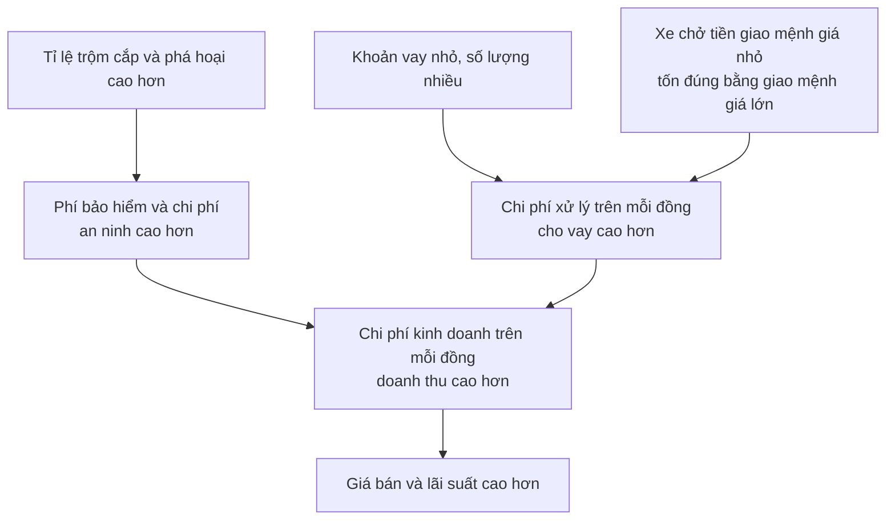
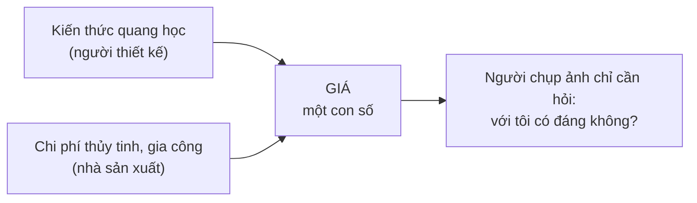

# Nhìn lại toàn cảnh về giá

> Giá cao ở khu nghèo thường bị quy cho lòng tham. Lời giải thích đúng hầu như
> luôn là **hệ thống**, không phải **ý định** — và phân biệt được hai thứ đó là
> điều quyết định chính sách sẽ giúp hay sẽ hại.

## Bắt đầu từ chuyện bạn đã biết

Không phải Newton là người đầu tiên nhìn thấy quả táo rơi. Ông là người đầu
tiên hiểu **hệ quả** của việc đó.

Nguyên lý kinh tế cũng vậy. "Giá cao thì người ta mua ít hơn" nghe hiển nhiên
tới mức nhàm. Nhưng rất ít người rút ra hết những gì nó kéo theo — và chính
những hệ quả ấy mới đáng giá.

Một ví dụ: chi phí thực tế của các chương trình y tế công gần như luôn vượt xa
dự toán ban đầu, ở nhiều nước. Lý do đơn giản là dự toán thường dựa trên **mức
sử dụng hiện tại** bác sĩ, bệnh viện và thuốc men. Khi dịch vụ trở thành miễn
phí hoặc được trợ giá, mức sử dụng tăng vọt — đúng như nguyên lý hiển nhiên
kia đã báo trước.

## Hai kiểu nhân quả

Đây là ý quan trọng nhất của chương, và là công cụ tư duy bạn sẽ dùng nhiều
nhất ngoài đời.

| | **Nhân quả do ý định** | **Nhân quả hệ thống** |
| --- | --- | --- |
| Hình ảnh | Bi-a: hòn này đập hòn kia vào lỗ | Trộn hai chất, cả hai cùng biến đổi, ra một chất thứ ba |
| Câu hỏi | *Ai muốn điều này xảy ra?* | *Những tương tác nào dẫn tới kết quả này?* |
| Ví dụ kinh tế | "Giá tăng vì họ tham" | "Giá tăng vì cung giảm hoặc cầu tăng" |

Trong nền kinh tế, kế hoạch của người mua và người bán **biến đổi lẫn nhau**
khi họ phát hiện ra phản ứng của phía kia. Một gia đình định mua biệt thự ven
biển rốt cuộc mua nhà nhỏ trong đất liền. Một người bán rốt cuộc bán lỗ, vì
lựa chọn còn lại là không bán được gì cả.

Engels — người mà Sowell dẫn lại với vẻ thích thú — diễn đạt điều này gọn hơn
bất cứ ai: điều mỗi cá nhân muốn bị tất cả những người khác cản lại, và thứ
hiện ra cuối cùng là thứ **không ai muốn cả**.

Kinh tế học quan tâm tới thứ **hiện ra**, không phải thứ ai đó định làm. Nếu
thị trường chứng khoán đóng cửa ở mức 14.367 điểm, đó là kết quả của vô số
tương tác giữa người mua và người bán, và không một ai trong số họ có ý định
đưa chỉ số về đúng con số ấy.

Sowell so sánh việc quy kết quả hệ thống cho ý định với việc người xưa giải
thích cây lay bằng linh hồn vô hình thay vì bằng chênh lệch áp suất không khí.

## Ví dụ để thấy điều này quan trọng tới mức nào

Vì sao **người nghèo thường phải trả nhiều hơn** cho cùng một thứ? Cửa hàng ở
khu thu nhập thấp bán đắt hơn; tiệm cầm đồ và công ty tài chính nhỏ ở đó tính
lãi cao hơn ngân hàng ở khu trung lưu; ở khu nghèo người ta phải trả phí để
đổi séc lấy tiền mặt, trong khi ở khu trung lưu ngân hàng làm việc đó miễn phí.

Giải thích quen thuộc: bóc lột.

Sowell chỉ ra những dữ kiện không khớp với giải thích đó. **Tỉ suất lợi nhuận
của các doanh nghiệp ở khu nội đô nghèo nhìn chung không cao hơn nơi khác.**
Và nhiều doanh nghiệp đang rời khỏi những khu ấy, còn các chuỗi siêu thị thì
tránh không vào — điều mà người ta không làm nếu đó là nơi kiếm lời dễ dàng.

Lời giải thích hệ thống:

Con số làm rõ vế giữa: cho **50 người** vay mỗi người **100 đô la** tốn nhiều
thời gian và tiền xử lý hơn hẳn so với cho **một người** vay **5.000 đô la**,
dù tổng số tiền như nhau. Khoảng **10%** hộ gia đình Mỹ không có tài khoản séc
— tỉ lệ này chắc chắn cao hơn ở nhóm thu nhập thấp — nên họ phải dùng dịch vụ
đổi séc có thu phí.

Vì sao chuyện phân biệt này không chỉ là chuyện chữ nghĩa: nếu bạn tin nguyên
nhân là lòng tham, biện pháp hợp lý là **áp trần giá và trần lãi suất**. Kết
quả, đúng theo chương trước, là **càng ít hàng hóa và dịch vụ được cung cấp cho
khu vực đó**. Cửa hàng đóng cửa, tiệm cầm đồ rút đi, và người dân hoặc phải đi
xa hơn để mua sắm — trả thêm tiền xe — hoặc phải vay của tín dụng đen, nơi lãi
suất còn cao hơn và cách đòi nợ bao gồm cả bạo lực.

> Nguyên tắc y khoa "trước hết, đừng gây hại" áp dụng được cho chính sách kinh
> tế. Phân biệt nhân quả hệ thống với nhân quả do ý định là một cách để gây ít
> hại hơn.

Sowell cũng nói thẳng một điều thường bị bỏ qua: phần lớn cư dân ở những khu
đó **không phải là tội phạm**. Chính thiểu số không trung thực mới đẩy chi phí
lên, và người phải gánh là những người lương thiện sống cùng khu.

Đây là một trong những đoạn thuyết phục nhất của cuốn sách. Cũng nên biết phần
mà nó chưa khép lại: lời giải thích hệ thống cho biết vì sao giá cao, nhưng
không tự nó trả lời câu hỏi xã hội nên làm gì với việc người nghèo phải trả
nhiều hơn. Sowell coi như chỉ có một lựa chọn là can thiệp giá. Còn những lựa
chọn khác — hạ chi phí gốc, hoặc chuyển thu nhập trực tiếp — không được bàn
tới ở đây.

## Tự phân bổ: vì sao giá làm giảm xung đột

Một lập luận ít gặp và rất đáng nhớ.

Hình dung hai nhóm tôn giáo cùng xây nhà thờ. Họ cạnh tranh nhau cùng một
lượng xi măng và thợ xây, nên việc nhóm kia xây làm giá vật liệu của nhóm này
đắt lên. Nhưng khi thấy giá cao, mỗi nhóm chỉ thu nhỏ bản thiết kế cho vừa túi
tiền — và **không nhóm nào đổ lỗi cho nhóm kia**. Sự cạnh tranh diễn ra gián
tiếp, qua giá.

Bây giờ giả sử nhà nước đứng ra xây nhà thờ và cấp cho các nhóm. Sự khan hiếm
vật liệu không hề thay đổi. Nhưng bây giờ hai nhóm là **đối thủ trực tiếp**,
không ai có động lực tự thu nhỏ yêu cầu, và mỗi bên có lý do để vận động chính
trị đòi tối đa. Giới hạn vẫn tồn tại — nhưng bây giờ nó mang gương mặt của
nhóm kia.

Nguyên lý này áp dụng cho mọi nhóm: sắc tộc, vùng miền, lứa tuổi. **Tự giới
hạn theo túi tiền của mình** rất khác với **bị nhóm khác chặn mất phần**. Cách
thứ nhất ít ma sát xã hội hơn, và hiệu quả hơn, vì mỗi người hiểu sở thích của
chính mình hơn bất kỳ bên thứ ba nào.

Khi bỏ giá đi, việc phân phối không biến mất — nó chỉ đổi hình thức: **xếp
hàng, danh sách chờ, may rủi, quan hệ, hối lộ**, hoặc một hệ thống tem phiếu
áp dụng chung cho tất cả.

## Từng phần, chứ không phải tuyệt đối

Đây là công cụ tư duy thứ hai của chương, và nó sắc.

Bạn có thể tin rằng **sức khỏe quan trọng hơn giải trí**. Nghe hợp lý. Nhưng
không ai thật sự tin rằng trữ băng cá nhân đủ dùng hai mươi năm thì quan trọng
hơn toàn bộ âm nhạc trong đời mình.

Vấn đề nằm ở chữ "quan trọng hơn". Kinh tế học không xếp hạng **loại** này
trên **loại** kia; nó so sánh **thêm một chút** cái này với **bớt một chút**
cái kia. Giá trị của mỗi thứ phụ thuộc vào việc bạn **đã có bao nhiêu** thứ đó.

- Con người không sống được nếu thiếu muối, chất béo và cholesterol — nhưng
  phần lớn người Mỹ nạp nhiều cả ba tới mức rút ngắn tuổi thọ.
- Rượu gây ra tai nạn và xơ gan; nhưng các nghiên cứu cho thấy lượng rất nhỏ
  lại có lợi cho sức khỏe. Rượu không tốt hay xấu một cách tuyệt đối.
- Một viên kim cương đáng giá hơn một xu. Nhưng **đủ nhiều xu** thì đáng giá
  hơn bất kỳ viên kim cương nào.

Ra quyết định bằng giá thì tự nhiên là **từng phần**. Ra quyết định bằng chính
trị thì có xu hướng **tuyệt đối** — tuyên bố A quan trọng hơn B rồi làm luật
theo đó. Khi một chính trị gia nói cần "xác định ưu tiên quốc gia", đó chính
là điều đang diễn ra.

### Thủ tục hành chính, nhìn qua lăng kính này

Vì sao giấy tờ hành chính cứ dày lên ở mọi nước? Vì nghĩ ra một yêu cầu **có
ích trong một hoàn cảnh nào đó** là việc dễ nhất trên đời, còn nhớ hỏi câu hỏi
"từng phần" mới là việc khó nhất:

> **Với cái giá nào?**

Người tiêu tiền của chính mình bị câu hỏi đó chặn lại ở mỗi bước. Người tiêu
tiền thuế — hoặc áp chi phí lên doanh nghiệp và người dân mà không ai đếm —
thì không có động lực đó. Sowell chỉ ra rằng ngay cả lập luận bênh vực thường
cũng chỉ nói các quy định ấy "không vô dụng", như thể đó là tiêu chí đúng.
Không cá nhân hay doanh nghiệp nào sẵn sàng trả tiền cho mọi thứ **không vô
dụng**, khi tiêu tiền của chính mình.

Ví dụ ông dẫn là luật lao động Ý, nơi nghĩa vụ chồng lên doanh nghiệp theo
từng ngưỡng số nhân viên: từ người thứ **11** phải nộp bản tự đánh giá hằng
năm về mọi rủi ro an toàn và sức khỏe; từ người thứ **16** việc sa thải trở
nên rất khó hoặc rất tốn kém; từ người thứ **51**, **7%** quỹ lương phải dành
cho người khuyết tật; từ người thứ **101** phải nộp báo cáo hai năm một lần về
cơ cấu giới trong công ty. Vào thời điểm mô tả này được đăng, tỉ lệ thất nghiệp
ở Ý là **10%** và nền kinh tế đang co lại.

## Trợ giá và thuế làm giá nói dối

Giá chỉ làm được việc của nó khi nó phản ánh chi phí thật. Đánh thuế riêng thứ
này, trợ giá riêng thứ kia, thì giá **không còn nói đúng** mức khan hiếm nữa.

Ví dụ rõ nhất là nước ở California. Nông dân ở Imperial Valley trả **15 đô la**
cho lượng nước mà ở Los Angeles có giá **400 đô la**. Kết quả: nông nghiệp
chiếm chưa tới **2%** sản lượng của bang nhưng tiêu thụ **43%** lượng nước của
bang — và người ta trồng lúa gạo và bông, những cây cần rất nhiều nước, giữa
một vùng khí hậu rất khô. Không ai trồng những thứ đó ở đó nếu phải trả chi
phí thật của nước.

Điểm tinh tế: Sowell **không** nói trồng những cây đó ở California là sai. Ông
nói rằng **cách duy nhất để biết** là để nông dân trả đủ chi phí rồi cạnh
tranh với nông dân ở vùng mưa nhiều. Câu hỏi này nên được quyết định từng
phần, bởi những người trực tiếp đối mặt với lựa chọn — không phải bằng một
phán quyết tuyệt đối của quan chức.

## Giá không phải là chi phí

Nhầm lẫn này là gốc của rất nhiều chính sách tồi.

Khi ai đó hỏi *"làm sao có thể đặt giá cho nghệ thuật, cho giáo dục, cho sức
khỏe?"*, giả định ẩn bên dưới là giá được ai đó **đặt** lên món hàng. Nhưng
chừng nào nghệ thuật, giáo dục và y tế còn cần thời gian, công sức và vật
liệu, thì **chi phí là có thật và nằm sẵn trong đó**. Một đạo luật ngăn không
cho chi phí ấy hiện ra qua giá không làm nó biến mất.

Với cả xã hội, **chi phí chính là những thứ khác lẽ ra đã được làm ra bằng
cùng nguồn lực đó**. Dòng tiền và biến động giá chỉ là triệu chứng của sự thật
ấy — và dập triệu chứng không chữa được bệnh.

Từ đó suy ra vì sao kiểm soát giá gây hậu quả như đã thấy. Khi chính trị gia
hứa "giảm chi phí y tế", điều họ thật sự nói là giảm **giá** thuốc và **phí**
khám. Chi phí thật — nhiều năm đào tạo một bác sĩ, nguồn lực xây và trang bị
một bệnh viện, hàng trăm triệu đô la và nhiều năm nghiên cứu cho một loại
thuốc mới — không giảm đi chút nào.

Áp trần giá là **từ chối trả đủ chi phí**. Và hậu quả tới chậm, đó là lý do
chính sách này dễ được lòng dân: nhà ở không biến mất ngay, nó xuống cấp dần
qua nhiều năm; thuốc đang có không mất đi, nhưng thuốc mới cho ung thư hay
Alzheimer thì khó ra đời tiếp với cùng nhịp độ, khi khoản tiền bù cho chi phí
và rủi ro nghiên cứu không còn nữa.

Khoảng cách thời gian ấy chính là vấn đề chính trị: ít ai nối được hậu quả hôm
nay với chính sách mà chính họ đã ủng hộ nhiều năm trước.

## Giá như một con số tóm tắt

Ví dụ khép lại chương, và là hình ảnh đẹp nhất về giá trong cả cuốn sách.

Một người chụp ảnh chọn giữa hai ống kính tele cho ảnh chất lượng và độ phóng
đại như nhau, nhưng một chiếc thu được gấp đôi lượng sáng. Chiếc đó chụp được
trong điều kiện tối hơn — nhưng khẩu độ lớn kéo theo những vấn đề quang học
phức tạp, mà lời giải đòi hỏi cấu tạo phức tạp hơn và loại thủy tinh đắt hơn.

Người chụp ảnh **không cần biết gì về quang học**. Thứ duy nhất anh ta nhìn
thấy là giá cao hơn, và câu hỏi duy nhất anh ta phải trả lời là khoản chênh đó
có đáng với kiểu ảnh anh ta chụp hay không. Người chụp phong cảnh ngoài trời
ngày nắng có thể thấy không đáng; người chụp trong bảo tàng cấm dùng đèn flash
thì không có lựa chọn nào khác.

Còn người thiết kế ống kính thì cần biết quang học, và **không cần biết** nội
quy bảo tàng.

Đây là lý do tri thức là nguồn lực khan hiếm nhất, và giá là cách tiết kiệm
nó. Trong một hệ thống không dùng giá, để quyết định phân bổ thủy tinh cho ống
kính máy ảnh, kính hiển vi, kính thiên văn, cửa sổ và gương, ai đó sẽ phải
nắm được lượng kiến thức mà không cá nhân hay nhóm nào có thể nắm nổi.

## Kết cục của thế kỷ 20

Thế kỷ 20 mở ra với nhiều người mong chờ ngày kinh tế điều phối bằng giá được
thay bằng kinh tế kế hoạch hóa tập trung. Tới cuối thế kỷ, phần lớn các chính
phủ xã hội chủ nghĩa và cộng sản đã quay lại dùng giá để điều phối nền kinh tế
của mình.

Sowell chốt bằng một chi tiết ông rõ ràng rất thích: một khảo sát quốc tế năm
**2012** xếp thị trường tự do nhất thế giới là **Hồng Kông** — nằm trong một
quốc gia do đảng cộng sản lãnh đạo.

## Điều cần nhớ

- Phân biệt **nhân quả hệ thống** với **nhân quả do ý định**. Hầu hết kết quả
  kinh tế là loại thứ nhất, và hầu hết lời giải thích phổ biến là loại thứ hai.
- Giá cao ở khu nghèo có lời giải thích hệ thống: **chi phí trên mỗi đồng doanh
  thu cao hơn**. Áp trần giá chỉ làm nguồn cung rút đi.
- **Tự phân bổ bằng giá** tạo ít xung đột xã hội hơn tranh giành ngân sách.
- So sánh **từng phần**, đừng xếp hạng **tuyệt đối**. Câu hỏi luôn là *"với cái
  giá nào?"*.
- **Giá không phải là chi phí.** Hạ giá không hạ chi phí — nó chỉ chuyển chi
  phí sang chỗ không ai đếm.
- Giá tóm tắt một thực tại phức tạp thành một con số, để người ra quyết định
  không cần biết toàn bộ thực tại đó.

## Tự kiểm tra

1. Nêu một lời giải thích hệ thống cho việc cửa hàng ở khu nghèo bán đắt hơn.
2. Vì sao hai nhóm tự xây nhà thờ bằng tiền của mình ít xung đột hơn hai nhóm
   cùng xin ngân sách nhà nước?
3. "Sức khỏe quan trọng hơn giải trí" sai ở chỗ nào?
4. Khi chính trị gia hứa giảm chi phí y tế, họ thường thật sự đang nói về cái
   gì?

---

Trước: [Chuyện gì xảy ra khi ép giá?](./03-kiem-soat-gia.md) ·
Tiếp: [Phần II — Doanh nghiệp và thương mại](../2-doanh-nghiep-va-thuong-mai/)
