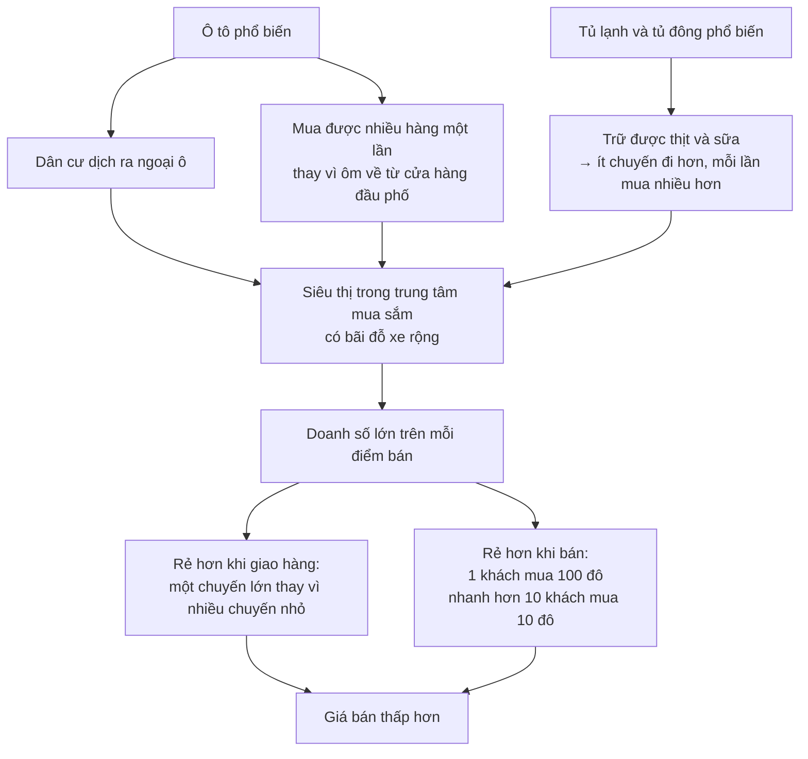

# Thăng trầm của doanh nghiệp

> Doanh nghiệp không phải là cỗ máy in tiền. **Khoảng một phần ba** doanh
> nghiệp mới không sống nổi hai năm, và **chỉ 35%** sống được mười năm. Việc
> chúng chết đi không phải là lỗi của hệ thống — đó là cách hệ thống làm việc.

## Bắt đầu từ chuyện bạn đã biết

Bạn biết tên những công ty đang thắng: Toyota, Microsoft, Sony. Bạn không biết
tên những công ty đã thua, vì không ai viết về họ.

Điều đó làm méo trực giác của bạn về kinh doanh. Nhìn từ ngoài, nó có vẻ dễ.

## Vài con số để chỉnh lại trực giác

- Khoảng **một phần ba** doanh nghiệp mới không trụ nổi **hai năm**; hơn **một
  nửa** không trụ nổi **bốn năm**; chỉ **35%** sống tới **mười năm**.
- Chỉ trong một năm, từ **2010 sang 2011**, có **26** doanh nghiệp rơi khỏi
  danh sách 500 công ty lớn nhất của tạp chí *Fortune* — trong đó có Radio
  Shack và Levi Strauss.
- Ngay cả trung tâm tài chính cũng dịch chuyển: từ thập niên **1780 đến 1830**,
  trung tâm tài chính của nước Mỹ là phố Chestnut ở Philadelphia. Hơn một thế
  kỷ rưỡi sau đó, vị trí ấy thuộc về Phố Wall ở New York — nơi sau này thay cả
  London làm trung tâm tài chính của thế giới.

Đó là lý do lãnh đạo doanh nghiệp thường làm việc nhiều giờ hơn nhân viên của
mình.

## Chuyện A & P: thắng và thua vì cùng một lý do

Đây là ví dụ trung tâm của chương, và đáng theo dõi kỹ vì nó gọn gàng lạ
thường.

**Thời thắng.** A & P từng là chuỗi bán lẻ lớn nhất thế giới trong bất kỳ
ngành nào. Năm **1929** nó có **15.000** cửa hàng. Suốt thập niên 1920, tỉ
suất lợi nhuận trên vốn đầu tư của nó **chưa bao giờ dưới 20%/năm** — khoảng
gấp đôi mức trung bình toàn quốc. Nó thịnh vượng tiếp qua các thập niên 1930,
1940 và 1950.

Nó thắng bằng cách **bán rẻ hơn**. Hiệu quả vận hành xuất sắc giữ chi phí thấp
hơn hầu hết đối thủ, chi phí thấp cho phép giá thấp, và giá thấp kéo khách tới.

**Thời thua.** Trong thập niên **1970**, A & P lỗ hơn **50 triệu đô la** trong
một kỳ 52 tuần. Vài năm sau, khoản lỗ cùng kỳ là **157 triệu đô la**. Hàng
nghìn cửa hàng đóng cửa, và chuỗi này co lại thành cái bóng của chính nó.

Nó thua vì **đối thủ bán rẻ hơn nữa**. Cùng một cơ chế, chỉ đổi chiều.

**Điều gì đã thay đổi?** Không phải A & P đột nhiên kém đi. Xã hội quanh nó
đổi:

A & P nằm lại quá lâu ở các cửa hàng trong nội đô, không theo dòng dân cư đổ
về California và vùng nắng ấm, và ngần ngại ký thuê dài hạn hoặc trả giá cao
cho mặt bằng ở nơi khách hàng và tiền của họ đang chuyển tới. Các chuỗi như
Safeway phản ứng nhanh hơn.

Và đây là câu đáng nhớ nhất của chương:

> A & P thành công ở một thời và thất bại ở một thời khác. Nhưng **nền kinh tế
> thành công ở cả hai thời** — người mua luôn có thực phẩm ở mức giá thấp nhất
> có thể vào lúc đó, từ bất cứ công ty nào đang rẻ nhất.

Chuyện lặp lại ở thế kỷ 21, khi Wal-Mart vươn lên dẫn đầu ngành thực phẩm với
số cửa hàng bán thực phẩm gần gấp đôi Safeway.

## Cùng một khuôn, ở nhiều ngành

| Ngành | Chuyện đã xảy ra |
| --- | --- |
| **Thép** | U.S. Steel thành lập năm **1901** là nhà sản xuất thép lớn nhất thế giới; thép của họ làm nên kênh đào Panama, tòa Empire State và hơn **150 triệu** ô tô. Tới **2011** họ rơi xuống **hạng 13**, lỗ **53 triệu** đô la năm đó và **124 triệu** năm sau |
| **Máy bay** | Năm **1998** Boeing bán hơn gấp đôi Airbus. Năm **2003** Airbus vượt lên dẫn đầu thế giới. Năm **2006** ban lãnh đạo Airbus bị sa thải vì chậm tiến độ, Boeing giành lại ngôi đầu |
| **Hàng không** | Pan Am, hãng tiên phong bay vượt Đại Tây Dương và Thái Bình Dương, phá sản sau khi ngành hàng không Mỹ được bãi bỏ quản lý giá |
| **Đồng hồ** | Thụy Sĩ nổi tiếng về bộ máy cơ. Công nghệ thạch anh xuất hiện đầu thập niên **1970**, chính xác hơn và rẻ hơn. Năm **1975** hãng Bulova lỗ **21 triệu** đô la trên doanh thu **55 triệu**, thị phần còn **8%** — bằng **một phần mười** so với đỉnh cao đầu thập niên 1960 |
| **Truyền hình** | Tới năm **2006**, chỉ còn **21%** tivi bán ra ở Mỹ dùng đèn hình; **49%** là LCD và **10%** là plasma |

## Báo giấy: một ngành co lại suốt nửa thế kỷ

Con số ở đây đáng nhớ vì chúng cho thấy sự suy giảm kéo dài bao lâu:

- Tổng số bản báo bán mỗi ngày ở thành phố New York giảm từ hơn **6 triệu**
  (năm **1949**) xuống dưới **3 triệu** (năm **1990**).
- Trên toàn nước Mỹ, số bản báo trên đầu người giảm **44%** trong giai đoạn
  **1947–1998**.
- Năm **1949**, riêng New York có hai tờ báo địa phương mỗi tờ bán hơn một
  triệu bản mỗi ngày: *Daily Mirror* (**1.020.879**) và *Daily News*
  (**2.254.644**). *Daily Mirror* đóng cửa năm **1963**.
- Tới năm **2004**, những tờ báo Mỹ còn phát hành từ một triệu bản trở lên mỗi
  ngày đều là báo toàn quốc: *USA Today*, *Wall Street Journal*, *New York
  Times*.
- Và vẫn chưa dừng: từ **2000 đến 2006**, lượng phát hành toàn quốc giảm thêm
  gần **4 triệu** bản.

## Kodak: bị hạ bởi chính phát minh của mình

Ví dụ trớ trêu nhất trong sách.

Năm **1976**, Kodak bán **90%** toàn bộ phim chụp ảnh và **85%** toàn bộ máy
ảnh ở Mỹ. Doanh số phim bắt đầu giảm lần đầu tiên sau năm **2000**; ba năm sau
đó, máy ảnh số vượt máy ảnh phim.

Đối thủ mới không chỉ là Nikon, Canon, Minolta, mà cả Sony và Samsung — những
công ty đến từ ngành điện tử. Rồi điện thoại thông minh xóa sổ luôn phân khúc
máy ảnh nhỏ, rẻ, đơn giản mà Kodak sống nhờ.

Cú trớ trêu: **máy ảnh số do chính Kodak phát minh ra**. Chỉ là các công ty
khác nhìn ra tiềm năng của nó sớm hơn và phát triển nó tốt hơn.

Tới quý ba năm **2011**, Kodak báo lỗ **222 triệu** đô la — quý lỗ thứ chín
trong ba năm. Giá cổ phiếu và số nhân viên đều rơi xuống dưới **một phần mười**
so với thời đỉnh cao. Tháng **1/2012**, Kodak nộp đơn phá sản.

Trong khi đó, đối thủ lớn nhất của họ — hãng Fuji của Nhật, cũng làm cả phim
lẫn máy ảnh — đa dạng hóa sang các lĩnh vực khác, gồm cả mỹ phẩm và tivi màn
hình phẳng.

## Con người, không phải định chế

Sowell nhấn mạnh một điều dễ quên: tập đoàn nghe có vẻ là những định chế to
lớn, vô danh, khó hiểu — nhưng rốt cuộc chúng được điều hành bởi **con người**,
những người khác nhau về tầm nhìn, khả năng tổ chức và mức tận tụy, và ai cũng
có khuyết điểm.

Ví dụ ông đưa ra là Sewell Avery, người nhiều năm được ca ngợi khi lãnh đạo
U.S. Gypsum rồi Montgomery Ward. Những năm cuối của ông ở Montgomery Ward đầy
tranh cãi; công ty tích trữ quá nhiều tiền mặt phòng suy thoái tới mức bị một
tạp chí gọi mỉa là "một ngân hàng có mặt tiền cửa hàng", trong khi các đối thủ
như Sears dùng tiền để mở rộng. Khi Avery từ chức, **giá cổ phiếu của công ty
tăng ngay lập tức**.

Và ngược lại, ngành ô tô cho thấy vị trí dẫn đầu cũng không bền: năm **2003**,
Toyota lãi khoảng **1.800 đô la** trên mỗi xe bán ra, trong khi GM lãi **300**
và Ford **lỗ 240**. Nhưng tới **2010**, ba hãng Detroit đã lãi trên mỗi xe
nhiều hơn mức trung bình của Toyota và Honda. Năm **2012**, lợi nhuận cả năm
của Ford là **5,7 tỉ** đô la, GM **4,9 tỉ**, còn Toyota **3,45 tỉ**. Năm
**2010** Toyota phải dừng sản xuất và triệu hồi hơn **8 triệu** xe vì lỗi chân
ga.

## Luận điểm thật sự của chương

Đây là chỗ Sowell đi từ chuyện kinh doanh sang chuyện xã hội, và là phần đáng
suy nghĩ nhất:

> Điều quan trọng không phải là **cá nhân hay công ty nào** thành công, mà là
> **kiến thức và hiểu biết đúng có thắng được** sự mù quáng hoặc bảo thủ của
> những người đang nắm quyền hay không.

Vì tri thức là nguồn lực khan hiếm, một nền kinh tế nơi hiểu biết đúng có lợi
thế quyết định trên thị trường là nền kinh tế có lợi thế lớn trong việc nâng
mức sống.

Từ đó là lập luận về **ai được phép ra quyết định**: một xã hội chỉ cho phép
tầng lớp quý tộc cha truyền con nối, một nhóm quân sự, hay một đảng cầm quyền
ra các quyết định lớn là một xã hội đã vứt bỏ tri thức và tài năng của phần
lớn dân số mình. Một xã hội chỉ cho phép nam giới quyết định đã vứt bỏ **một
nửa**.

Đối lập lại là xã hội nơi một cậu bé nông thôn đi bộ tám dặm tới Detroit tìm
việc có thể lập ra Ford Motor Company, và nơi hai anh thợ sửa xe đạp có thể
phát minh ra máy bay. Thiếu dòng dõi, thiếu bằng cấp, thậm chí thiếu tiền đều
không chặn được một ý tưởng chạy được — vì tiền đầu tư luôn đi tìm kẻ thắng để
đặt cược.

Và câu kết luận về thể chế:

> Không hệ thống kinh tế nào có thể dựa vào việc những người đang lãnh đạo nó
> **cứ tiếp tục sáng suốt**. Kinh tế điều phối bằng giá thì không cần dựa vào
> điều đó — vì lãnh đạo có thể bị buộc đổi hướng hoặc bị thay, bởi thua lỗ, bởi
> cổ đông giận dữ, bởi nhà đầu tư bên ngoài thâu tóm, hoặc bởi phá sản.

## Chỗ cần thận trọng

Lập luận về "sự hủy diệt sáng tạo" này mạnh và được nhiều trường phái chấp
nhận. Điều cuốn sách lướt qua là **cái giá của quá trình chuyển đổi rơi vào
ai**. Khi Kodak phá sản, xã hội được lợi từ máy ảnh số — nhưng người mất việc
ở Rochester không phải là người hưởng lợi đó, và họ thường không dễ chuyển
sang ngành mới. Cả hai điều đều đúng cùng lúc; Sowell chỉ kể một nửa.

Ngoài ra, các so sánh lợi nhuận trên mỗi xe giữa Toyota và Detroit năm 2003
rồi 2010 cho thấy chính điều Sowell muốn nói — nhưng cũng nên nhớ rằng giai
đoạn ấy có cả khủng hoảng 2008 và các gói cứu trợ ngành ô tô Mỹ, điều mà con
số trần trụi không kể.

## Điều cần nhớ

- Thất bại là **một phần của cơ chế**, không phải trục trặc của nó. Chỉ 35%
  doanh nghiệp mới sống tới mười năm.
- A & P thắng và thua vì **cùng một lý do**: ai có chi phí thấp hơn thì bán rẻ
  hơn. Người tiêu dùng thắng ở cả hai thời.
- Công ty bị bỏ lại không phải vì đột nhiên kém đi, mà vì **điều kiện xung
  quanh đổi** và đối thủ phản ứng nhanh hơn.
- Kodak phát minh ra thứ đã giết mình. Có ý tưởng không bằng **nhìn ra hệ quả
  của nó**.
- Giá trị của cạnh tranh không nằm ở việc ai thắng, mà ở chỗ **hiểu biết đúng
  có đường thắng được quyền lực đang tại vị**.

## Tự kiểm tra

1. A & P dẫn đầu nhờ điều gì, và mất ngôi vì điều gì? Hai câu trả lời đó liên
   quan với nhau thế nào?
2. Ô tô và tủ lạnh đã thay đổi kinh tế học của ngành bán lẻ thực phẩm ra sao?
3. Vì sao việc Kodak phát minh ra máy ảnh số lại không cứu được Kodak?
4. Theo Sowell, vì sao một xã hội hạn chế ai được ra quyết định thì tự làm
   mình nghèo đi?

---

Trước: [Phần II](./README.md) ·
Tiếp: [Lợi nhuận và thua lỗ](./02-loi-nhuan-va-thua-lo.md)
