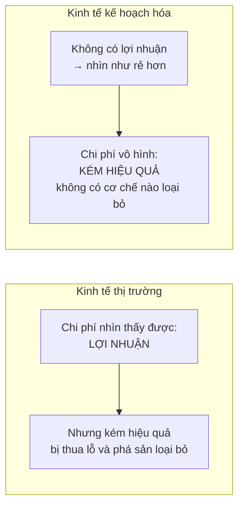
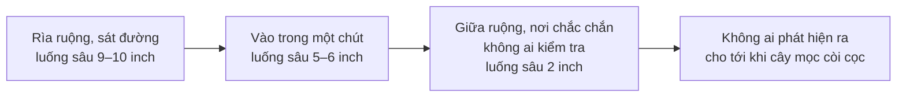
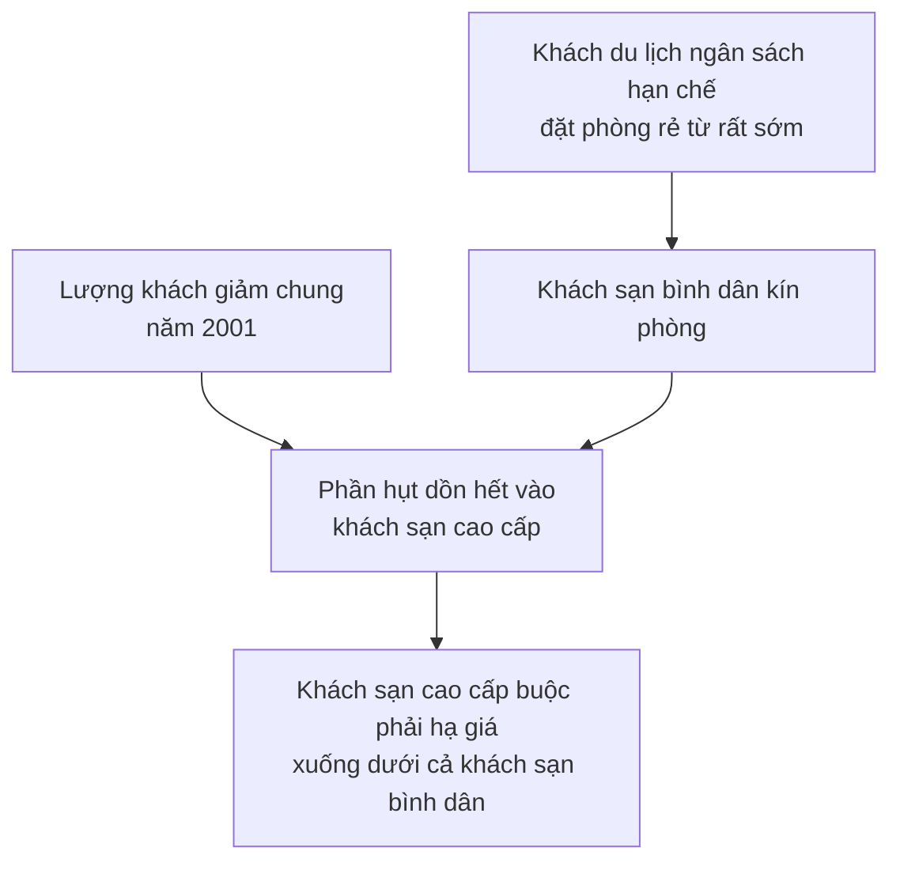

# Lợi nhuận và thua lỗ

> Lợi nhuận bị coi là khoản phụ thu vô ích cộng thêm vào giá. Sowell lập luận
> ngược lại: **lợi nhuận là cái giá phải trả cho hiệu quả** — và cái giá đó rẻ
> hơn chi phí của sự kém hiệu quả mà nó loại bỏ.

## Bắt đầu từ chuyện bạn đã biết

Khi một siêu thị giá rẻ mở gần nhà bạn, các cửa hàng xung quanh cũng hạ giá.
Bạn được lợi kể cả khi không bao giờ bước chân vào siêu thị mới đó.

## Cạnh tranh lan ra ngoài chính nó

Wal-Mart bắt đầu bán thực phẩm năm **1988** và tới đầu thế kỷ 21 trở thành nhà
bán thực phẩm lớn nhất nước Mỹ. Nhưng phần thú vị là chuyện xảy ra với **đối
thủ**.

Khi hai siêu thị Wal-Mart cỡ lớn mở gần một cửa hàng Kroger ở Houston, doanh
số của Kroger giảm **10%**. Người quản lý phản ứng bằng cách cắt giá và cắt
chi phí lao động: mua bánh làm sẵn thay vì tự nướng, đặt rau trộn cắt sẵn từ
nhà cung cấp, nhận rau quả đã xếp sẵn để bày thay vì nhân viên xếp tay. Kết
quả là giờ công giảm **30–40%** so với khi mới mở, và giá các mặt hàng thiết
yếu — ngũ cốc, bánh mì, sữa, trứng, tã giấy — giảm xuống.

Một nghiên cứu cho thấy: khi Wal-Mart bắt đầu bán thực phẩm ở một cộng đồng,
giá thực phẩm trung bình ở cộng đồng đó **giảm 6 đến 12 phần trăm**.

Người hưởng lợi gồm cả những người chưa bao giờ mua ở Wal-Mart.

## Lợi nhuận là gì — và câu hỏi Sowell đặt ra

Đây là khái niệm bị hiểu sai nhiều nhất trong kinh tế học, và Sowell liệt kê
những người đã gọi tên nó:

| Người | Cách gọi lợi nhuận |
| --- | --- |
| George Bernard Shaw (xã hội chủ nghĩa Fabian) | khoản "thu quá" |
| Karl Marx | "giá trị thặng dư" |
| Jawaharlal Nehru (thủ tướng đầu tiên của Ấn Độ) | một "từ bẩn" |
| John Dewey (triết gia) | sản xuất vì lợi nhuận nên phục tùng sản xuất để dùng |

Điểm chung của cả bốn: lợi nhuận là khoản **cộng thêm không cần thiết** vào
chi phí thật, đẩy giá lên cho người mua. Một trong những sức hấp dẫn lớn nhất
của chủ nghĩa xã hội thời nó còn là lý thuyết là nó hứa bỏ khoản phụ thu ấy
đi, làm mọi thứ rẻ hơn, nhất là với người thu nhập thấp.

Và đây là câu hỏi thực nghiệm mà Sowell dùng làm trục cho cả chương:

> Bỏ lợi nhuận đi thì theo lý thuyết giá phải thấp hơn và mức sống phải cao
> hơn. **Vì sao thực tế lại không như vậy?**

## Câu trả lời: động lực

Hy vọng có lãi và nỗi sợ lỗ là thứ ép chủ doanh nghiệp phải sản xuất ở chi phí
thấp nhất và bán thứ khách hàng sẵn lòng trả tiền nhất. Không có hai sức ép
đó, người quản lý doanh nghiệp nhà nước có ít lý do hơn nhiều để làm cho hiệu
quả — và càng ít lý do để chạy theo điều kiện đang đổi.

Chính một lãnh đạo Liên Xô, Leonid Brezhnev, nói rằng giám đốc xí nghiệp nước
ông né tránh đổi mới như quỷ né hương trầm. Sowell hỏi lại một câu rất thực
tế: **tại sao họ phải chuốc lấy rủi ro?** Nếu đổi mới thành công, họ được
thêm gần như không gì; nếu thất bại, họ có thể mất việc — hoặc tệ hơn. Dưới
thời Stalin, thất bại thường bị quy thành phá hoại, và bị trừng phạt tương ứng.

### Chiếc xe không cần đổi mới

Ví dụ hay nhất về việc thiếu động lực trông như thế nào là chiếc Hindustan
Ambassador của Ấn Độ.

Đó là bản sao không che giấu của chiếc Morris Oxford của Anh. Tới tận thập
niên **1990**, nó vẫn bị mô tả là một phiên bản gần như không nâng cấp của
chiếc Morris Oxford thập niên 1950, nổi tiếng vì hoàn thiện kém, lái nặng và
dễ gây tai nạn.

Vậy mà người ta vẫn phải **xếp hàng chờ mua** — hàng tháng, có khi hàng năm.
Lý do đơn giản: xe nhập khẩu không được phép vào cạnh tranh.

Sau khi Ấn Độ mở cửa thị trường từ năm **1991**, chuyện đổi khác. Hindustan
buộc phải đầu tư cải tiến, và những chiếc Ambassador mới đáng tin hơn hẳn —
thậm chí bắt đầu "có gia tốc cảm nhận được". Nhưng nó mất ngôi số một vào tay
chiếc Maruti, một mẫu xe Nhật sản xuất tại Ấn Độ: năm **1997**, **80%** xe bán
ra ở Ấn Độ là Maruti. Rồi chính Maruti cũng phải cải tiến để chuẩn bị cho làn
sóng tiếp theo — và khi GM, Volkswagen và Toyota đầu tư nhà máy ở Ấn Độ, thị
phần Maruti giảm còn **38%** vào năm **2012**.

Ngành đồng hồ Ấn Độ kể cùng một câu chuyện bằng con số khác: năm **1985**, sản
lượng đồng hồ điện tử trên thế giới đã hơn **gấp đôi** đồng hồ cơ, nhưng hãng
HMT của Ấn Độ vẫn có hơn **90%** sản lượng là đồng hồ cơ. Tới **1989**, hơn
**bốn phần năm** đồng hồ trên thế giới là điện tử — HMT vẫn hơn 90% là cơ. Sau
khi nới các hạn chế, đồng hồ điện tử chiếm đa số sản lượng Ấn Độ ngay trong
**1993–1994**, và thị phần HMT rơi xuống **14%**.

### Còn phía kia thì sao?

Dưới cạnh tranh, ngay cả doanh nghiệp lãi nhất cũng có thể mất thị trường nếu
ngừng đổi mới.

IBM tiên phong làm máy tính, trong đó có một cỗ máy năm **1944** chiếm
**3.000 foot khối**. Tới thập niên **1970**, Intel làm ra con chip nhỏ hơn
móng tay làm được đúng những việc đó.

Nhưng Intel cũng không yên. Cuộc đua với AMD khốc liệt tới mức:

- AMD lỗ hơn **một tỉ đô la** năm **2002**, cổ phiếu mất **bốn phần năm** giá
  trị.
- Bốn năm sau, cổ phiếu Intel giảm **20%** chỉ trong ba tháng; Intel tuyên bố
  sa thải **1.000** quản lý; lợi nhuận Intel giảm **57%** trong khi lợi nhuận
  AMD tăng **53%**.

Và tất cả diễn ra trong một ngành mà Intel bán hơn **80%** toàn bộ chip máy
tính của thế giới. Chính vị tổng giám đốc Intel viết một cuốn sách có tựa đề
*Chỉ kẻ hoang tưởng mới sống sót*.

> Điều đáng quan tâm không phải là số phận của Intel hay AMD. Mà là người dùng
> máy tính được lợi cả về công nghệ lẫn giá cả từ cuộc chiến đó.

Năm **2011**, **45** trong số 500 công ty lớn nhất theo xếp hạng *Fortune* báo
lỗ, tổng cộng hơn **50 tỉ đô la**. Những khoản lỗ đó buộc các tập đoàn khổng
lồ phải đổi cách làm, vì không ai chịu nổi mức lỗ đó mãi.

## Luận điểm trung tâm, trong một hình

> **Lợi nhuận là cái giá trả cho hiệu quả.** Nếu cái giá ấy lớn hơn giá trị của
> hiệu quả nó mua được, thì các tổ chức phi lợi nhuận và cơ quan nhà nước đã
> làm được cùng công việc rẻ hơn hoặc tốt hơn, và đã đánh bật doanh nghiệp
> trên thị trường. Điều đó hiếm khi xảy ra — trong khi chiều ngược lại xảy ra
> ngày càng nhiều.

## Chủ doanh nghiệp thật ra nhận được gì?

Một điểm kỹ thuật nhưng quan trọng, và hay bị hiểu sai.

Người ta hình dung nhà tư bản là người "kiếm lợi nhuận". Thứ chủ doanh nghiệp
thật sự có là **quyền sở hữu phần còn lại** sau khi đã trả hết chi phí sản
xuất từ số tiền khách hàng đưa. Phần còn lại đó có thể **dương, âm, hoặc bằng
không**.

Người lao động **phải** được trả. Chủ nợ **phải** được trả — nếu không họ kiện
để siết tài sản, và trước cả khi tới mức đó, họ chỉ cần ngừng cung cấp đầu
vào. Người duy nhất mà khoản nhận phụ thuộc vào việc doanh nghiệp làm ăn ra
sao chính là **chủ**.

Đó là lý do "lợi nhuận" không phải khoản phụ thu tùy ý, mà là phần dư của một
canh bạc có thể thua.

## Quy mô: lợi thế và bất lợi

### Lợi thế theo quy mô

Sản xuất nhiều hơn thường làm chi phí trên mỗi đơn vị giảm. Điều này cũng giải
thích một chuyện người ta hay tranh cãi: **quảng cáo** thường bị coi là chi
phí cộng thêm vào giá. Nhưng nếu quảng cáo làm bán được nhiều hơn, lợi thế
theo quy mô có thể kéo chi phí sản xuất xuống đủ để sản phẩm **rẻ đi** chứ
không đắt lên. Đây là câu hỏi thực nghiệm, không phải kết luận có sẵn, và câu
trả lời khác nhau tùy công ty và tùy ngành.

### Bất lợi theo quy mô

Nếu lớn hơn luôn rẻ hơn, câu hỏi tiếp theo là: sao không gộp GM, Ford và
Chrysler làm một?

Vì mọi doanh nghiệp đều có một điểm mà quá nó, chi phí trên mỗi đơn vị **ngừng
giảm rồi bắt đầu tăng** — khi tổ chức lớn tới mức khó giám sát và khó phối
hợp, tay phải không biết tay trái đang làm gì. Hồi thập niên 1960, khi AT&T là
tập đoàn lớn nhất thế giới, chính tổng giám đốc của nó đùa rằng công ty to tới
mức nếu hôm nay bạn đá vào mông nó thì hai năm sau cái đầu mới kêu "ối".

Một khảo sát ngân hàng toàn cầu năm **2006** mô tả cùng vấn đề bằng giọng
nghiêm túc hơn: ban lãnh đạo càng lúc càng khó tổng hợp mọi việc đang diễn ra
trong ngân hàng, mở đường cho chi phí trùng lặp, rủi ro bị che giấu và kiểm
soát nội bộ thất bại. Rủi ro có thể nằm gọn trong tầm kiểm soát theo hiểu biết
của cấp cao nhất — trong khi ở một chi nhánh xa, ai đó đang làm những giao
dịch mà cấp trên không hề biết.

Con số cụ thể: trong suốt thời gian General Motors là nhà sản xuất xe lớn nhất
thế giới, chi phí sản xuất mỗi chiếc xe của họ được ước tính **cao hơn hàng
trăm đô la** so với Ford, Chrysler hay các hãng Nhật hàng đầu.

Và chuyện này ảnh hưởng cả chất lượng: các khảo sát cho thấy bệnh viện **nhỏ
và chuyên sâu** thường an toàn hơn cho bệnh nhân so với bệnh viện lớn chữa đủ
thứ bệnh.

### Câu chuyện luống cày

Ví dụ đắt nhất của chương. Liên Xô say mê lợi thế theo quy mô và bỏ qua bất
lợi theo quy mô; nông trang trung bình của họ **lớn gấp mười lần** nông trại
trung bình của Mỹ và dùng hơn gấp mười lần số lao động.

Trên những cánh đồng chung mênh mông ấy, mức hoàn thành kế hoạch được tính
theo **số hecta đã cày**. Nên tài xế máy kéo có lợi khi cày càng nhanh càng
nhiều càng tốt.

Kết quả:

Sowell nhấn mạnh điều quan trọng nhất về ví dụ này: hành vi đó **phản tác dụng
với nền kinh tế nhưng hoàn toàn hợp lý với người làm nó**. Tài xế hiểu rõ chỗ
nào dễ bị kiểm tra và chỗ nào không, rồi điều chỉnh chất lượng công việc theo
đúng cách tối đa hóa thu nhập của mình.

Một người nông dân cày ruộng của chính mình trong kinh tế thị trường sẽ không
làm vậy — vì hành vi của anh ta được điều khiển bởi **động lực lợi nhuận**,
chứ không bởi người đi kiểm tra.

### Vì sao nhà hàng nhỏ hơn nhà máy thép

Điểm mà bất lợi bắt đầu lấn át lợi thế khác nhau theo ngành.

Một nhà hàng chạy tốt thường cần có chủ ở đó, với động lực đủ mạnh để liên tục
theo dõi vô số thứ: món ăn có hợp khẩu vị khách không, nhân viên phục vụ có
khiến khách muốn quay lại không, nhà cung cấp có còn gửi đúng loại và đúng
chất lượng không, bếp có giữ chuẩn và có cập nhật món mới không, nhân sự thay
đổi thì tuyển và đào tạo ra sao, khu phố xung quanh đang đổi thế nào.

Đó là loại chi tiết đòi hỏi **hiểu biết trực tiếp tại chỗ** và động lực vượt
quá một khoản lương cố định. Chính điều đó giới hạn quy mô nhà hàng, so với
nhà máy thép hay hãng ô tô.

Và đó cũng là lý do các chuỗi nhà hàng toàn quốc thường vận hành bằng
**nhượng quyền**: tổ chức trung tâm lo quảng cáo và chuẩn mực chung, còn việc
giám sát tại chỗ giao cho chủ địa phương. Howard Johnson đi tiên phong trong
nhượng quyền nhà hàng từ thập niên **1930**, góp một nửa vốn, người quản lý
địa phương góp nửa còn lại — để người đó có phần lợi ích gắn với lợi nhuận của
nhà hàng, thay vì chỉ nhận lương.

## Chi phí và công suất nhàn rỗi

Một phần rất thực dụng: nó giải thích những mức giá trông như vô lý.

Nhiều ngành phải xây đủ công suất cho lúc **cao điểm** — nghĩa là những lúc
khác có công suất thừa. Chi phí phục vụ thêm một khách vào lúc thừa công suất
**thấp hơn nhiều** so với lúc cao điểm.

Một con tàu du lịch phải thu đủ để trả lương thủy thủ, mua thực phẩm, đổ nhiên
liệu, **và** bù cả giá mua con tàu lẫn chi phí văn phòng. Muốn chở gấp đôi
khách vào mùa cao điểm thì phải mua thêm tàu. Nhưng nếu mùa thấp điểm chỉ có
một phần ba lượng khách, thì gấp đôi lượng khách mùa đó **không cần thêm tàu
nào** — chỉ là ít cabin trống hơn.

Nên hãng tàu có lợi khi giảm giá sâu mùa thấp điểm, và nhóm khách hưu trí —
những người không bị ràng buộc bởi lịch nghỉ phép hay lịch học của con — là
đối tượng tự nhiên.

Khi các hãng tàu sang trọng xây thừa, giá rơi thẳng đứng: một hành trình qua
kênh Panama thường bán **2.995 đô la** được hạ xuống **1.695**; một hành trình
Caribbean giảm từ **4.495** xuống **1.999**. Họ chỉ làm vậy khi cạnh tranh
không để lại lựa chọn nào khác — và khi chi phí tăng thêm lúc thừa công suất
vẫn thấp hơn mức giá đã giảm.

### Nghịch lý khách sạn

Giữa năm **2001** ở Cancun, Mexico, phòng rẻ nhất của một khách sạn hạng vừa
có giá **180 đô la** một đêm, trong khi khách sạn sang trọng gần đó cho thuê
phòng **169 đô la**. Ở Manhattan, một khách sạn bốn sao cho thuê rẻ hơn một
khách sạn hai sao gần đấy. Ở Phoenix, một khu nghỉ cao cấp rẻ hơn một Holiday
Inn cùng thành phố.

Lời giải là công suất:

Chiều ngược lại cũng đúng: khi du lịch phục hồi năm **2004**, các khách sạn
bắt đầu rút lại khuyến mãi, phòng nhỏ nhất và rẻ nhất ở một khách sạn hạng
sang tại New York lên **545 đô la** một đêm, và các khoản tặng kèm miễn phí
biến mất.

Chính vì giá cùng một phòng trong cùng một khách sạn dao động mạnh như vậy mà
sinh ra cả một ngành phụ trợ — những dịch vụ như Priceline hay Travelocity —
chuyên ghép người săn giá rẻ với những phòng bất ngờ còn trống.

## Chuyên môn hóa: thứ chỉ có khi có thể tin nhau

Phần cuối chương, và là phần có sức nặng nhất.

General Motors sản xuất ô tô mà **không sản xuất một chiếc lốp nào**. Họ dựa
vào Goodyear, Michelin và các nhà cung cấp khác để lốp có mặt đúng lúc xe rời
dây chuyền.

Vì sao dám dựa? Nếu nhà cung cấp lốp bỏ rơi GM, đó là thảm họa cho GM — nhưng
là **tự sát tài chính** cho hãng lốp, vì họ mất một khách hàng mua hàng triệu
chiếc lốp mỗi năm, chưa kể tiền bồi thường vi phạm hợp đồng.

Ở Liên Xô thì ngược lại. Nhiều xí nghiệp tự làm lấy linh kiện của mình, vì nhà
cung cấp độc quyền nhà nước không có động lực tài chính nào để làm hài lòng
khách hàng. Và một quan chức cấp cao của chính nước này từng than rằng hàng
trăm nghìn xe cơ giới nằm đắp chiếu vì **không có lốp**.

Ở Trung Quốc thời kinh tế kế hoạch, hầu hết các doanh nghiệp lớn **tự vận
chuyển hàng của mình**, dù kém hiệu quả tới đâu. Không phải vì họ giỏi vận tải
hơn công ty chuyên vận tải, mà vì công ty chuyên vận tải quốc doanh không đáng
tin về thời gian giao lẫn cách bốc dỡ. Một nhà máy tivi có thể chở tivi kém
hiệu quả hơn — nhưng ít nhất họ **ít khả năng làm vỡ tivi của chính mình**.

Di chứng còn tới nay: Trung Quốc chi cho vận tải một tỉ lệ trên thu nhập quốc
dân **khoảng gấp đôi** so với Mỹ, dù lãnh thổ Mỹ lớn hơn và còn có hai bang
cách 48 bang còn lại hơn một nghìn dặm.

### Tồn kho là thước đo của sự thiếu tin cậy

Đây là chỉ số tinh tế nhất trong chương:

| Nơi | Mức tồn kho |
| --- | --- |
| **Toyota** (Nhật) | Lượng lưu kho tính cho khoảng **một giờ** làm việc; nhà cung cấp giao ba bốn lần mỗi ngày |
| **Ford** (Mỹ) | Tồn kho cho tới **ba tuần** |
| **Liên Xô** | Tồn kho gần bằng **toàn bộ sản lượng làm ra trong một năm** |

Hai nhà kinh tế học Liên Xô rút ra kết luận cay đắng từ con số cuối: phần lớn
người làm trong công nghiệp Liên Xô có thể **nghỉ phép cả năm có lương** mà
nền kinh tế vẫn sống được bằng hàng tồn.

Đó không phải lợi thế mà là gánh nặng. Tồn kho **tốn tiền và không sinh lời**;
với cả nền kinh tế, sản xuất ra hàng tồn là tiêu hao nguồn lực mà không thêm
gì vào mức sống của dân.

Nhưng — và đây là chỗ Sowell công bằng — quyết định trữ nhiều **không phải là
phi lý** với hoàn cảnh của họ. **Nhà cung cấp càng kém tin cậy, trữ nhiều càng
có lợi**, để khỏi đứt linh kiện sống còn. Mỗi người hành xử hợp lý; kết quả
chung vẫn tệ.

Địa lý cũng làm điều tương tự: ở nhiều vùng châu Phi hạ Sahara, khi vận tải
phụ thuộc vào sông suối có thể cạn nếu mùa mưa tới muộn hay kết thúc sớm, người
ta buộc phải trữ lượng lớn cả nông sản lẫn hàng công nghiệp — và chi phí đó góp
phần vào mức sống thấp của khu vực.

### Danh tiếng cũng là một khoản đầu tư

Đầu thập niên **1930**, khi tủ lạnh mới bắt đầu phổ biến ở Mỹ, những mẫu tủ
lạnh sản xuất hàng loạt đầu tiên mà Sears bán có nhiều lỗi kỹ thuật. Sears
buộc phải thực hiện cam kết hoàn tiền và **nhận lại 30.000 chiếc** — giữa lúc
Đại khủng hoảng, khi công ty cũng túng tiền chẳng kém khách hàng.

Sức ép đó buộc họ chọn: bỏ hẳn mặt hàng tủ lạnh, hay làm cho nó đáng tin. Họ
chọn vế thứ hai, và trở thành một trong những nhà bán tủ lạnh hàng đầu nước Mỹ.

Trong thị trường cạnh tranh, **độ tin cậy là một phần của sản phẩm**, vì giữ
khách là chuyện sống còn.

## Chỗ cần thận trọng

Lập luận "lợi nhuận là giá trả cho hiệu quả" mạnh nhưng được trình bày như một
cuộc so sánh nhị phân giữa thị trường tự do và kế hoạch hóa kiểu Liên Xô — và
đó là đối thủ dễ nhất có thể chọn. Cuộc tranh luận thật sự ngày nay hiếm khi
là "thị trường hay Gosplan", mà là **thị trường được điều tiết tới mức nào và
ở những ngành nào**. Cuốn sách ít khi bước vào cuộc tranh luận đó.

Ngoài ra, ví dụ Wal-Mart chỉ kể phần giá. Tác động của nó lên tiền lương và
lên các cửa hàng nhỏ là chủ đề của một khối lượng nghiên cứu kinh tế đáng kể,
và không đồng thuận — đây là **khẳng định thực nghiệm** được chọn lọc, không
phải kết luận đã khép.

## Điều cần nhớ

- **Lợi nhuận là chi phí nhìn thấy được; kém hiệu quả là chi phí vô hình.**
  Cái thứ hai không có cơ chế nào loại bỏ nếu không có thua lỗ.
- Chủ doanh nghiệp là **người nhận phần dư**, và phần dư có thể âm. Lương và
  nợ phải trả trước.
- Cạnh tranh làm lợi cho cả khách hàng của đối thủ, không chỉ khách của người
  thắng.
- Quy mô lớn có **cả lợi thế lẫn bất lợi**. Điểm giao nhau khác nhau theo
  ngành — vì thế nhà hàng nhỏ hơn nhà máy thép.
- Luống cày nông sâu khác nhau là hình ảnh gọn nhất về **giám sát thay cho
  động lực**.
- **Tồn kho là thước đo của sự thiếu tin cậy.** Chuyên môn hóa chỉ khả thi khi
  các bên có thể tin nhau.

## Tự kiểm tra

1. Vì sao người chưa bao giờ mua ở Wal-Mart vẫn được lợi khi Wal-Mart mở cửa
   hàng gần đó?
2. Chủ doanh nghiệp được trả trước hay sau người lao động? Điều đó nói gì về
   bản chất của lợi nhuận?
3. Tài xế máy kéo Liên Xô cày nông ở giữa ruộng — hành vi đó phi lý ở cấp độ
   nào và hợp lý ở cấp độ nào?
4. Vì sao một khách sạn năm sao lại có lúc rẻ hơn khách sạn hai sao bên cạnh?
5. Vì sao Liên Xô buộc phải trữ nhiều hàng tồn tới vậy?

---

Trước: [Thăng trầm của doanh nghiệp](./01-thang-tram-cua-doanh-nghiep.md) ·
Tiếp: [Kinh tế của doanh nghiệp lớn](./03-kinh-te-cua-doanh-nghiep-lon.md)
