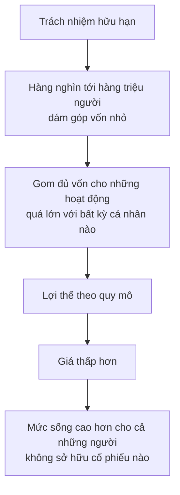
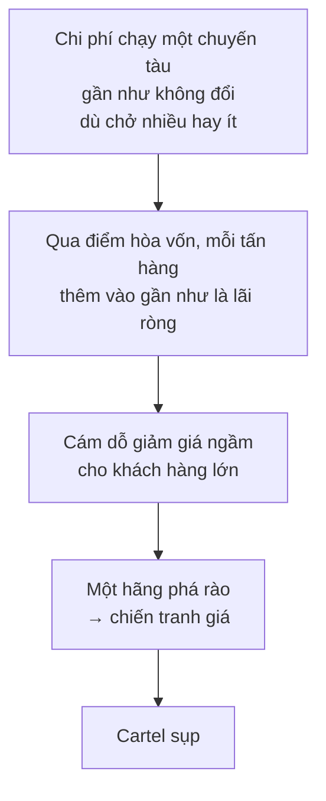

# Kinh tế của doanh nghiệp lớn

> "Lớn" có hai nghĩa hoàn toàn khác nhau, và lẫn lộn chúng là gốc của phần lớn
> tranh cãi về doanh nghiệp lớn. Một công ty khổng lồ trong ngành đầy đối thủ
> chịu sức ép khác hẳn một công ty nhỏ nhưng độc quyền.

## Hai nghĩa của chữ "lớn"

| Kiểu | Nghĩa | Ví dụ của Sowell |
| --- | --- | --- |
| **Lớn tuyệt đối** | Doanh thu hàng tỉ đô la, nhưng chỉ chiếm một phần khiêm tốn trong tổng ngành | Wal-Mart |
| **Lớn tương đối** | Chiếm tỉ lệ rất cao trong toàn bộ doanh số của ngành mình | Microsoft với hệ điều hành máy tính cá nhân |

Một công ty độc quyền tuyệt đối trong một ngành có thể **nhỏ hơn** một công ty
ở ngành khác nơi có hàng chục đối thủ. Động lực và ràng buộc mà hai công ty
này đối mặt khác nhau hoàn toàn — nên phải phân tích riêng.

## Công ty cổ phần: vì sao nó tồn tại

### Trách nhiệm hữu hạn

Công ty cổ phần không phải lúc nào cũng là doanh nghiệp. Tổ chức được lập theo
hình thức này đầu tiên ở Mỹ là Harvard Corporation, lập từ thế kỷ 17 để quản
trị trường đại học đầu tiên của nước Mỹ.

Điểm khác biệt cốt lõi: ở doanh nghiệp cá thể, gia đình hoặc hợp danh, **chủ
chịu trách nhiệm cá nhân** cho mọi nghĩa vụ tài chính — tòa có thể phong tỏa
tài khoản và tài sản riêng của họ. Công ty cổ phần có **tư cách pháp lý riêng
biệt**, nên trách nhiệm giới hạn trong tài sản của chính công ty. Đó là ý
nghĩa của chữ "Ltd." sau tên công ty Anh và "Inc." sau tên công ty Mỹ.

Cách dễ nhất để thấy điều này quan trọng tới đâu là nhìn lúc nó **vắng mặt**.
Trong Thế chiến thứ nhất, Herbert Hoover lập một tổ chức từ thiện mua và phân
phát lương thực cho hàng triệu người đói khắp châu Âu. Một chủ ngân hàng mà
ông mời tham gia hỏi đây có phải tổ chức trách nhiệm hữu hạn không. Khi Hoover
trả lời là không, người đó **từ chức ngay lập tức** — vì toàn bộ tiền tiết
kiệm cả đời ông ta có thể bị xóa sổ nếu quyên góp không đủ bù cho hàng triệu
đô la lương thực đã mua.

### Vì sao điều này quan trọng với cả những người không sở hữu cổ phiếu nào

Đây là lập luận trung tâm của phần này:

Không có đủ người giàu trên đời để tài trợ các tập đoàn khổng lồ, và ngay cả
người giàu cũng hiếm khi đặt toàn bộ gia sản vào một doanh nghiệp. Nếu mỗi nhà
đầu tư phải chịu trách nhiệm cho khoản nợ của một tổ chức quá lớn để họ giám
sát được, sẽ chẳng ai đầu tư.

Ở Mỹ, tính cả cổ phiếu nắm trực tiếp lẫn cổ phiếu do quỹ hưu trí mua bằng tiền
của người lao động, **khoảng một nửa dân số** là nhà đầu tư vào cổ phiếu — kể
cả rất nhiều người chưa bao giờ nghĩ mình là cổ đông.

Còn chủ nợ thì sao, khi họ chỉ đòi được trong phạm vi tài sản công ty? Chính
chữ "Ltd." hay "Inc." là lời cảnh báo trước, để họ giới hạn khoản cho vay và
tính lãi suất theo mức rủi ro đó.

### Tách quyền sở hữu khỏi quyền quản lý

Một tập đoàn lớn có quá nhiều cổ đông để họ tự điều hành. Ban điều hành được
thuê — và nếu cần thì bị sa thải — bởi hội đồng quản trị. Mô hình này không
chỉ có ở doanh nghiệp: các trường đại học cũng thường do ban giám hiệu điều
hành, được hội đồng quản trị thuê và sa thải.

Đây cũng là mục tiêu phê phán quen thuộc: sự tách rời giữa sở hữu và kiểm soát
cho phép ban điều hành vận hành công ty vì lợi ích của chính họ, gây thiệt cho
cổ đông. Các vụ bê bối lớn đầu thế kỷ 21 cho thấy khả năng gian lận là có thật.

Phản biện của Sowell có hai vế:

1. **Gian lận cũng xảy ra ở mọi loại tổ chức khác** — doanh nghiệp không phải
   công ty cổ phần, chính phủ dân chủ lẫn toàn trị, Liên Hợp Quốc, và các tổ
   chức từ thiện phi lợi nhuận. Không rõ hình thức công ty cổ phần có dễ sinh
   ra chuyện đó hơn hay không.
2. **Nhiều cổ đông không muốn quyền kiểm soát.** Họ muốn phần thưởng của việc
   đầu tư mà không muốn gánh nặng của việc quản lý. Điều này rõ nhất ở các cổ
   đông lớn: nếu muốn trách nhiệm quản lý, họ đã đủ tiền để tự lập doanh
   nghiệp riêng.

Cơ chế giám sát, theo cách nhìn này, được chia đôi: **tính trung thực** của
ban điều hành do cơ quan quản lý và pháp luật theo dõi, còn **tính hiệu quả**
do cạnh tranh trên thị trường theo dõi — cụ thể là các nhà đầu tư bên ngoài
luôn rình những công ty mà họ tin mình quản lý tốt hơn, mua đủ cổ phiếu để
thâu tóm và đổi cách vận hành. Sowell ghi nhận một chi tiết nói lên nhiều
điều: sức ép đó đủ lớn để nhiều ban điều hành đã vận động chính quyền bang
thông qua luật cản trở quá trình này.

Ông cũng dẫn một chi tiết khác: các nỗ lực của giới vận động nhằm tăng tiếng
nói của cổ đông trong việc quyết lương tổng giám đốc lại bị **chính các quỹ
tương hỗ đang nắm cổ phiếu** phản đối.

### Một so sánh giữa các nước

| Nước | Quyền của cổ đông |
| --- | --- |
| **Anh** | Rất mạnh: cổ đông có thể triệu tập họp để bãi nhiệm hội đồng quản trị bất kỳ lúc nào, ra nghị quyết buộc hội đồng hành động, bỏ phiếu về cổ tức và lương tổng giám đốc, và ép hội đồng chấp nhận một đề nghị thâu tóm mà hội đồng muốn từ chối |
| **Mỹ, Nhật, Đức, Pháp** | Hạn chế hơn nhiều |

Rồi Sowell đặt cạnh đó kết quả: trong 30 tập đoàn lớn nhất thế giới, **13** là
của Mỹ, **6** của Nhật, **3** của Đức và **3** của Pháp. Chỉ **một** là của
Anh, cộng thêm một công ty do người Anh sở hữu một nửa. Ngay cả Hà Lan, một
nước nhỏ, cũng có tỉ trọng lớn hơn.

**Hãy đọc đoạn này như một khẳng định thực nghiệm yếu.** Đây là tương quan
giữa hai biến trên một mẫu 30 công ty, với vô số yếu tố khác chưa được kiểm
soát — quy mô thị trường nội địa, lịch sử công nghiệp, tiền tệ, thuế. Nó gợi
ý một câu hỏi thú vị; nó không chứng minh được chiều nhân quả nào.

### Lương tổng giám đốc

Mức thù lao trung bình của tổng giám đốc các tập đoàn đủ lớn để có tên trong
chỉ số Standard & Poor's là khoảng **10 triệu đô la một năm** vào năm **2010**
— nhiều hơn hẳn thu nhập của hầu hết mọi người, nhưng ít hơn nhiều vận động
viên và nghệ sĩ, chưa kể giới tài chính.

Lập luận kiểm chứng của Sowell khá thông minh: nếu hội đồng quản trị trả quá
hào phóng vì đang tiêu tiền của người khác, thì những công ty do **một nhóm
nhỏ định chế tài chính sở hữu** — nơi người quyết lương đang tiêu tiền của
chính mình — lẽ ra phải trả thấp hơn. Thực tế, đó chính là nhóm trả lương tổng
giám đốc **cao nhất**.

## Độc quyền: cơ chế thật sự

Đây là chỗ cần đọc chậm vì nó sửa một cách nói phổ biến.

Người ta thường nói doanh nghiệp độc quyền **"hạn chế sản lượng"**. Sowell chỉ
ra rằng đó không phải ý định của họ, và họ không phải người hạn chế:

> Doanh nghiệp độc quyền **rất muốn** người tiêu dùng mua nhiều hơn ở mức giá
> đã bị thổi lên. Chính **người tiêu dùng** dừng lại sớm hơn so với lượng họ
> sẽ mua ở mức giá cạnh tranh. Giá cao của nhà độc quyền khiến người mua tự
> hạn chế, và vì thế nhà độc quyền phải sản xuất ít lại cho khớp với lượng bán
> được.

Bằng chứng gián tiếp cho điều này: nhà độc quyền thường **quảng cáo rất mạnh**
để thuyết phục người ta mua thêm.

Còn tổn thất với nền kinh tế nằm ở đâu? Người tiêu dùng từ bỏ việc sử dụng
những nguồn lực khan hiếm mà với họ có giá trị cao hơn so với các công dụng
thay thế. Ví dụ Sowell dùng là **giấy phép taxi**: khi số giấy phép bị hạn chế
nhân tạo, những người hoàn toàn sẵn lòng lái taxi với mức cước mà khách sẵn
lòng trả lại bị chặn, nên họ đi làm việc khác có giá trị thấp hơn hoặc thất
nghiệp.

## Cartel: vì sao chúng hay sụp

Cartel là một nhóm doanh nghiệp thỏa thuận với nhau để cùng giữ giá cao hoặc
tránh cạnh tranh nhau. Trên lý thuyết, nó hoạt động y như một nhà độc quyền.

Trên thực tế, các thành viên **gian lận lẫn nhau trong bí mật** — âm thầm hạ
giá cho vài khách hàng để giành phần của đồng minh. Khi việc này lan rộng,
cartel trở thành vô nghĩa, dù trên giấy nó còn tồn tại hay không.

### Ví dụ đường sắt

Thế kỷ 19, các tuyến đường sắt cạnh tranh nhau trên những **trục chính** nối
các thành phố lớn như Chicago và New York, trong khi mỗi **nhánh phụ** tới
thị trấn nhỏ thường chỉ có một hãng phục vụ.

Kết quả là một nghịch lý: giá độc quyền trên nhánh phụ cao tới mức **chở hàng
đi xa trên trục chính thường rẻ hơn chở đi gần trên nhánh phụ**.

Các hãng lập cartel để cứu lợi nhuận trên trục chính. Cartel liên tục đổ vỡ,
và lý do rất đẹp về mặt kinh tế học:

Các hãng tàu hơi nước đã thử lập cartel trước đường sắt, và sụp vì đúng những
lý do đó. Sowell rút ra ba điều kiện cần cho một cartel thành công:

1. **Thỏa thuận** giữa các bên.
2. **Cách kiểm tra lẫn nhau** để biết ai đang phá rào.
3. **Cách ngăn các công ty ngoài cartel** nhảy vào cạnh tranh.

Cả ba đều dễ nói hơn làm. Một trong những cartel thành công nhất — ngành thép
Mỹ — thành công chính nhờ một hệ thống định giá khiến các công ty dễ kiểm tra
nhau; và hệ thống đó cuối cùng bị tòa án cấm theo luật chống độc quyền.

## Thị trường tự chống cartel như thế nào

Luật chống độc quyền không phải cách duy nhất. Doanh nghiệp tư nhân ngoài
cartel có động lực chống lại nó — và họ hành động **nhanh hơn nhiều** so với
nhiều năm mà một vụ kiện chống độc quyền lớn cần để đi tới kết luận.

Thời các "trust" còn cực thịnh ở Mỹ, Montgomery Ward là một trong những đối
thủ lớn nhất của chúng. Với máy nông nghiệp, xe đạp, đường, đinh hay dây thừng
— chiến thuật đều như nhau: tìm nhà sản xuất không thuộc trust, mua dưới giá
cartel, rồi bán lẻ dưới giá của hàng do thành viên cartel làm ra. Và vì
Montgomery Ward khi đó là nhà bán lẻ số một nước Mỹ, họ còn đủ lớn để **tự lập
nhà máy** nếu cần.

Sears làm cả hai: tự sản xuất bếp, giày, súng, giấy dán tường, đồng thời đặt
gia công những thứ khác. A & P tự nhập và tự rang cà phê, tự đóng hộp cá hồi,
và nướng **nửa tỉ ổ bánh mì mỗi năm** để bán trong hệ thống của mình.

Logic chung: nơi nào độc quyền hay cartel giữ giá cao hơn mức bình thường, nơi
đó có lợi nhuận bất thường — và lợi nhuận bất thường **hút đối thủ mới vào
ngành**, rồi cạnh tranh kéo giá xuống. Vì vậy, để cartel sống sót, nó **buộc
phải tìm cách chặn người khác vào ngành**.

## Rào cản gia nhập: cách hiệu quả nhất là nhờ nhà nước

Cách chắc chắn nhất để giữ đối thủ ở ngoài là **để nhà nước cấm họ**. Vua chúa
đã ban hoặc bán quyền độc quyền suốt nhiều thế kỷ; nhà nước hiện đại làm việc
tương tự bằng cách hạn chế cấp phép — từ hàng không, vận tải đường bộ, cho tới
nghề tết tóc.

Lý do chính trị thì không bao giờ thiếu. Nhưng hiệu ứng kinh tế ròng là **bảo
vệ doanh nghiệp đang có khỏi đối thủ tiềm năng**, và do đó giữ giá ở mức cao
giả tạo.

Ví dụ cực đoan nhất là Ấn Độ phần lớn nửa sau thế kỷ 20, nơi nhà nước không
chỉ quyết công ty nào được sản xuất mặt hàng nào, mà còn **áp hạn mức mỗi công
ty được sản xuất bao nhiêu**:

- Một nhà sản xuất xe máy bị triệu tập ra ủy ban nhà nước vì đã làm ra **nhiều
  xe hơn mức được phép**.
- Một nhà sản xuất thuốc cảm **lo sợ** vì trong một đợt dịch cúm, dân chúng đã
  mua "quá nhiều" sản phẩm của ông ta. Luật sư của công ty dành **nhiều tháng**
  chuẩn bị bào chữa cho việc đã sản xuất và bán vượt hạn mức, phòng khi bị gọi
  ra cùng ủy ban đó.

Toàn bộ khối công việc pháp lý tốn kém ấy cuối cùng do ai trả? Người tiêu dùng.

## Rào cản không phải là vĩnh viễn

Hiệu lực của rào cản gia nhập thay đổi theo ngành và theo thời.

Ngành máy tính từng rất khó vào, thời một cỗ máy tính chiếm hàng nghìn foot
khối và chi phí chế tạo khổng lồ tương ứng. Vi mạch thay đổi điều đó: máy nhỏ
hơn làm được cùng công việc, và chip rẻ tới mức các công ty nhỏ cũng sản xuất
được — kể cả các công ty ở nước khác. Vì vậy ngay cả một thế độc quyền trên
phạm vi một quốc gia cũng không loại bỏ được cạnh tranh.

Nước Mỹ đi tiên phong trong việc tạo ra máy tính, nhưng việc **chế tạo** máy
tính nhanh chóng lan sang Đông Á — nơi cung cấp phần lớn máy tính cho chính
thị trường Mỹ, kể cả khi chúng mang thương hiệu Mỹ.

## Chỗ cần thận trọng

Phần phân tích độc quyền và cartel ở đây là kinh tế học chuẩn mực, không gây
tranh cãi. Phần về quản trị công ty thì thiên về một phía: Sowell trả lời các
phê phán bằng lập luận "chỗ nào cũng có gian lận" và "cổ đông không muốn quyền
kiểm soát", cả hai đều đúng một phần, nhưng ông không bàn tới vấn đề mà kinh
tế học gọi là **chi phí người đại diện** (agency cost) — chi phí phát sinh khi
người quản lý và người sở hữu có lợi ích lệch nhau. Đó là một lĩnh vực nghiên
cứu lớn và nghiêm túc, không phải chỉ là lời than của giới vận động.

## Điều cần nhớ

- Phân biệt **lớn tuyệt đối** với **lớn trong thị phần**. Chỉ vế thứ hai mới
  liên quan tới độc quyền.
- **Trách nhiệm hữu hạn** là thứ cho phép gom vốn từ hàng triệu người lạ — và
  vì thế cho phép những hoạt động quá lớn với bất kỳ ai.
- Nhà độc quyền **không hạn chế sản lượng**; chính giá cao của họ khiến người
  mua tự hạn chế.
- Cartel sụp từ bên trong vì mỗi thành viên có lợi khi phá rào ngầm. Nó chỉ
  sống nếu có cách **kiểm tra lẫn nhau** và **chặn người mới**.
- Rào cản gia nhập bền nhất là rào cản **do nhà nước dựng lên**.

## Tự kiểm tra

1. Wal-Mart và Microsoft "lớn" theo hai nghĩa khác nhau thế nào?
2. Vì sao trách nhiệm hữu hạn lại quan trọng với cả người không sở hữu cổ
   phiếu nào?
3. Câu "nhà độc quyền hạn chế sản lượng" sai ở đâu?
4. Ba điều kiện để một cartel sống sót là gì, và điều kiện nào dễ hỏng nhất?

---

Trước: [Lợi nhuận và thua lỗ](./02-loi-nhuan-va-thua-lo.md) ·
Tiếp: [Quản lý và luật chống độc quyền](./04-quan-ly-va-luat-chong-doc-quyen.md)
