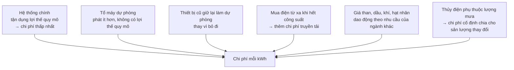
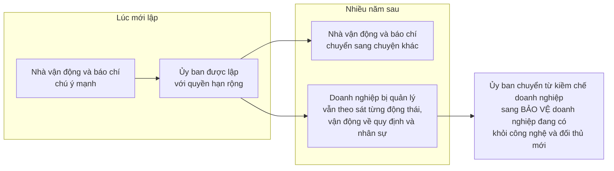

# Quản lý và luật chống độc quyền

> Cơ quan quản lý giá được lập ra để bảo vệ người tiêu dùng khỏi doanh nghiệp
> độc quyền. Sowell lập luận rằng chúng thường kết thúc ở chỗ **bảo vệ doanh
> nghiệp đang có khỏi đối thủ mới** — và giải thích vì sao điều đó gần như
> không tránh được.

## Hai công cụ của nhà nước

Cuối thế kỷ 19, nhà nước Mỹ bắt đầu phản ứng với độc quyền và cartel bằng hai
cách khác nhau:

| Công cụ | Cách hoạt động | Mốc |
| --- | --- | --- |
| **Ủy ban quản lý** | Trực tiếp ấn định mức giá mà doanh nghiệp độc quyền được phép thu | Ủy ban Thương mại Liên bang về vận tải (ICC) lập năm **1887**, ủy ban đầu tiên loại này |
| **Luật chống độc quyền** | Không giám sát chi tiết, chỉ can thiệp khi có vi phạm cụ thể — như cảnh sát giao thông | Đạo luật Sherman năm **1890** |

Thời các công ty điện thoại địa phương còn độc quyền theo vùng và công ty mẹ
AT&T độc quyền đường dài, Ủy ban Truyền thông Liên bang kiểm soát giá của
AT&T, còn các cơ quan cấp bang kiểm soát giá gọi nội hạt.

## Vấn đề thứ nhất: không ai biết mức giá "đúng"

Trên lý thuyết, một ủy ban quản lý sẽ đặt giá ở đúng mức mà thị trường cạnh
tranh sẽ tạo ra.

Trên thực tế, **không có cách nào biết mức đó là bao nhiêu**. Chỉ có bản thân
thị trường vận hành mới lộ ra mức giá ấy — qua việc doanh nghiệp kém hiệu quả
bị phá sản và chỉ những doanh nghiệp hiệu quả nhất sống sót, rồi giá thấp của
họ trở thành giá thị trường.

Sowell nhấn mạnh rằng đây không phải chuyện thiếu thông minh: ngay cả **ban
lãnh đạo bên trong ngành** cũng thường phát hiện ra theo cách đau đớn rằng
cách làm mà họ tưởng là hiệu quả nhất hóa ra không đủ hiệu quả để chống lại
đối thủ.

Nên điều nhiều nhất mà cơ quan quản lý làm được là chấp nhận những khoản chi
phí **trông có vẻ hợp lý** và cho phép một mức lợi nhuận **trông có vẻ hợp lý**
trên đó.

## Vấn đề thứ hai: "chi phí sản xuất" không phải một con số

Đây là phần hay nhất của chương, và ví dụ về điện là ví dụ rõ nhất trong cả
cuốn sách.

Khi bạn thức giữa đêm và bật đèn, lượng điện đó gần như **không tốn gì** để
cung cấp — vì hệ thống phát điện phải chạy suốt ngày đêm, và giữa đêm nó thừa
rất nhiều công suất. Khi bạn bật điều hòa vào một buổi chiều hè nóng, cùng lúc
với hàng triệu nhà và văn phòng khác, hệ thống có thể bị đẩy tới giới hạn và
phải khởi động các tổ máy dự phòng đắt đỏ để tránh mất điện.

Ước tính được dẫn trong sách: chi phí điện để chạy một chiếc máy rửa bát vào
**giờ cao điểm** có thể **gấp 100 lần** chi phí chạy đúng chiếc máy đó vào lúc
nhu cầu thấp.

Vì sao chênh lệch lớn tới vậy?

Vậy ủy ban quản lý phải ấn định giá thế nào? Nếu họ đặt giá theo chi phí
**trung bình**, thì khi nhu cầu tăng hoặc nguồn cung hụt, nhà cung cấp từ bang
khác sẽ **không chịu bán** dưới chi phí phát điện dự phòng của chính họ. Đó là
một phần nguyên nhân của các đợt mất điện nổi tiếng ở California năm **2001**.

Chi phí trung bình là con số vô nghĩa khi chi phí thật lúc thì cao hơn hẳn,
lúc thì thấp hơn hẳn mức trung bình đó.

## Vấn đề thứ ba: chính trị

Công chúng khó mà nắm hết những rắc rối trên, nên khi hóa đơn điện tăng vọt,
phản ứng tự nhiên là phẫn nộ. Và chính trị gia bị cám dỗ can thiệp bằng cách
áp lại mức giá cũ — nghĩa là **kiểm soát giá**, với hậu quả quen thuộc: lượng
cầu lớn hơn, lượng cung nhỏ hơn, và mất điện.

Sowell đưa ra một ví dụ rất sắc về việc chuyện này ít liên quan tới hệ tư tưởng
tới mức nào. Ở Ấn Độ, nỗ lực tăng giá điện bị biểu tình phản đối trên đường
phố — cũng như ở California. Ở bang Karnataka, nơi đảng Quốc đại đang cầm
quyền, chính một đảng đối lập xuống đường phản đối. Ở bang láng giềng Andhra
Pradesh, nơi đảng Quốc đại đang ở phe đối lập, chính **đảng Quốc đại** dẫn đầu
các cuộc biểu tình tương tự.

Không phải hệ tư tưởng, cũng không phải đảng phái — chỉ là diễn cho khán giả
xem.

## Vấn đề thứ tư: sự bất đối xứng về chú ý

Đây là cơ chế quan trọng nhất trong chương, và nó giải thích vì sao kết quả
thường ngược với ý định.

Một bên mất hứng thú; bên kia thì không bao giờ, vì với họ đó là chuyện sống
còn. Kết quả không cần ai mưu mô: nó là hệ quả tự nhiên của cấu trúc động lực.

### Câu chuyện xe tải và đường sắt

Ví dụ minh họa của Sowell gọn tới mức đáng nhớ.

ICC được lập ra để ngăn đường sắt thu giá độc quyền, với lý do ở nhiều vùng
chỉ có một tuyến đường sắt duy nhất. Rồi ngành **vận tải đường bộ** nổi lên.
Xe tải đi được tới bất cứ đâu có đường, nên nó **phá thế độc quyền** của đường
sắt — đúng thứ mà ICC được lập ra để chống.

Phản ứng của ICC không phải là tuyên bố rằng nhu cầu quản lý nay đã giảm hoặc
không còn cần thiết. Họ **xin và được Quốc hội trao thêm quyền** qua Đạo luật
Vận tải Cơ giới năm **1935**, để hạn chế hoạt động của chính các nhà xe tải.

Từ đó, xe tải chỉ được chạy liên bang nếu có giấy chứng nhận của ICC xác nhận
hoạt động đó phục vụ "sự tiện lợi và cần thiết của công chúng" — theo định
nghĩa của ICC.

Kết quả trong thực tế:

- ICC có thể cho phép một hãng chở hàng từ New York tới Washington, **nhưng
  không cho phép** chở từ Philadelphia tới Baltimore — dù hai thành phố đó nằm
  ngay trên đường đi.
- Nếu giấy phép không cho chở hàng chiều về từ Washington ra New York, xe phải
  **chạy không** về, trong khi xe của hãng khác chở hàng đúng tuyến đó.

Với nền kinh tế, đó là lãng phí nguồn lực khổng lồ. Nhưng về mặt chính trị, nó
đạt được một điều: **nhiều công ty sống sót và có lãi hơn** so với một thị
trường cạnh tranh tự do.

Và Sowell nêu đúng cái giá của điều đó trong một câu: việc dùng nhiều nguồn
lực hơn mức cần thiết chính là cái đã cho phép nhiều công ty hơn mức cần thiết
tồn tại.

Vì sao ủy ban lại muốn vậy? Vì cạnh tranh tự do đe dọa chính ủy ban: những
doanh nghiệp sắp bị xóa sổ chắc chắn sẽ vận động chính trị chống lại việc các
ủy viên tại vị và chống lại quyền hạn của ủy ban. Công đoàn cũng có lợi ích
gắn với việc giữ nguyên hiện trạng.

## "Kiểm soát" thị trường: một con số đánh lừa

Phần thứ hai của chương, về luật chống độc quyền, xoay quanh một chữ.

Thực hành chuẩn ở tòa án Mỹ là mô tả tỉ lệ doanh số của một công ty như phần
thị trường mà công ty đó **"kiểm soát"**. Sowell chỉ ra chữ này chứa một giả
định lớn chưa được chứng minh.

Pan American Airways từng "kiểm soát" một phần đáng kể thị trường của nó. Thời
gian cho thấy họ chẳng kiểm soát được gì cả — nếu có, họ đã không để mình bị
đẩy ra khỏi ngành. A & P cũng vậy.

### Alcoa: nhà độc quyền làm giá giảm

Ví dụ thử thách lý thuyết. Trong nhiều thập niên, Alcoa là nhà sản xuất nhôm
thỏi nguyên sinh **duy nhất** ở Mỹ.

- Tỉ suất lợi nhuận sau thuế trên vốn đầu tư: khoảng **10%** một năm — không
  phải mức của một kẻ bóc lột.
- Giá nhôm **giảm dần** qua nhiều năm, xuống còn một phần nhỏ so với trước khi
  Alcoa ra đời.
- Alcoa vẫn bị truy tố theo luật chống độc quyền, và bị kết tội.

Vì sao giá giảm trong khi lý thuyết nói nó phải tăng? Vì dù "kiểm soát" thị
trường nhôm, Alcoa biết rõ họ **không thể đẩy giá tùy ý** mà không đẩy người
dùng sang thép, thiếc, gỗ hoặc nhựa.

Đó là ý then chốt: **con số thị phần bỏ qua các sản phẩm thay thế** được xếp
chính thức vào ngành khác.

### Những thứ thay thế nhau mà thống kê không thấy

| Trường hợp | Con số |
| --- | --- |
| **Tàu cao tốc Madrid–Seville** (Tây Ban Nha) | Tỉ lệ hành khách giữa đường sắt và hàng không chuyển từ **33% / 67%** sang **82% / 18%** |
| **Vượt Đại Tây Dương** | Năm **1954**: tàu biển chở **1 triệu** khách, máy bay **600.000**. Mười một năm sau: tàu biển **650.000**, máy bay **4 triệu** |
| **Mỹ Latin thế kỷ 21** | Hàng không giá rẻ cạnh tranh với **xe khách**; một chuyến bay vào Mexico City có giá khoảng **một nửa** vé xe khách chạy đêm 14 tiếng |
| **Nhựa, năm 2004** | Khi giá dầu tăng vọt, doanh số một loại nhựa làm từ **dầu ngô** tăng **60%** so với năm trước, khi nhà sản xuất nhựa chuyển khỏi dầu mỏ |
| **Máy ảnh** | Điện thoại thông minh giết phân khúc máy ảnh rẻ của Kodak — dù điện thoại và máy ảnh được xếp vào hai ngành khác nhau |

Và ví dụ đẩy ý tưởng tới tận cùng: nếu sân golf tăng gấp đôi phí, nhiều người
chơi thường sẽ chơi ít đi hoặc bỏ hẳn, rồi tiêu khoản tiền đó vào du lịch, du
thuyền, nhiếp ảnh hay trượt tuyết.

> Về mặt kinh tế, nếu giá **A** tăng làm người ta mua nhiều **B** hơn, thì A và
> B là **hàng thay thế nhau** — bất kể chúng có giống nhau hay hoạt động giống
> nhau hay không.

### Định nghĩa thị trường quyết định kết quả vụ kiện

Vì thị phần phụ thuộc vào việc "thị trường" được định nghĩa thế nào, bên khởi
kiện có động lực định nghĩa nó **thật hẹp**:

- **Vụ Microsoft** đầu thế kỷ này: thị trường được định nghĩa là hệ điều hành
  cho máy tính cá nhân đơn lẻ dùng vi xử lý loại Intel. Định nghĩa đó loại bỏ
  hệ điều hành của Apple, của Sun Microsystems, và cả Linux. Trong thị trường
  hẹp đó, Microsoft rõ ràng "thống trị". Đáng chú ý là vụ kiện **không** cáo
  buộc Microsoft đẩy giá lên — cáo buộc là họ **tặng kèm miễn phí** trình
  duyệt Internet vào Windows, làm hại đối thủ Netscape. Và năm **2003**, chính
  quyền thành phố Munich chuyển **14.000** máy tính từ Windows sang Linux —
  một hệ điều hành đã bị loại khỏi định nghĩa thị trường, nhưng rõ ràng là
  hàng thay thế.
- **Vụ giày năm 1962** của Tòa án Tối cao Mỹ định nghĩa thị trường là "sản
  xuất trong nước các loại giày không phải giày cao su", qua đó loại bỏ giày
  thể thao, giày đi biển và toàn bộ giày nhập khẩu. Trước đó, cũng năm 1962,
  tòa đã chặn một thương vụ sáp nhập hai công ty giày mà kết quả sẽ tạo ra một
  công ty chiếm **chưa tới 7%** doanh số giày toàn nước Mỹ; năm **1966**, tòa
  chặn việc sáp nhập hai chuỗi siêu thị địa phương mà gộp lại bán **chưa tới
  8%** thực phẩm ở khu vực Los Angeles.
- **Vụ bia năm 2013**: Bộ Tư pháp Mỹ kiện để ngăn hãng bia Budweiser mua toàn
  bộ hãng bia Corona, vì gộp lại sẽ cho họ "kiểm soát" **46%** doanh số bia ở
  Mỹ. Thực tế là đa số lượng bia bán ra vẫn nằm trong tay các hãng khác — chỉ
  riêng năm trước đó đã có hơn **400** hãng bia mới ra đời, nâng tổng số lên
  mức cao kỷ lục **2.751**. Và căn bản hơn: định nghĩa thị trường là "bia" bỏ
  qua việc bia chỉ là một loại đồ uống có cồn, và bia đã mất thị phần vào tay
  các loại đồ uống có cồn khác suốt cả thập kỷ.
- **Ấn Độ** đi xa nhất theo hướng cơ học: theo Đạo luật về Độc quyền và Hành vi
  Thương mại Hạn chế năm **1969**, mọi doanh nghiệp có tài sản vượt một ngưỡng
  nhất định (khoảng **27 triệu đô la**) bị tuyên là độc quyền và bị hạn chế mở
  rộng kinh doanh.

### Thương mại quốc tế làm con số thị phần mất nghĩa

Nếu Brazil chỉ có một nhà sản xuất một món hàng, đó **không phải** độc quyền
theo nghĩa kinh tế nào cả, khi nước láng giềng Argentina có hàng chục nhà sản
xuất cùng món đó và trên thế giới có hàng trăm. Nó chỉ trở thành độc quyền
thật nếu **chính phủ Brazil chặn nhập khẩu**.

Cùng logic ấy áp dụng trong nước. Khi số báo địa phương ở Mỹ giảm mạnh sau
giữa thế kỷ 20, nhiều nơi chỉ còn một tờ báo — trên giấy tờ là độc quyền tuyệt
đối. Nhưng người sống ở Palo Alto không cần mua báo Palo Alto để biết rạp gần
nhà đang chiếu phim gì, vì tờ *San Francisco Chronicle* bán rộng rãi ở đó và
đặt giao tận nhà rất dễ. Còn tin trong nước và quốc tế thì càng không. Tiến bộ
kỹ thuật cho phép *New York Times* và *Wall Street Journal* được in ở
California cùng lúc với in ở New York, biến chúng thành báo toàn quốc; còn
*USA Today* đạt lượng phát hành lớn nhất nước Mỹ mà **không có gốc địa phương
nào cả**.

Kết cục là nhiều tờ báo "độc quyền" địa phương chật vật để tồn tại, nói gì tới
lợi nhuận độc quyền.

## Chỗ cần thận trọng

Đây là chương có lập trường rõ nhất trong Phần II, và cần đọc như vậy.

Phần phân tích **sự bị thao túng của cơ quan quản lý** (regulatory capture) và
phần chỉ ra điểm yếu của thống kê "thị phần" là kinh tế học nghiêm túc, được
nhiều trường phái công nhận — chính George Stigler, người Sowell trích ở đầu
chương, được trao giải Nobel một phần vì nhóm công trình này.

Điều cuốn sách không cân bằng là ở chỗ khác. Sowell chọn những vụ kiện chống
độc quyền **dở nhất** — vụ giày 7%, vụ siêu thị 8% — và để chúng đại diện cho
cả chính sách. Ông không bàn tới những trường hợp mà can thiệp chống độc quyền
được cả những nhà kinh tế học thiên thị trường đánh giá là đã có tác dụng, như
việc chia tách AT&T năm 1984, hay những thị trường có **hiệu ứng mạng** mạnh
tới mức lập luận "luôn có hàng thay thế" yếu đi đáng kể.

Lập luận "hàng thay thế luôn tồn tại" cũng có giới hạn mà chương này không nêu:
nó mạnh khi chi phí chuyển đổi thấp, và yếu đi rất nhanh khi chi phí chuyển
đổi cao.

## Điều cần nhớ

- Cơ quan quản lý **không thể biết** mức giá cạnh tranh là bao nhiêu, vì chỉ
  thị trường vận hành mới lộ ra nó.
- **"Chi phí sản xuất" không phải một con số.** Cùng một chiếc máy rửa bát có
  thể tốn gấp 100 lần tùy giờ bật.
- **Bất đối xứng về chú ý** biến cơ quan quản lý thành người bảo vệ doanh
  nghiệp đang có. Không cần âm mưu, chỉ cần thời gian.
- Chữ **"kiểm soát thị trường"** chứa một giả định sai. Pan Am "kiểm soát" thị
  trường của mình cho tới lúc phá sản.
- Thị phần phụ thuộc vào **định nghĩa thị trường**, và định nghĩa đó là thứ
  quyết định kết quả vụ kiện.

## Tự kiểm tra

1. Vì sao điện dùng lúc nửa đêm và lúc chiều hè lại có chi phí khác nhau tới
   vậy?
2. ICC được lập ra để làm gì, và cuối cùng nó đã làm gì với ngành xe tải?
3. Alcoa độc quyền nhôm mà giá nhôm vẫn giảm. Vì sao?
4. Vì sao bia và rượu vang lại nên được tính chung khi đánh giá thị phần của
   một hãng bia?

---

Trước: [Kinh tế của doanh nghiệp lớn](./03-kinh-te-cua-doanh-nghiep-lon.md) ·
Tiếp: [Kinh tế thị trường và phi thị trường](./05-kinh-te-thi-truong-va-phi-thi-truong.md)
