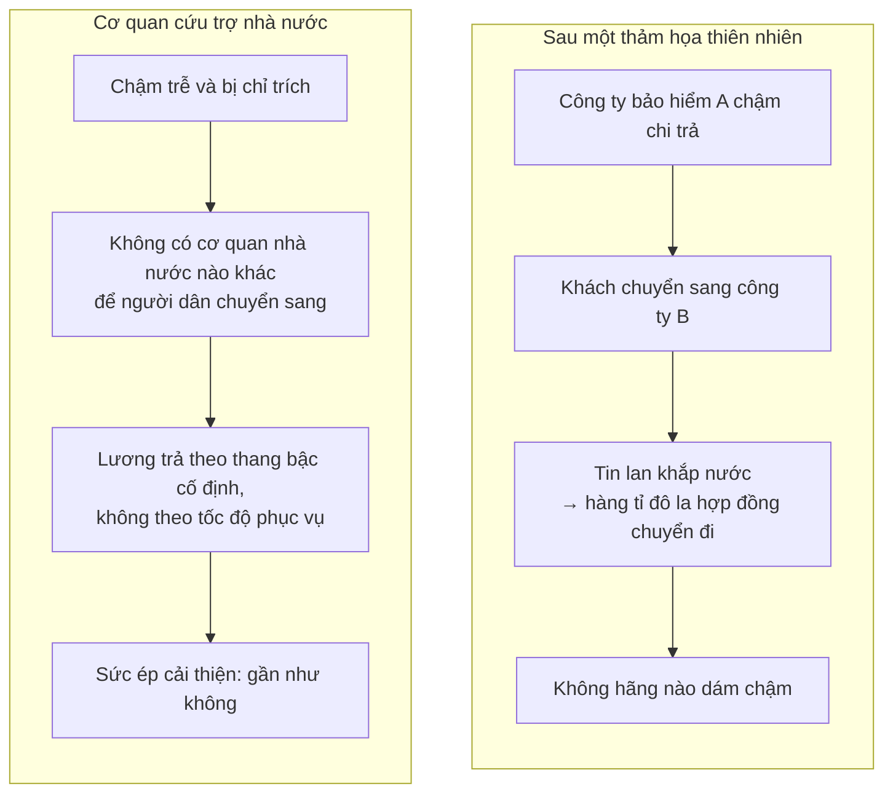

# Kinh tế thị trường và phi thị trường

> Doanh nghiệp vì lợi nhuận chỉ là **một** trong nhiều cách tổ chức sản xuất mà
> loài người từng dùng. Câu hỏi của chương này là vì sao nó lấn át những cách
> còn lại — và cái giá của việc đó rơi vào ai.

## Bắt đầu từ chuyện bạn đã biết

Con người sống hàng nghìn năm không có doanh nghiệp. Bộ lạc săn bắt và đánh cá
cùng nhau. Suốt nhiều thế kỷ phong kiến, cả nông nô lẫn quý tộc đều không phải
doanh nhân. Ngay ở nước Mỹ gần đây thôi, hàng triệu gia đình sống trên những
nông trại tự cung tự cấp — tự trồng lấy cái ăn, tự dựng nhà, tự may quần áo.

Vậy mà giờ đây doanh nghiệp có mặt ở khắp nơi tới mức ít ai hỏi: **tại sao lại
là cách này?**

## Ranh giới mờ hơn bạn tưởng

Trước khi so sánh, Sowell làm một việc hữu ích: cho thấy ba khu vực — vì lợi
nhuận, phi lợi nhuận, và nhà nước — **chồng lấn nhau rất nhiều**.

- Trường đại học xuất bản sách và tổ chức các sự kiện thể thao thu về hàng
  triệu đô la tiền vé.
- Tạp chí *National Geographic* do một tổ chức phi lợi nhuận xuất bản, cũng
  như các tạp chí của Viện Smithsonian và của các viện nghiên cứu độc lập.
- Hiệp hội Ô tô Mỹ, một tổ chức phi lợi nhuận, làm một số việc của cơ quan
  đăng kiểm như gia hạn giấy phép — đồng thời cũng đặt vé máy bay và tàu du
  lịch như một công ty lữ hành thương mại.

Và các hoạt động **dịch chuyển qua lại** theo thời gian. Giao thông công cộng
đô thị ở Mỹ từng do doanh nghiệp tư nhân vận hành trước khi chính quyền thành
phố tiếp quản xe điện, xe buýt và tàu điện ngầm. Gần đây thì ngược lại: thu
gom rác và quản lý nhà tù ở một số nơi đã chuyển sang tư nhân, và việc vận hành
nhà sách trong trường đại học được giao cho các công ty như Follett hay Barnes
& Noble. Ngay cả giáo dục đại học vì lợi nhuận cũng xuất hiện — Đại học Phoenix
có nhiều sinh viên hơn bất kỳ trường tư phi lợi nhuận nào, và nhiều hơn cả một
số hệ thống đại học công của cả bang.

Chính sự tồn tại song song đó là thứ cho phép so sánh: cùng một công việc,
những động lực khác nhau.

## Vì sao doanh nghiệp lấn át?

Câu trả lời của Sowell là **lợi thế chi phí, thể hiện qua giá**. Và ông dẫn một
nguồn bất ngờ để củng cố: trong *Tuyên ngôn của Đảng Cộng sản*, Marx và Engels
mô tả giá rẻ của hàng hóa tư bản chủ nghĩa như thứ pháo hạng nặng phá đổ mọi
bức tường.

Điều đó không hề miễn cho doanh nghiệp khỏi bị phê phán — khi đó hay về sau.

## Luận điểm trung tâm: độc quyền, chứ không phải sở hữu

Đây là cách đóng khung sắc nhất của chương, và nó tinh tế hơn "thị trường tốt,
nhà nước xấu":

> **Độc quyền là kẻ thù của hiệu quả** — dưới chủ nghĩa tư bản cũng như chủ
> nghĩa xã hội. Khác biệt giữa hai hệ thống là ở chỗ dưới chủ nghĩa xã hội,
> độc quyền là **thông lệ**.

Ngay cả trong nền kinh tế hỗn hợp, phần việc do nhà nước làm thường là độc
quyền, trong khi phần việc trên thị trường thường do các doanh nghiệp đối thủ
cùng làm.

Điểm cần chú ý: lập luận này **không** nói người làm ở cơ quan nhà nước lười
hơn hay kém đạo đức hơn. Nó nói họ đối mặt với **cấu trúc động lực khác**.

### Khi độc quyền nhà nước buộc phải cạnh tranh

Ví dụ Ấn Độ cho thấy chuyện gì xảy ra khi bức tường bị dỡ. Bưu điện Ấn Độ
chuyển **16 tỉ** bưu phẩm năm **1999**; tới năm **2005**, sau khi FedEx và UPS
vào thị trường, con số đó còn **chưa tới 8 tỉ**.

Chi tiết đắt nhất nằm ở phía quản lý: người đứng đầu bưu điện vùng Mumbai kể
rằng thời ông mới vào ngành, nhân viên đưa thư phải thuê thêm người khuân
những bao thư căng phồng và mất cả ngày mới phát hết. Giờ thì hàng nghìn nhân
viên xong việc trước bữa trưa. Vì **không được phép sa thải** nhân sự dư, ông
dành phần lớn thời gian nghĩ ra việc mới để giữ họ bận — đã loại phương án bán
hành tây ở bưu cục vì hành mau hỏng, và đang cân nhắc bán dầu gội và dầu dưỡng
tóc.

## Chất lượng cũng là chuyện động lực

Xe hơi, máy ảnh, dịch vụ nhà hàng và dịch vụ hàng không ở Liên Xô đều nổi
tiếng kém. Sowell lập luận rằng đó **không phải đặc tính dân tộc** mà là hệ
quả của động lực:

- Khi người sản xuất phải **làm hài lòng người tiêu dùng** để sống sót, họ
  nhìn cả lượng lẫn chất.
- Khi thước đo sống còn là **hoàn thành chỉ tiêu** do ủy ban kế hoạch đặt ra,
  và ủy ban đó đang ngập trong hàng triệu mặt hàng, thì thứ duy nhất giám sát
  nổi là **sản lượng thô**.

Bằng chứng cho thấy đây là động lực chứ không phải dân tộc tính: chất lượng
cũng xuống cấp ở Mỹ và Tây Âu mỗi khi giá thị trường bị thay bằng kiểm soát
tiền thuê hoặc các hình thức phân bổ hành chính khác.

Và một quan sát từ chính Ấn Độ, nơi cả hai kiểu dịch vụ cùng tồn tại trong một
ngày: ở quán ăn ven đường, đĩa cơm tới sau ba phút và thêm một chiếc bánh mì
thì mất ba mươi giây; ở cửa hàng vải, người bán mở ra cả trăm tấm saree cho
xem rồi kiên nhẫn gấp lại từng tấm, kể cả khi khách không mua gì. Cùng người
đó, khi đi mua vé tàu, đóng tiền điện thoại hay rút tiền ở ngân hàng quốc
doanh, thì bị đối xử như một sự phiền phức và phải xếp hàng dài.

Người bán hàng ở chợ biết sự tồn tại của mình phụ thuộc vào khách. Cửa hàng
bên cạnh chỉ cách vài bước.

### Danh tiếng như một tài sản

Hai ví dụ Sowell dùng để cho thấy điều này không chỉ là lý thuyết:

- **F.W. Woolworth** xây dựng chuỗi bán lẻ của mình trên sự nhấn mạnh tới thái
  độ lịch sự với khách — điều xuất phát từ ký ức đau đớn của chính ông, khi
  còn là một cậu bé nông thôn nghèo bị nhân viên cửa hàng đối xử như rác lúc
  bước vào xem hàng.
- **Ray Kroc** khăng khăng giữ tiếng sạch sẽ cho McDonald's, và điều đó cứu
  ông vào đúng lúc cần nhất: người cấp vốn sau này kể rằng nếu bãi đỗ xe bẩn,
  nếu tạp dề nhân viên dính dầu mỡ, nếu đồ ăn không ngon, thì McDonald's đã
  không bao giờ được vay khoản tiền đó. Trước đó, chính các nhà cung cấp cốc
  giấy, sữa và khăn giấy đã đồng ý cho ông vay tiền để vượt qua một cơn khủng
  hoảng tài chính.

Từ đó là một trong những câu gọn nhất của cuốn sách:

> Thứ được gọi là "chủ nghĩa tư bản" có lẽ nên gọi chính xác hơn là **chủ
> nghĩa tiêu dùng**. Chính người tiêu dùng là người bắt nhịp, và nhà tư bản
> nào muốn tiếp tục làm nhà tư bản thì phải học nhảy theo nhịp đó.

## Bằng chứng mà Sowell coi là quyết định

Thế kỷ 20 mở ra với hy vọng thay cạnh tranh thị trường bằng một nền kinh tế
hiệu quả hơn và nhân văn hơn, do nhà nước hoạch định vì lợi ích nhân dân. Tới
cuối thế kỷ, phần lớn các nước cộng sản đã từ bỏ kế hoạch hóa tập trung, còn
các chính phủ xã hội chủ nghĩa ở những nước dân chủ bắt đầu bán đi các doanh
nghiệp nhà nước mà khoản lỗ triền miên là gánh nặng cho người đóng thuế.

Tư nhân hóa được các chính phủ bảo thủ như của Margaret Thatcher ở Anh và
Ronald Reagan ở Mỹ nâng thành nguyên tắc. Nhưng Sowell cho rằng bằng chứng
thuyết phục nhất không đến từ đó, mà từ chỗ khác: chính **các chính phủ xã hội
chủ nghĩa và cộng sản**, do những người về mặt triết học chống lại chủ nghĩa
tư bản lãnh đạo, cũng quay lại phía thị trường sau khi thấy điều gì xảy ra khi
công nghiệp và thương mại vận hành mà không có giá cả, lợi nhuận và thua lỗ
dẫn đường.

## Kẻ thắng và kẻ thua — phần khó nhất

Đây là phần trung thực nhất và cũng gây tranh cãi nhất của chương.

Sowell đặt thẳng vấn đề: vận may của khu vực này và vận rủi của khu vực kia
thường là **nhân và quả của nhau**.

- Smith Corona bắt đầu lỗ hàng triệu đô la mỗi năm vì máy đánh chữ **không
  phải ngẫu nhiên** trùng với lúc Dell kiếm hàng triệu từ máy tính.
- Doanh số phim chụp ảnh giảm **không phải ngẫu nhiên** trùng với sự lên ngôi
  của máy ảnh số.

Vì nguồn lực khan hiếm có nhiều công dụng, **một số doanh nghiệp buộc phải mất
quyền sử dụng chúng để những doanh nghiệp khác có được quyền đó**. Smith
Corona phải bị chặn khỏi việc dùng vật liệu và nhân công để làm máy đánh chữ,
khi những nguồn lực đó có thể làm ra máy tính mà công chúng muốn hơn.

Và Sowell nói rõ điều quan trọng: **đây không phải lỗi của ai cả**. Máy đánh
chữ của Smith Corona có tốt tới đâu, nhân viên của họ có lành nghề và tận tâm
tới đâu cũng không đổi được việc công chúng đã có lựa chọn tốt hơn.

Ví dụ quy mô lớn: rất khó hình dung công nghiệp thế kỷ 20 lấy đâu ra hàng
triệu lao động đã làm mức sống tăng vọt, nếu không có sự suy giảm — vẫn thường
bị than tiếc — của số nông trại và nông dân trong cùng thế kỷ đó.

Còn đây là lý do ông cho rằng không thể "lên kế hoạch" cho quá trình này:

> Biết trước những phát minh sắp tới sẽ là gì thì tức là **đã thực hiện phát
> minh đó trước khi nó được thực hiện**. Đó là một mâu thuẫn tự thân.

## Chỗ cần thận trọng — và một ví dụ tự tố cáo

Lập luận về tái phân bổ nguồn lực là đúng về mặt kinh tế. Nhưng cách Sowell
đóng lại chủ đề này là chỗ yếu nhất của chương, và đáng nêu rõ.

Để bác lại lời than về mất việc làm, ông dẫn một cuốn sách kể về một nữ quản
lý cấp cao bị mất việc trong một đợt tái cơ cấu, và do đó phải bán hai trong
ba con ngựa của mình cùng **16.500 đô la** cổ phiếu để trang trải trong lúc
tìm việc mới — trong khi bà có hơn **một triệu đô la** tiền tiết kiệm và một
điền trang rộng bảy hecta.

Ví dụ đó đúng là lố bịch, và Sowell chỉ ra điều đó chính xác. Nhưng hãy để ý
ông đã làm gì: **chọn trường hợp dễ chế giễu nhất để đại diện cho cả vấn đề**.
Người công nhân 55 tuổi mất việc ở một thị trấn một nhà máy, không có kỹ năng
chuyển đổi và không có một triệu đô la tiết kiệm, không xuất hiện trong trang
sách nào.

Cả hai điều sau đều đúng cùng lúc, và một bản rút gọn trung thực phải nói cả
hai: **nguồn lực phải được tái phân bổ để mức sống tăng lên**, và **chi phí của
việc tái phân bổ đó rơi xuống những con người cụ thể, thường là những người ít
có khả năng gánh nhất**. Câu hỏi chính sách thật sự — xã hội có nên chia sẻ
gánh nặng chuyển đổi đó không, và nếu có thì bằng cách nào mà không làm tắt
chính quá trình ấy — là một câu hỏi nghiêm túc mà chương này gạt đi bằng một
giai thoại.

## Điều cần nhớ

- **Độc quyền là kẻ thù của hiệu quả trong mọi hệ thống.** Điều khác nhau là
  nó có phải thông lệ hay không.
- Cùng một con người, đặt vào hai cấu trúc động lực khác nhau, cho ra hai chất
  lượng dịch vụ khác nhau. Ví dụ quán ăn và ngân hàng quốc doanh ở cùng một
  thành phố.
- **Danh tiếng là tài sản** khi khách hàng có nơi khác để đi — và chỉ khi đó.
- Thành công của ngành này và suy tàn của ngành kia thường là **nhân quả của
  nhau**. Ngăn vế sau là ngăn luôn vế trước.
- Không thể lập kế hoạch cho đổi mới, vì biết trước phát minh là đã phát minh
  rồi.

## Tự kiểm tra

1. Vì sao công ty bảo hiểm tư nhân chi trả nhanh hơn cơ quan cứu trợ nhà nước,
   theo lập luận của Sowell — và lập luận đó có nói gì về phẩm chất cá nhân
   của người làm việc ở hai nơi không?
2. Điều gì xảy ra với bưu điện Ấn Độ sau khi FedEx và UPS vào thị trường?
3. Vì sao Sowell coi việc các chính phủ cộng sản quay lại dùng giá là bằng
   chứng mạnh hơn cả việc Thatcher tư nhân hóa?
4. Smith Corona và Dell liên quan gì tới nhau?

---

Trước: [Quản lý và luật chống độc quyền](./04-quan-ly-va-luat-chong-doc-quyen.md) ·
Tiếp: [Phần III — Lao động và tiền lương](../3-lao-dong-va-tien-luong/)
